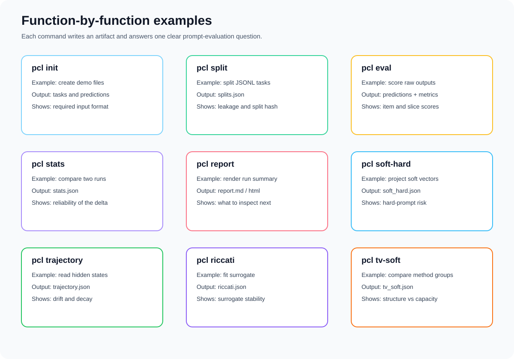

# PromptControlLab

PromptControlLab is an open-source toolkit for prompt evaluation, prompt diagnostics,
reproducibility, and control-oriented analysis.

It helps researchers and engineering teams answer practical questions:

- Did a prompt change really improve the result?
- Was the improvement caused by validation overfitting?
- Were train, validation, and withheld examples kept separate?
- How much behavior may be lost when a soft prompt is projected to hard tokens?
- Do hidden-state trajectories show drift, decay, or turnpike-like behavior?
- Does a time-varying prompt help because of temporal structure, or just because it has
  more parameters?

PromptControlLab is not just a score table. It creates reproducible artifacts that explain
what was tested, how it was split, how outputs were scored, whether the change is reliable,
and which diagnostics need inspection.

Chinese documentation is available in [README.zh.md](README.zh.md).

## Visual Overview


The toolkit follows a simple path: prepare a task pool, make a clean tri-split, score
baseline and candidate outputs, run paired statistics, then write a report. Optional
diagnostics can be added when soft prompts or hidden states are available.


Every run writes a small audit trail. The files are designed to be readable by people,
scripts, papers, and future dashboards without rerunning the experiment.



The sections below give one concrete example for every CLI command. Each example follows
the same pattern: what to run, what file you get, and what question the result answers.

## Who It Is For

- Prompt optimization researchers who need clean train/val/withheld protocols.
- LLM engineering teams that want local prompt regression reports.
- Soft prompt researchers who need soft-to-hard deployment diagnostics.
- Model migration and evaluation teams that need repeatable artifact trails.
- Researchers studying hidden-state trajectories, turnpike-like behavior, and Riccati
  surrogate diagnostics.

## Install

```bash
pip install -e ".[dev,research]"
```

With uv:

```bash
uv pip install -e ".[dev,research]"
```

Core commands use only the standard library. Research diagnostics such as `soft-hard`,
`trajectory`, and `riccati` use optional scientific dependencies.

## Function Examples

### 1. `pcl init`: create a runnable example

Operation:

```bash
pcl init --path demo
cd demo
```

Result:

- `examples/tasks.jsonl`
- `examples/predictions_baseline.jsonl`
- `examples/predictions_candidate.jsonl`
- `promptcontrol.example.yaml`

What it tells you:

This shows the minimum input format. A task has an `id`, an `input`, an `expected`
answer, and a `slice`. A prediction file maps each `id` to a model `output`.

### 2. `pcl split`: separate train, validation, and withheld examples

Operation:

```bash
pcl split --data examples/tasks.jsonl --out runs/candidate --seed 0
```

Result:

- `runs/candidate/splits.json`

What it tells you:

The file contains train, validation, and withheld ids, a split hash, and a leakage
report. If `has_leakage` is false, the three split groups do not overlap. The split
hash lets another person reproduce the same split.

### 3. `pcl eval`: score raw model outputs

Operation:

```bash
pcl eval --data examples/tasks.jsonl \
  --predictions examples/predictions_baseline.jsonl \
  --out runs/baseline \
  --metric exact_match \
  --method baseline

pcl eval --data examples/tasks.jsonl \
  --predictions examples/predictions_candidate.jsonl \
  --out runs/candidate \
  --metric exact_match \
  --method candidate
```

Result:

- `runs/baseline/predictions.jsonl`
- `runs/baseline/metrics.json`
- `runs/candidate/predictions.jsonl`
- `runs/candidate/metrics.json`

What it tells you:

`predictions.jsonl` explains what happened on every example: output, expected answer,
score, slice, and any error. `metrics.json` gives the overall mean score and slice-level
scores, so you can see whether one task group regressed even if the average improved.

### 4. `pcl stats`: check whether the change is reliable

Operation:

```bash
pcl stats --baseline runs/baseline/predictions.jsonl \
  --candidate runs/candidate/predictions.jsonl \
  --out runs/candidate/stats.json
```

Result:

- `runs/candidate/stats.json`

What it tells you:

The file reports the baseline mean, candidate mean, mean delta, bootstrap confidence
interval, paired permutation p-value, and Holm-adjusted p-value. If the confidence
interval crosses zero, treat the apparent improvement as uncertain. If the interval is
above zero and the adjusted p-value is small, the candidate improvement is more reliable.

### 5. `pcl report`: turn artifacts into a readable report

Operation:

```bash
pcl report --run runs/candidate --title "Candidate Prompt Report"
```

Result:

- `runs/candidate/report.md`
- `runs/candidate/report.html`

What it tells you:

The report gathers split hygiene, metrics, statistical comparison, and any diagnostics
that were already written under `diagnostics/`. It gives a readable summary of whether
the prompt change looks useful and what should be checked next.

### 6. `pcl soft-hard`: inspect soft-to-hard deployment risk

Operation:

```bash
pcl soft-hard --soft soft_prompt.npz \
  --vocab vocab_embeddings.npz \
  --out runs/candidate/diagnostics
```

Input format:

- `soft_prompt.npz` must contain a rank-2 array named `soft`.
- `vocab_embeddings.npz` must contain a rank-2 array named `embeddings`.

Result:

- `runs/candidate/diagnostics/soft_hard.json`

What it tells you:

The file reports nearest-token indices, mean projection distance, max projection
distance, and a risk label. Large distances mean the learned soft vectors are far from
real token embeddings, so converting the soft prompt into hard tokens may lose behavior.

## Research Diagnostics


### 7. `pcl trajectory`: measure hidden-state drift and decay

Operation:

```bash
pcl trajectory --states hidden_states.npz --out runs/candidate/diagnostics
```

Input format:

- `hidden_states.npz` must contain a rank-2 array named `states`, shaped
  `[steps, hidden_dim]`.

Result:

- `runs/candidate/diagnostics/trajectory.json`

What it tells you:

The file reports mean step drift, max step drift, log-decay slope, fit quality, and a
turnpike-like signal. A negative slope with reasonable fit quality suggests motion
toward a stable region. High drift or weak fit suggests more heterogeneous behavior.

### 8. `pcl riccati`: check a finite-dimensional surrogate

Operation:

```bash
pcl riccati --trajectory hidden_states.npz --out runs/candidate/diagnostics
```

Alternative input:

```bash
pcl riccati --matrices matrices.npz --out runs/candidate/diagnostics
```

Input format:

- `--trajectory` reads `hidden_states.npz` with an array named `states`.
- `--matrices` reads `matrices.npz` with arrays named `A`, `B`, `Q`, and `R`.

Result:

- `runs/candidate/diagnostics/riccati.json`

What it tells you:

The file reports the closed-loop spectral radius, a diagnostic decay rate, and whether
the fitted surrogate is stable. This is a check on the finite-dimensional surrogate. It
is not a proof about the full language model.

### 9. `pcl tv-soft`: compare static and time-varying method groups

Operation:

```bash
pcl tv-soft --predictions scored_methods.jsonl --out runs/candidate/diagnostics
```

Input format:

- `scored_methods.jsonl` uses scored prediction records with `id`, `output`, `expected`,
  `score`, `slice`, and `method`.
- Typical method names are `static`, `time_varying`, `shuffled_tv`, and `random_tv`.

Result:

- `runs/candidate/diagnostics/tv_soft.json`

What it tells you:

If `time_varying` beats `static` while `shuffled_tv` and `random_tv` do not, the gain is
more consistent with temporal structure. If shuffled or random variants also improve,
inspect parameter capacity and selection effects.

## Documentation

- [Background](docs/background.en.md)
- [Users](docs/users.en.md)
- [Tutorial](docs/tutorial.en.md)
- [Artifacts](docs/artifacts.en.md)
- [Innovation and contribution](docs/innovation.en.md)

## License

Apache-2.0.
