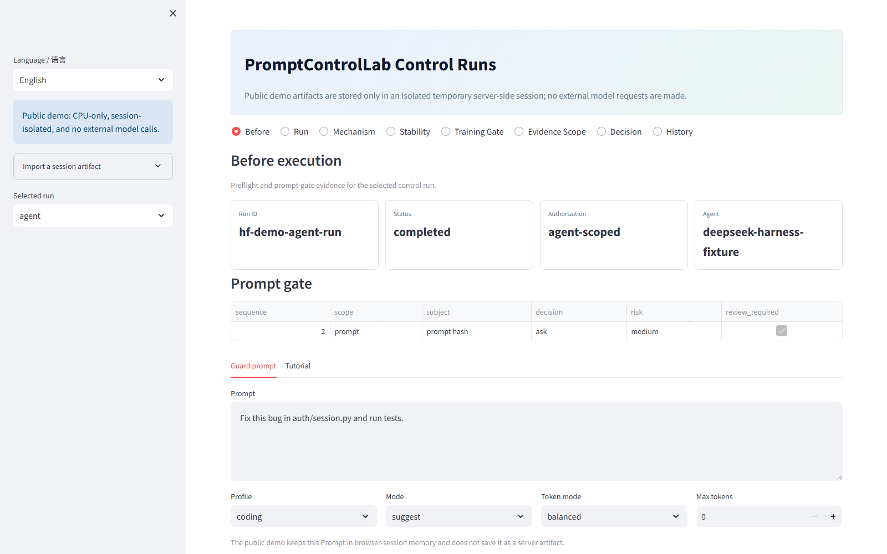
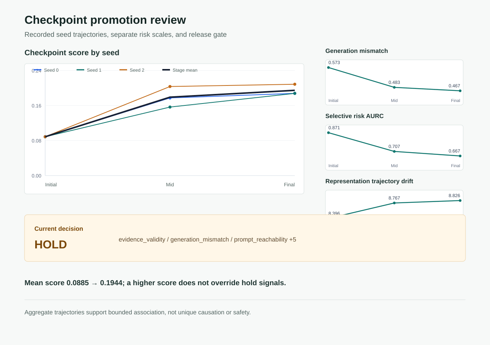
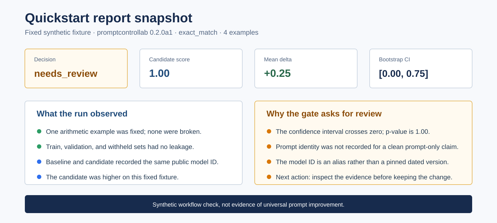

# PromptControlLab
**Evaluate prompts, search for improvements, and understand the evidence—all locally.**
> `0.3.0a1` prerelease candidate. The local experiment workspace is integrated; see the [acceptance record](https://github.com/VeraPyuyi/prompt_control_lab/blob/main/docs/releases/0.3.0a1-validation.md) for verified and pending checks. Release publication is separate.

## Start with an experiment

From this checkout, install `python -m pip install -e ".[ui,optimize,research]"`, then run `pcl ui --runs runs --language en`. From a built wheel, install `python -m pip install "./promptcontrollab-0.3.0a1-py3-none-any.whl[ui,optimize,research]"`; Node and the source checkout are not needed to use the app.

Choose **Try the offline example** for a preset synthetic comparison with no model calls. Next, edit prompts, upload CSV/JSONL data and either evaluate your selected model, import saved outputs, or run a bounded GEPA search. Compare conditions, effect, coverage and cost separately; export a portable report and replay it elsewhere.

[Experiment guide](https://github.com/VeraPyuyi/prompt_control_lab/blob/main/docs/experiments.en.md) · [Five research tools](https://github.com/VeraPyuyi/prompt_control_lab/blob/main/examples/research-tools/README.md) · [Example configurations](https://github.com/VeraPyuyi/prompt_control_lab/blob/main/examples/experiments/README.md) · [中文指南](https://github.com/VeraPyuyi/prompt_control_lab/blob/main/docs/experiments.zh.md)

## 2-Minute Change Review

```bash
python -m pip install -e ".[ui]"
pcl review --baseline docs/case_studies/checkpoint_change_review/baseline --candidate docs/case_studies/checkpoint_change_review/candidate --out runs/checkpoint-review
pcl ui --runs runs/checkpoint-review --language en
```

The review runs in `shadow` mode: it reads recorded artifacts, writes a bounded explanation and decision trace, and never changes either source run. Use `pcl control --authorization inspect` when you need prompt preflight before execution.

Normalize Agent telemetry with `pcl trace import --input traces.jsonl --format auto --out runs/imported`, then compare using `pcl review --baseline runs/old --candidate runs/imported --kind auto --out runs/change-review`. Trace import accepts OpenTelemetry GenAI and OpenInference JSONL, orders and deduplicates events, and redacts sensitive fields.

## Try on Hugging Face
<p><a href="https://huggingface.co/spaces/VeraPyuyi/prompt-control-lab"></a> <a href="https://huggingface.co/spaces/VeraPyuyi/prompt-control-lab"></a></p>
The CPU-only public Space needs no API key: it offers offline Guard/improvement, curated reports, audits, history and control certificates, plus bounded JSON/JSONL upload in an isolated temporary session. The [full local installation](https://github.com/VeraPyuyi/prompt_control_lab/blob/main/docs/huggingface_space.en.md) additionally supports durable runs, real repository audit, providers, plugins, DeepSeek Harness and post-training workflows; see the exact [`deploy/huggingface/README.md`](https://github.com/VeraPyuyi/prompt_control_lab/blob/main/deploy/huggingface/README.md) boundary. GitHub remains the source, Issue, PR and release home.

## Preview The Outputs
<p><strong>Unified Change Review.</strong> Three flagship cases show the same workflow on an Agent, model, and checkpoint change. The 60-run Codex case records lower full-run token and tool use with equal completion; the Qwen/Mistral case keeps a close aggregate result at <code>needs_review</code> because task slices disagree and paired records are absent; the three-seed checkpoint case preserves <code>hold</code> despite a higher score.</p>
<p><a href="docs/case_studies/agent_change_review/README.md">Agent workflow case</a> | <a href="docs/case_studies/model_change_review/README.md">Model change case</a> | <a href="docs/case_studies/checkpoint_change_review/README.md">Checkpoint case</a>.</p><p><a href="docs/case_studies/checkpoint_change_review/README.md"></a></p><p><strong>What changed:</strong> aggregate initial and final checkpoints across three seeds. <strong>Observed:</strong> score rose from <code>0.0885</code> to <code>0.1944</code>; generation mismatch and selective risk decreased, while trajectory drift increased. <strong>Can explain / cannot prove:</strong> training stage is associated with a changed performance and risk profile, but not a unique causal mechanism or deployment safety. <strong>Next:</strong> preserve <code>hold</code> until the triggered stability, generation, and readout evidence is resolved or justified.</p>
<p><strong>Quickstart report.</strong> The fixed synthetic fixture returns <code>needs_review</code>: the score is higher, but the CI crosses zero, prompt identity is incomplete, and the model alias is not pinned. Run <code>pcl quickstart --out demo --open-report</code>; this verifies the reporting path, not universal improvement.</p>
<p><a href="docs/quickstart.en.md"></a></p>
<p><strong>Research diagnosis.</strong> The real three-seed SFT pilot improved mean score and reduced generated tokens, yet returned <code>hold</code> because stability and generation/readout checks did not pass. Open the <a href="https://github.com/VeraPyuyi/prompt_control_lab/blob/main/docs/case_studies/sft_checkpoint_pilot/report.md">full report</a>, or run <code>pcl research-quickstart --out demo-research</code>.</p>
<p><a href="docs/case_studies/sft_checkpoint_pilot/README.md"></a></p>

## Core Diagnostic Loop

```bash
pcl evidence scan --root /path/to/evidence --profile prompt-reach-v2 --out manifest.json
pcl evidence import --manifest manifest.json --out runs/prompt-reach-v2 --portable
pcl posttrain-gate --baseline runs/checkpoint-000 --candidate runs/checkpoint-500 --policy examples/posttrain.policy.yaml --out runs/posttrain-gate
```

These commands connect dispersed experiment artifacts to prompt reachability, readout alignment, routing, projection, and stability evidence. The public-safe [371-source prompt-reach-v2 case](https://github.com/VeraPyuyi/prompt_control_lab/blob/main/docs/case_studies/prompt_reach_v2/README.md) reports four observed dimensions and one dimension that requires reanalysis. For bounded control checks, `pcl terminal-sensitivity`, `pcl green-certificate`, and `pcl posterior-certificate` distinguish empirical trends, finite-dimensional surrogate consistency, and premise-backed local certificates. See the [control certificate guide](https://github.com/VeraPyuyi/prompt_control_lab/blob/main/docs/control_certificates.en.md); none of these levels is a proof about an entire operational language model.

The real [three-seed SFT checkpoint case](https://github.com/VeraPyuyi/prompt_control_lab/blob/main/docs/case_studies/sft_checkpoint_pilot/README.md) records 9 checkpoints and 6 paired gates. Mean score rose from 0.0885 to 0.1944 and mean generated tokens fell 27.2%. The format slice independently remained at 0; the `hold` was triggered by trajectory/prompt-stability and generation-mismatch/readout checks, while routing evidence remained insufficient. This is an observed, bounded workflow result, not a universal improvement claim. See the [evidence import guide](https://github.com/VeraPyuyi/prompt_control_lab/blob/main/docs/server_evidence.en.md) and [post-training gate](https://github.com/VeraPyuyi/prompt_control_lab/blob/main/docs/posttraining.en.md).
## Flagship Integration: DeepSeek Harness

The [native Cordis integration](https://github.com/VeraPyuyi/prompt_control_lab/blob/main/docs/deepseek_harness.en.md) gates model requests and tools, streams redacted lifecycle evidence through one persistent local bridge, and is contract-locked to Harness `0.1.1-rc.2` at `b150a551...`. The [public-safe real-session case](https://github.com/VeraPyuyi/prompt_control_lab/blob/main/docs/case_studies/deepseek_harness/README.md) records four model request/response pairs, two terminal reads, one bounded edit, one test invocation with exit code `0`, and 3/3 passing tests. The verified live run is `low` risk, `converging`, and conservatively `suggest`; lifecycle acceptance is still not presented as a safety proof.
## Supported Surfaces
Providers: OpenAI, Anthropic, Gemini, DeepSeek, Qwen/DashScope, Kimi/Moonshot, and OpenAI-compatible endpoints. Agents: DeepSeek Harness native control plus Codex, Cursor, Claude Code, and GitHub Action adapters. The versioned `prompt_control_lab.control_event.v1` contract feeds Change Review, bounded diagnostics, and the local UI: Change Review / Before / Run / Why / After / Decision / History / Stability & Confidence. See the [control benchmark](https://github.com/VeraPyuyi/prompt_control_lab/blob/main/docs/control_benchmark.en.md).
## Documentation

[Architecture and modules](https://github.com/VeraPyuyi/prompt_control_lab/blob/main/docs/modules/README.md) | [5-minute quickstart](https://github.com/VeraPyuyi/prompt_control_lab/blob/main/docs/quickstart.en.md) | [Control certificates](https://github.com/VeraPyuyi/prompt_control_lab/blob/main/docs/control_certificates.en.md) | [Evidence and interpretation](https://github.com/VeraPyuyi/prompt_control_lab/blob/main/docs/server_evidence.en.md) | [Post-training diagnosis](https://github.com/VeraPyuyi/prompt_control_lab/blob/main/docs/posttraining.en.md) | [Control loop](https://github.com/VeraPyuyi/prompt_control_lab/blob/main/docs/control_loop.en.md) | [DeepSeek Harness](https://github.com/VeraPyuyi/prompt_control_lab/blob/main/docs/deepseek_harness.en.md) | [Providers](https://github.com/VeraPyuyi/prompt_control_lab/blob/main/docs/providers.en.md) | [Local UI](https://github.com/VeraPyuyi/prompt_control_lab/blob/main/docs/control_ui.en.md)

Install and existing workflows: [release guide](https://github.com/VeraPyuyi/prompt_control_lab/blob/main/docs/release_install.en.md), `pcl start --guide`, `pcl quickstart --out demo --open-report`, `pcl start --choice demo --out demo`, and `pcl choose --need "<your goal>"`.

External evidence remains available through `pcl import promptfoo --input results.json --out runs/from-promptfoo --prompt-id candidate` (`pcl ingest` remains the backward-compatible alias); see the [choice guide](https://github.com/VeraPyuyi/prompt_control_lab/blob/main/docs/choice_guide.en.md).

Engineering references: [production protocol](https://github.com/VeraPyuyi/prompt_control_lab/blob/main/docs/production_pilot.en.md), [preflight pilot](https://github.com/VeraPyuyi/prompt_control_lab/blob/main/docs/case_studies/agent_guard_pilot.en.md), [paired Codex pilot](https://github.com/VeraPyuyi/prompt_control_lab/blob/main/docs/case_studies/agent_guard_paired_pilot.en.md), [ecosystem scorecard](https://github.com/VeraPyuyi/prompt_control_lab/blob/main/docs/assets/ecosystem_scorecard.svg), and [evidence matrix](https://github.com/VeraPyuyi/prompt_control_lab/blob/main/docs/assets/ecosystem_evidence_matrix.svg). These small pilots are not universal benchmarks.
## Method Origins and Boundaries

PEOC contributes the control-theoretic framing and several diagnostic methods; the product surface generalizes them to prompt, checkpoint, and agent evidence. `soft-hard`, `trajectory`, `riccati`, and `tv-soft` are observable or fitted-surrogate explanations, not mathematical safety proofs for an operational LLM. See the [method mapping](https://github.com/VeraPyuyi/prompt_control_lab/blob/main/docs/research_from_paper.en.md) and [PEOC import guide](https://github.com/VeraPyuyi/prompt_control_lab/blob/main/docs/research_import_peoc.en.md).

One mathematical foundation for the terminal-objective sensitivity, long-horizon stability, and Riccati-surrogate diagnostics is [*Horizon-Uniform Sensitivity and Decay of Terminal Reward Perturbations in Discrete-Time Pontryagin Systems*](https://arxiv.org/abs/2606.17762) by Pyuyi Chufeng Huang and Zikang Song (2026). The paper establishes horizon-uniform Green estimates, exponential decay of terminal-reward sensitivity, a posteriori existence checks, and Riccati convergence under explicit regularity, hyperbolicity, and boundary-transversality assumptions. PromptControlLab translates these ideas into bounded diagnostics for prompt, checkpoint, and agent-run evidence; unless those assumptions are independently verified, the outputs remain observational or finite-dimensional surrogate evidence rather than a theorem about an operational language model.
Contributions are welcome: [contributing guide](https://github.com/VeraPyuyi/prompt_control_lab/blob/main/CONTRIBUTING.md), [security policy](https://github.com/VeraPyuyi/prompt_control_lab/blob/main/SECURITY.md), and [v0.2.0-alpha.1 release checklist](https://github.com/VeraPyuyi/prompt_control_lab/blob/main/docs/release_checklist_v0.2.0-alpha.1.md).

Apache-2.0. See [LICENSE](https://github.com/VeraPyuyi/prompt_control_lab/blob/main/LICENSE).
