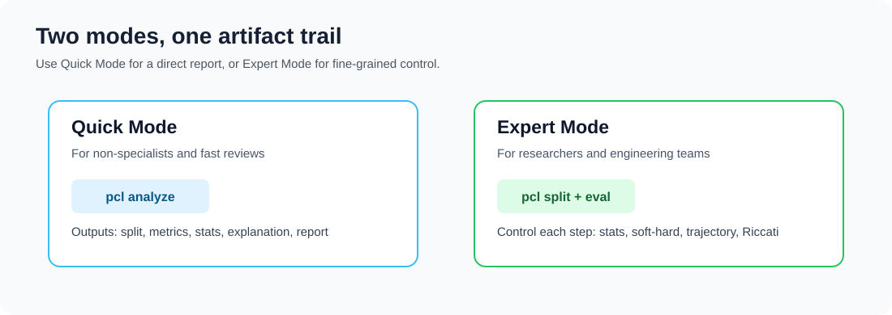
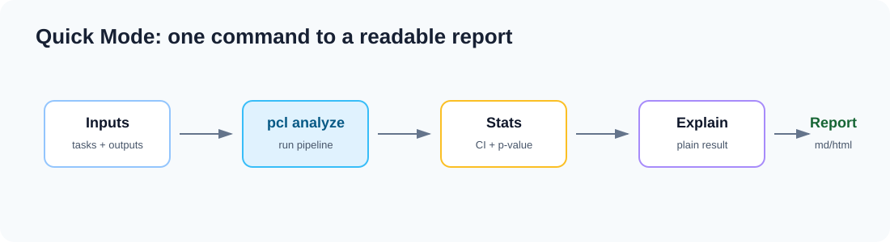
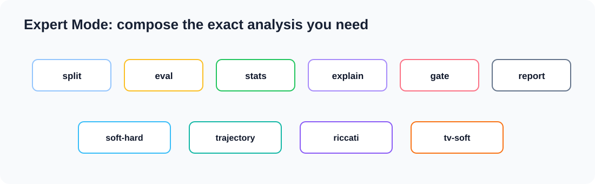

# prompt_control_lab 🧪✨

[](https://github.com/VeraPyuyi/prompt_control_lab/stargazers)
[](https://github.com/VeraPyuyi/prompt_control_lab/forks)
[](https://github.com/VeraPyuyi/prompt_control_lab/watchers)
[](LICENSE)
[](pyproject.toml)

prompt_control_lab is an open-source toolkit for prompt evaluation, prompt diagnostics,
reproducibility, and control-oriented analysis.

It helps researchers and engineering teams answer practical questions without turning prompt
work into guesswork:

- Did a prompt change really improve the result?
- Was the improvement caused by validation overfitting?
- Were train, validation, and withheld examples kept separate?
- How much behavior may be lost when a soft prompt is projected to hard tokens?
- Do hidden-state trajectories show drift, decay, or turnpike-like behavior?
- Does a time-varying prompt help because of temporal structure, or just because it has
  more parameters?

prompt_control_lab is not just a score table. It creates a friendly, reproducible audit trail
that explains what was tested, how it was split, how outputs were scored, whether the change is
reliable, and which diagnostics need inspection.

> 📌 The repository is currently private, so public badge services may show zero or unavailable
> counts until the repository is made public.

Chinese documentation is available in [README.zh.md](README.zh.md).

## Visual Overview 🗺️


The toolkit follows a simple path: prepare a task pool, make a clean tri-split, score
baseline and candidate outputs, run paired statistics, then write a report. Optional
diagnostics can be added when soft prompts or hidden states are available.


Every run writes a small audit trail. The files are designed to be readable by people,
scripts, papers, and future dashboards without rerunning the experiment.


The sections below give one concrete example for every CLI command. Each example follows
the same pattern: what to run, what file you get, and what question the result answers.



## Two Modes 🧭

prompt_control_lab now has two ways to use the same open-source tool.



**Quick Mode** is for people who want a report quickly. Use `pcl analyze` when you
already have a task file plus baseline and candidate outputs. It runs the normal
pipeline for you: split, score, compare, explain, and report.



**Expert Mode** is for researchers and engineers who need more control. Use the
individual commands when you want to tune split ratios, import different outputs,
run statistics with custom sampling, attach diagnostics, or inspect every artifact.

## Ecosystem Positioning and Advantages 🌱

prompt_control_lab sits next to existing LLM tools. It is not meant to replace prompt
optimizers, evaluation frameworks, or observability platforms. Its role is narrower and
more diagnostic: after a prompt changes, it helps you decide whether the result is
reproducible, statistically reliable, deployable, and stable enough to inspect further.


Adjacent tools are valuable in their own workflows:

- [DSPy](https://dspy.ai/learn/optimization/optimizers/) focuses on optimizers that tune
  prompts or language-model programs against a metric.
- [TextGrad](https://github.com/zou-group/textgrad) explores textual gradients and
  automatic-differentiation-style optimization over text.
- [OpenPrompt](https://github.com/thunlp/OpenPrompt) provides prompt-learning pipelines.
- [promptfoo](https://www.promptfoo.dev/docs/intro/) focuses on LLM evaluation, testing,
  red-teaming, and CI workflows.
- [DeepEval](https://deepeval.com/docs/getting-started) provides LLM evaluation metrics
  and test cases for applications.
- [Langfuse](https://langfuse.com/docs) and
  [LangSmith](https://docs.smith.langchain.com/) focus on tracing, observability,
  prompt management, experiments, and evaluation workflows.

prompt_control_lab is different because it makes the diagnostic layer first-class:


| Area | What many adjacent tools emphasize | What prompt_control_lab adds |
| --- | --- | --- |
| Prompt improvement | Find or rewrite a better prompt/program. | `pcl improve` gives a simple offline rewrite, while reports explain why the rewrite is suggested. |
| Evaluation | Score outputs on examples and compare runs. | `pcl split`, `pcl stats`, and `pcl report` keep train/val/withheld separate and report paired uncertainty. |
| Reproducibility | Store configs, prompts, traces, or experiments. | Every run writes explicit artifacts, split hashes, metrics, explanations, and report files. |
| Deployment risk | Usually handled through output-level tests. | `pcl soft-hard` measures soft-to-hard projection risk before deploying a hard prompt. |
| Internal behavior | Often outside normal prompt-eval workflows. | `pcl trajectory` checks hidden-state drift, decay, and turnpike-like signals when hidden states are available. |
| Control analysis | Rarely exposed as reusable prompt tooling. | `pcl riccati` and `pcl tv-soft` expose surrogate stability and time-varying control diagnostics. |

The main innovation is the stack: prompt changes are not reduced to one score. They become
a small evidence package that a researcher, engineer, or non-specialist can inspect.


In practical terms, the tool contributes four things to the field:

- Cleaner prompt-evaluation hygiene through a built-in train/val/withheld protocol.
- More reliable prompt comparisons through paired statistics and correction-aware reports.
- More deployable soft-prompt research through explicit soft-to-hard risk reporting.
- A reusable bridge from prompt engineering to control-oriented diagnostics, including
  hidden trajectories, turnpike-like decay, Riccati surrogates, and time-varying controls.

## Easiest Prompt Improvement ✨

If you only have a prompt string and want a clearer version, use:

```bash
pcl improve --prompt "Answer the user question."
```

To reduce prompt-token cost more aggressively:

```bash
pcl improve --prompt "Answer the user question." --token-mode aggressive --max-tokens 80
```

Result:

- The optimized prompt is printed in the terminal.
- If you add `--out runs/improve`, the tool writes `improved_prompt.txt`,
  `prompt_improvement.json`, and `prompt_diff.md`.
- The terminal and JSON output include dependency-free estimated token counts. The default
  `balanced` mode keeps key constraints while shortening wording; `aggressive` favors a
  shorter prompt for lower estimated token cost.

What it tells you:

This command gives a practical rewrite without calling any external model. If you also pass
`--run runs/quick`, it uses the existing report to add warnings about regressed slices, broken
examples, and deployment risk. `--max-tokens` is treated as an estimated budget, not a
model-specific tokenizer guarantee.

## Prompt Guard Plugins 🛡️

`pcl guard` is the input-layer mode for IDE and CLI agents. It checks a prompt before the
agent sees it, then returns a safer, clearer, and more token-conscious version.

```bash
pcl guard --prompt "Fix this bug" --profile coding --token-mode balanced
```

For hooks and wrappers:

```bash
echo "Fix this bug" | pcl guard --stdin --profile coding --json
```

Result:

- `action`: `suggest`, `auto`, or `block`
- `risk_level`: `low`, `medium`, or `high`
- `improved_prompt`: the guarded prompt
- `token_report`: estimated token cost before and after guarding
- `reasons`: short explanations for the decision

Plugin adapters live in [`plugins/`](plugins/):

- [`plugins/claude-code`](plugins/claude-code): working Claude Code `UserPromptSubmit` hook
- [`plugins/cursor`](plugins/cursor): Cursor rules and command workflow notes
- [`plugins/codex`](plugins/codex): Codex skill and wrapper workflow notes

## Who It Is For 👥

- Prompt optimization researchers who need clean train/val/withheld protocols.
- LLM engineering teams that want local prompt regression reports.
- Soft prompt researchers who need soft-to-hard deployment diagnostics.
- Model migration and evaluation teams that need repeatable artifact trails.
- Researchers studying hidden-state trajectories, turnpike-like behavior, and Riccati
  surrogate diagnostics.

## Install ⚙️

```bash
pip install -e ".[dev,research]"
```

With uv:

```bash
uv pip install -e ".[dev,research]"
```

Core commands use only the standard library. Research diagnostics such as `soft-hard`,
`trajectory`, and `riccati` use optional scientific dependencies.

## Function Examples 🧩

### 1. `pcl init`: create a runnable example

Operation:

```bash
pcl init --path demo
cd demo
```

Result:

- `examples/tasks.jsonl`
- `examples/predictions_baseline.jsonl`
- `examples/predictions_candidate.jsonl`
- `promptcontrol.example.yaml`

What it tells you:

This shows the minimum input format. A task has an `id`, an `input`, an `expected`
answer, and a `slice`. A prediction file maps each `id` to a model `output`.

### 2. `pcl improve`: rewrite one prompt directly

Operation:

```bash
pcl improve --prompt "Answer the user question."
```

Token-conscious operation:

```bash
pcl improve --prompt "Answer the user question." --token-mode aggressive --max-tokens 80
```

Operation with an existing report:

```bash
pcl improve --prompt-file prompts/current.txt --run runs/quick --out runs/improve
```

Result:

- terminal output with the optimized prompt
- `runs/improve/improved_prompt.txt`
- `runs/improve/prompt_improvement.json`
- `runs/improve/prompt_diff.md`
- estimated token counts in the terminal, JSON, and Markdown diff

What it tells you:

This gives a clearer prompt with task goal, output-format constraints, and stability rules. With
`--run`, it also uses previous diagnostics to add simple warnings about task slices or examples
that regressed. The default token mode is `balanced`: it tries to keep useful constraints while
avoiding unnecessary wording. `aggressive` is shorter and better for cost, but may remove some
guardrails.

### 3. `pcl guard`: protect prompts before IDE or CLI agents use them

Operation:

```bash
pcl guard --prompt "Fix this bug" --profile coding --token-mode balanced --json
```

Gate operation:

```bash
echo "Answer the user question." | pcl guard --stdin --mode gate --max-tokens 80 --json
```

Result:

- JSON with `action`, `risk_level`, `improved_prompt`, `token_report`, and `reasons`
- `action=block` when gate mode sees a high-risk or over-budget prompt

What it tells you:

This is the pre-model prompt guard. It is useful for Claude Code hooks, Cursor rules, Codex
skills, and shell wrappers where you want prompt cleanup before the model spends tokens.

### 4. `pcl analyze`: run Quick Mode end to end

Operation:

```bash
pcl analyze \
  --data examples/tasks.jsonl \
  --baseline-predictions examples/predictions_baseline.jsonl \
  --candidate-predictions examples/predictions_candidate.jsonl \
  --metric exact_match \
  --out runs/quick \
  --explain-level plain
```

Equivalent config-driven operation:

```bash
pcl analyze --config promptcontrol.example.yaml --out runs/quick
```

Result:

- `runs/quick/splits.json`
- `runs/quick/baseline/metrics.json`
- `runs/quick/candidate/metrics.json`
- `runs/quick/stats.json`
- `runs/quick/explanation.json`
- `runs/quick/report.md`
- `runs/quick/report.html`

What it tells you:

This is the easiest path for non-specialists. It answers: did the candidate prompt
improve, is the evidence reliable, did any task slice regress, and what should be
checked next?

### 5. `pcl split`: separate train, validation, and withheld examples

Operation:

```bash
pcl split --data examples/tasks.jsonl --out runs/candidate --seed 0
```

Result:

- `runs/candidate/splits.json`

What it tells you:

The file contains train, validation, and withheld ids, a split hash, and a leakage
report. If `has_leakage` is false, the three split groups do not overlap. The split
hash lets another person reproduce the same split.

### 6. `pcl eval`: score raw model outputs

Operation:

```bash
pcl eval --data examples/tasks.jsonl \
  --predictions examples/predictions_baseline.jsonl \
  --out runs/baseline \
  --metric exact_match \
  --method baseline

pcl eval --data examples/tasks.jsonl \
  --predictions examples/predictions_candidate.jsonl \
  --out runs/candidate \
  --metric exact_match \
  --method candidate
```

Result:

- `runs/baseline/predictions.jsonl`
- `runs/baseline/metrics.json`
- `runs/candidate/predictions.jsonl`
- `runs/candidate/metrics.json`

What it tells you:

`predictions.jsonl` explains what happened on every example: output, expected answer,
score, slice, and any error. `metrics.json` gives the overall mean score and slice-level
scores, so you can see whether one task group regressed even if the average improved.

### 7. `pcl stats`: check whether the change is reliable

Operation:

```bash
pcl stats --baseline runs/baseline/predictions.jsonl \
  --candidate runs/candidate/predictions.jsonl \
  --out runs/candidate/stats.json
```

Result:

- `runs/candidate/stats.json`

What it tells you:

The file reports the baseline mean, candidate mean, mean delta, bootstrap confidence
interval, paired permutation p-value, and Holm-adjusted p-value. If the confidence
interval crosses zero, treat the apparent improvement as uncertain. If the interval is
above zero and the adjusted p-value is small, the candidate improvement is more reliable.

### 8. `pcl report`: turn artifacts into a readable report

Operation:

```bash
pcl report --run runs/candidate --title "Candidate Prompt Report"
```

Result:

- `runs/candidate/report.md`
- `runs/candidate/report.html`

What it tells you:

The report gathers split hygiene, metrics, statistical comparison, and any diagnostics
that were already written under `diagnostics/`. It gives a readable summary of whether
the prompt change looks useful and what should be checked next.

### 9. `pcl explain`: turn artifacts into a direct explanation

Operation:

```bash
pcl explain --run runs/quick --level plain
pcl explain --run runs/quick --level technical
```

Result:

- `runs/quick/explanation.json`

What it tells you:

`plain` explains the run in direct language for readers who only need the conclusion.
`technical` keeps artifact paths and raw comparison details so researchers can audit
the result.

### 10. `pcl gate`: check a run against policy thresholds

Operation:

```bash
pcl gate --run runs/quick --policy examples/gate.policy.yaml
```

Result:

- `runs/quick/gate_result.json`

What it tells you:

The file returns `pass`, `needs_review`, or `fail`. It explains whether the candidate
score, regression size, adjusted p-value, and optional diagnostic risk meet the policy.

### 11. `pcl soft-hard`: inspect soft-to-hard deployment risk

Operation:

```bash
pcl soft-hard --soft soft_prompt.npz \
  --vocab vocab_embeddings.npz \
  --out runs/candidate/diagnostics
```

Input format:

- `soft_prompt.npz` must contain a rank-2 array named `soft`.
- `vocab_embeddings.npz` must contain a rank-2 array named `embeddings`.

Result:

- `runs/candidate/diagnostics/soft_hard.json`

What it tells you:

The file reports nearest-token indices, mean projection distance, max projection
distance, and a risk label. Large distances mean the learned soft vectors are far from
real token embeddings, so converting the soft prompt into hard tokens may lose behavior.

## Research Diagnostics 🔬


### 12. `pcl trajectory`: measure hidden-state drift and decay

Operation:

```bash
pcl trajectory --states hidden_states.npz --out runs/candidate/diagnostics
```

Input format:

- `hidden_states.npz` must contain a rank-2 array named `states`, shaped
  `[steps, hidden_dim]`.

Result:

- `runs/candidate/diagnostics/trajectory.json`

What it tells you:

The file reports mean step drift, max step drift, log-decay slope, fit quality, and a
turnpike-like signal. A negative slope with reasonable fit quality suggests motion
toward a stable region. High drift or weak fit suggests more heterogeneous behavior.

### 13. `pcl riccati`: check a finite-dimensional surrogate

Operation:

```bash
pcl riccati --trajectory hidden_states.npz --out runs/candidate/diagnostics
```

Alternative input:

```bash
pcl riccati --matrices matrices.npz --out runs/candidate/diagnostics
```

Input format:

- `--trajectory` reads `hidden_states.npz` with an array named `states`.
- `--matrices` reads `matrices.npz` with arrays named `A`, `B`, `Q`, and `R`.

Result:

- `runs/candidate/diagnostics/riccati.json`

What it tells you:

The file reports the closed-loop spectral radius, a diagnostic decay rate, and whether
the fitted surrogate is stable. This is a check on the finite-dimensional surrogate. It
is not a proof about the full language model.

### 14. `pcl tv-soft`: compare static and time-varying method groups

Operation:

```bash
pcl tv-soft --predictions scored_methods.jsonl --out runs/candidate/diagnostics
```

Input format:

- `scored_methods.jsonl` uses scored prediction records with `id`, `output`, `expected`,
  `score`, `slice`, and `method`.
- Typical method names are `static`, `time_varying`, `shuffled_tv`, and `random_tv`.

Result:

- `runs/candidate/diagnostics/tv_soft.json`

What it tells you:

If `time_varying` beats `static` while `shuffled_tv` and `random_tv` do not, the gain is
more consistent with temporal structure. If shuffled or random variants also improve,
inspect parameter capacity and selection effects.

## Documentation 📚

- [Background](docs/background.en.md)
- [Users](docs/users.en.md)
- [Tutorial](docs/tutorial.en.md)
- [Artifacts](docs/artifacts.en.md)
- [Innovation and contribution](docs/innovation.en.md)

## License 📄

Apache-2.0.
