# prompt_control_lab

[](https://github.com/VeraPyuyi/prompt_control_lab/stargazers)
[](https://github.com/VeraPyuyi/prompt_control_lab/forks)
[](https://github.com/VeraPyuyi/prompt_control_lab/watchers)
[](LICENSE)
[](pyproject.toml)

**Control-theoretic diagnostics and reproducible evaluation for prompt optimization.**

`prompt_control_lab` is the open-source toolkit for the Prompt-Engineering-Optimal-Control project.
Its research core turns prompt optimization experiments into reproducible splits, paired statistics,
soft-to-hard deployment diagnostics, hidden-state trajectory probes, Riccati surrogate checks, and
time-varying soft-control comparisons.

It also includes an applied engineering layer for AI coding agents: prompt policy guardrails, public
model provenance, diff audit, PR summaries, plugin templates, and a local UI. Those features are
downstream applications of the research workflow, not the main identity of the project.

Python package name: `promptcontrollab`. Repository and product name: `prompt_control_lab`.

Chinese documentation is available in [README.zh.md](README.zh.md).

## Start In 2 Minutes

```bash
# 0. Install the walkthrough extras.
pip install -e ".[research,ui]"

# 1. Run a paper-style research diagnostics demo.
pcl research-demo --out runs/research-demo

# 2. Re-run the unified diagnostics report from demo inputs.
pcl diagnose --run runs/research-demo

# 3. Create a reproducible prompt-evaluation demo project.
pcl init --path demo
cd demo

# 4. Run the tri-split evaluation/statistics/report pipeline.
pcl analyze --config promptcontrol.example.yaml --out runs/quick

# 5. Open the local dashboard for reports and research diagnostics.
pcl ui --runs runs/ --policy examples/guard.policy.yaml --port 8501
```

What you get: split hash, train/validation/withheld hygiene, predictions, metrics, paired
statistics, comparison-validity audit, explanation, gate result, report artifacts, and a local UI.
No prompts, code, or artifacts are uploaded by the dashboard.

## Why This Exists

Most prompt optimization reports still collapse the experiment to one output score. That hides
important questions:

- Was train/validation/withheld separation clean?
- Is the candidate prompt better under paired uncertainty, or just lucky on one split?
- Does a learned soft prompt survive hard-token projection?
- Did the hidden-state trajectory become more stable or more drifting?
- Does a time-varying prompt help because of temporal structure or just extra capacity?
- Is a fitted Riccati surrogate internally stable, and what are the limits of that claim?

`prompt_control_lab` exists to make those questions concrete, reproducible, and inspectable.

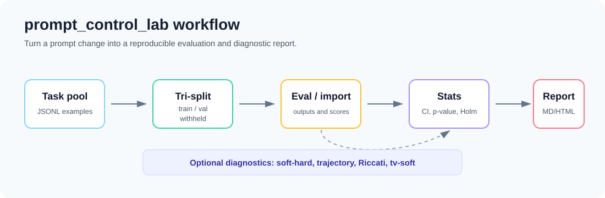

## Research Core

These are the paper-derived capabilities that drive the project:

| Paper concept | CLI / artifact | What it explains |
|---|---|---|
| Tri-split withheld protocol | `pcl split`, `pcl analyze`, `splits.json` | Whether prompt evaluation avoided train/validation/withheld leakage. |
| Paired statistical comparison | `pcl stats`, `stats.json` | Whether a prompt change is reliable under bootstrap CI, permutation p-value, and Holm correction. |
| Prompt-only comparison validity | `pcl validity`, `comparison_validity.json` | Whether a baseline/candidate result is clean prompt-only evidence rather than a model, split, or metric confound. |
| Prompt optimization evidence card | `pcl evidence-card`, `evidence_card.json/md/html` | One compact audit card for protocol hygiene, paired stats, comparison validity, deployment risk, hidden-state diagnostics, Riccati, and time-varying control evidence. |
| Evidence gate | `pcl evidence-gate`, `evidence_gate_result.json/md/html` | A reviewer/CI gate for source-input hashes and research-bundle verification, with gap and claim checks kept as advisory context. |
| Prompt optimization claim check | `pcl claim-check`, `claim_check.json/md/html` | Whether the recorded evidence supports a paired, partial-research, or full-research claim. |
| Soft-to-hard deployment gap | `pcl soft-hard`, `diagnostics/soft_hard.json` | Whether soft prompt gains survive nearest-token hard projection. |
| HuggingFace hidden-state extraction | `pcl extract-hidden`, `hidden_states.npz` | Turns open-model prompts into trajectory-ready hidden-state artifacts. |
| Hidden-state trajectory diagnostic | `pcl trajectory`, `diagnostics/trajectory.json` | Whether internal trajectories show drift, decay, or turnpike-like signals. |
| Riccati surrogate diagnostic | `pcl riccati`, `diagnostics/riccati.json` | Whether a fitted finite-dimensional surrogate is self-consistent and stable. |
| Time-varying soft-control lane | `pcl tv-soft`, `diagnostics/tv_soft.json` | Whether time-varying gains look like temporal structure rather than parameter capacity. |

To experience the whole research stack without preparing model artifacts first, run
`pcl research-demo --out runs/research-demo`. To apply the same unified diagnostic report to your
own soft prompts, hidden states, matrices, and method predictions, use `pcl diagnose`. Research
demo now also writes a synthetic tri-split, baseline/candidate scored runs, paired statistics,
prompt-only comparison validity, `evidence_card.json` / `.md` / `.html`,
`evidence_gate_result.json` / `.md` / `.html`, and `claim_check.json` / `.md` / `.html`.
The local UI surfaces a research evidence map, evidence gate status, the evidence card, and a claim
evidence ladder in the Research Overview, so reviewers can see whether the bundle has reproducible
source/bundle evidence, diagnostics, and claim support for paired, partial-research, or full-research claims.

See [Research From The Paper](docs/research_from_paper.en.md) for the direct mapping from paper
ideas to commands, inputs, outputs, and interpretation boundaries.

## Ecosystem Bridge

If you already use Promptfoo, DeepEval, Langfuse, or LangSmith, keep them. `prompt_control_lab`
imports their exported eval/trace artifacts and adds the research evidence layer they usually do
not provide: prompt-only validity, paired uncertainty, evidence cards, claim checks, source/bundle
hash verification, and paper-derived diagnostic gap tracking.

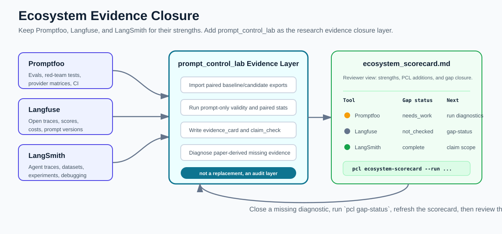

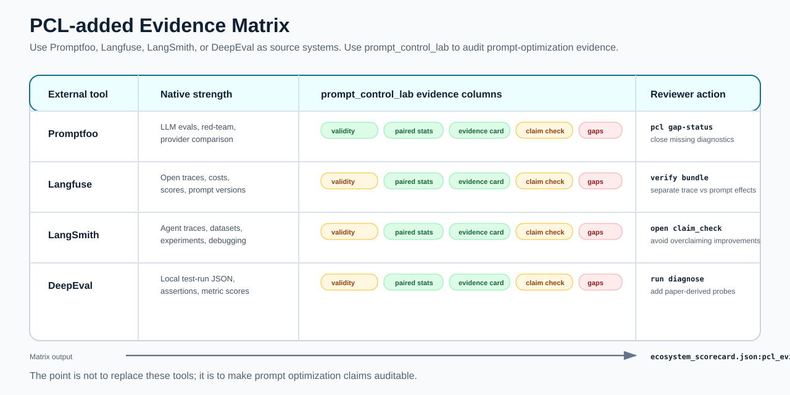

```bash
# Fast demo with bundled Promptfoo/DeepEval/Langfuse/LangSmith-style exports.
pcl ecosystem-demo --examples examples/external --out runs/ecosystem-demo

# One-pass reviewer evidence package: import external exports, compare, diagnose gaps,
# verify source inputs, verify the research bundle, and run the evidence gate.
pcl evidence-audit \
  --tool promptfoo \
  --baseline-input results.json \
  --candidate-input results.json \
  --baseline-prompt-id baseline \
  --candidate-prompt-id candidate \
  --provider openai:gpt-4o-mini-20260601 \
  --split-hash eval-split-2026-06 \
  --out runs/from-promptfoo-audit

# Smaller bridge when you already have two external exports.
pcl evidence-from \
  --tool promptfoo \
  --baseline-input results.json \
  --candidate-input results.json \
  --baseline-prompt-id baseline \
  --candidate-prompt-id candidate \
  --out runs/from-promptfoo-evidence

# Low-level import remains available for scripts and custom pipelines.
pcl import promptfoo --input results.json --out runs/from-promptfoo --prompt-id candidate
pcl import auto --input results.json --out runs/from-external --score-name exact_match
```

`pcl ingest` is kept as the backward-compatible alias. Use `pcl research-bundle --verify`,
`pcl source-verify --strict`, `pcl evidence-gate --strict`, and `pcl gap-status` when you need
reviewer/CI checks after the import. For the full walkthrough and tool-specific import examples,
see [Ecosystem Bridge](docs/ecosystem_bridge.en.md), [Comparison With Promptfoo, LangSmith,
Langfuse, and Prompt Optimizer](docs/comparison.en.md), and [examples/external](examples/external/).

Competitive wedge: adjacent tools already cover security testing, local eval, tracing,
observability, prompt management, and production workflows. PCL should win as the **research
evidence layer**: paired uncertainty, prompt-only validity, evidence cards, claim checks,
soft-hard gap analysis, hidden-state trajectory diagnostics, Riccati surrogates, and
time-varying control evidence.

## Applied Engineering Layer

The agent guard, model provenance, diff audit, GitHub Action, plugins, and UI are practical
applications built around the research core. They help teams use the same evidence trail when a
prompt is handed to Claude Code, Cursor, Codex, or another coding agent.

## Local Case Studies

A small local preflight pilot is included in [agent_guard_pilot.csv](docs/case_studies/agent_guard_pilot.csv). It contains 20 raw coding prompts paired with prompts produced by `pcl guard --profile coding --policy examples/guard.policy.yaml --token-mode balanced`.

| Metric | Local preflight pilot |
|---|---:|
| Paired prompts | 20 |
| Medium-risk prompts | 17 |
| High-risk prompts | 3 |
| Policy violations flagged | 84 |
| Avg raw estimated prompt tokens | 8.75 |
| Avg guarded estimated prompt tokens | 51.75 |

This is **not** a universal benchmark and does **not** claim task-success improvement. The paired agent executions were not run, so success/test/file-change fields are explicitly marked `not_run`. The pilot shows how the guard rewrites and classifies this prompt set before execution.

A second, real paired pilot is included in [agent_guard_paired_pilot.csv](docs/case_studies/agent_guard_paired_pilot.csv). It runs local Codex twice per task from the same fresh fixture repo: once with the raw prompt and once with the guarded prompt. The current set has 12 isolated Python tasks, including multi-file and stateful bug fixes.

| Metric | Raw agent | Guarded agent |
|---|---:|---:|
| Completed tasks | 12/12 | 12/12 |
| Tests passed | 12/12 | 12/12 |
| Average touched files | 1.25 | 1.0 |
| Total unexpected file edits | 3 | 0 |
| Average estimated prompt tokens | 8.08 | 51.08 |
| Average duration seconds | 173.74 | 119.97 |

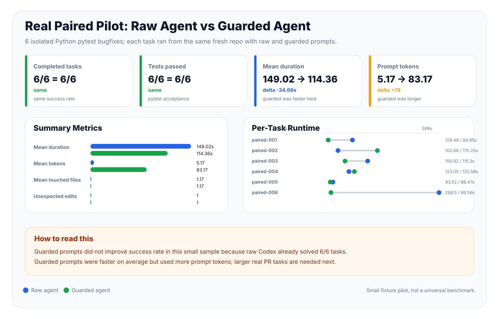

Interpretation: guarded prompts still did **not** improve success rate because raw Codex solved all 12 tasks too. After compacting the guard output, guarded prompts used fewer tokens than the earlier 83-token template but still more than raw prompts. In this run they touched fewer files, produced zero unexpected edits, and completed faster on average. See the full notes in [agent_guard_paired_pilot.en.md](docs/case_studies/agent_guard_paired_pilot.en.md).

## Demo And UI

The repository includes narrated 4K hands-on demo videos generated from real UI screenshots and scripted operation replay.

[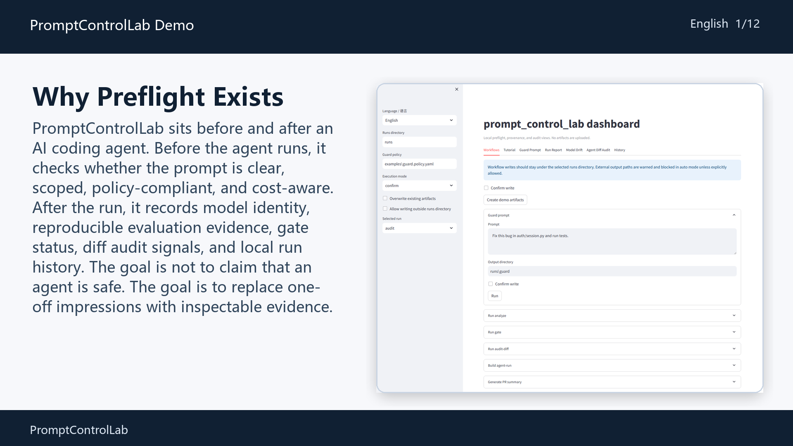](docs/assets/demo/prompt_control_lab_demo.en.mp4)

- [English MP4](docs/assets/demo/prompt_control_lab_demo.en.mp4)
- [English subtitles](docs/assets/demo/prompt_control_lab_demo.en.srt)
- [Chinese MP4](docs/assets/demo/prompt_control_lab_demo.zh.mp4)
- [Chinese subtitles](docs/assets/demo/prompt_control_lab_demo.zh.srt)

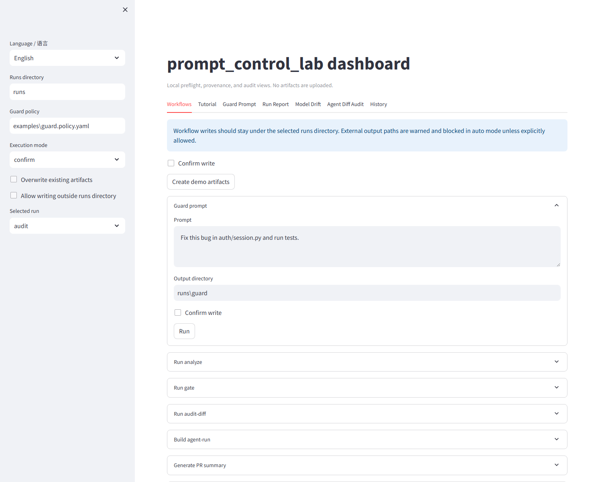

## Quick Map

1. `pcl research-demo`: generate synthetic paper-style inputs, a small comparison bundle, and all research diagnostics.
2. `pcl diagnose`: run soft-hard, trajectory, Riccati, and tv-soft as one diagnostic workflow.
3. `pcl split` / `pcl analyze`: tri-split prompt evaluation and report generation.
4. `pcl stats`: paired bootstrap CI, permutation p-value, and Holm correction.
5. `pcl validity`: check whether a baseline/candidate comparison is clean prompt-only evidence.
6. `pcl soft-hard`: soft-to-hard projection gap and deployment risk.
7. `pcl extract-hidden`: extract HuggingFace hidden states into trajectory-ready `.npz`.
8. `pcl trajectory`: hidden-state drift, decay slope, and turnpike-like signal.
9. `pcl riccati`: fitted finite-dimensional Riccati/DARE surrogate diagnostics.
10. `pcl tv-soft`: static/time-varying/shuffled/random soft-control comparison.
11. `pcl ecosystem-demo`: run all bundled external-tool bridge examples as one comparison bundle.
12. `pcl ecosystem-scorecard`: regenerate the cross-tool Promptfoo/DeepEval/Langfuse/LangSmith positioning scorecard.
13. `pcl evidence-audit`: import external exports, add PCL evidence, check gaps, verify source inputs, and verify the research bundle.
14. `pcl evidence-from`: import external baseline/candidate exports and generate a PCL evidence card in one command.
15. `pcl import auto` / `promptfoo` / `deepeval` / `langfuse` / `langsmith`: import external eval/trace artifacts into PCL research artifacts. `pcl ingest` is kept as the backward-compatible alias.
16. `pcl compare-runs`: turn two imported/scored runs into stats, validity, and a report in one command.
17. `pcl claim-check`: say what claim the current evidence tier can safely support.
18. `pcl report` / `pcl explain` / `pcl gate`: turn artifacts into readable decisions.
19. `pcl guard` / `pcl audit-diff`: applied AI coding agent preflight and post-run audit.

## Install The CLI ⚙️

Python 3.10 or newer is required. On some machines the command is `python`,
on others it is `python3` or `py -3.10`. If `pip install -e .` fails because
Python is not found, try:

```bash
python --version
python3 --version
py -3.10 --version
```

### 1. Clone the repository

```bash
git clone https://github.com/VeraPyuyi/prompt_control_lab.git
cd prompt_control_lab
```

If you already have the repository locally, just enter the repo folder.

### 2. Install the lightweight CLI

```bash
pip install -e .
```

With `uv`:

```bash
uv pip install -e .
```

### 3. Install development and research extras

Use this when you want tests plus optional scientific diagnostics:

```bash
pip install -e ".[dev,research]"
```

With `uv`:

```bash
uv pip install -e ".[dev,research]"
```

For HuggingFace hidden-state extraction, install the HF extra:

```bash
pip install -e ".[hf]"
```

Use a small local/open model first; this command loads the model on your machine.

### 4. Install local UI extras

Use this when you want the interactive dashboard:

```bash
pip install -e ".[ui]"
```

With `uv`:

```bash
uv pip install -e ".[ui]"
```

### 5. Build and test a local wheel

The PyPI package name is `promptcontrollab`. The repository and product name are
`prompt_control_lab`.

```bash
python -m build
pipx install dist/promptcontrollab-0.1.0-py3-none-any.whl
pcl doctor
```

If the package has not been published to PyPI in your environment, use the local wheel or editable
source install above. Do not use `prompt_control_lab` as the pip package name.

### 6. Check that the CLI works

```bash
pcl --help
pcl start --choice improve --prompt "Answer the user question."
pcl improve --prompt "Answer the user question."
pcl doctor
pcl ui --help
```

Expected result: `pcl --help` lists commands, `pcl start` shows the beginner path,
`pcl improve` prints an optimized prompt plus estimated token cost, and `pcl doctor` checks Python,
package import, CLI parser, guard policy parsing, Claude Code hook, Cursor MCP server, demo report
generation, API-key presence, and optional research dependencies.

## Optional Project Defaults ⚙️

`pcl init` now writes `.promptcontrol.yaml` next to `promptcontrol.example.yaml`. The project file
keeps local defaults for day-to-day commands:

```yaml
guard_policy: examples/guard.policy.yaml
gate_policy: examples/gate.policy.yaml
runs_dir: runs
expected_paths:
  - src
  - tests
test_commands:
  - pytest
allowed_models: gpt-4o,gpt-5.2
ui.default_view: workflows
```

CLI arguments still win. The precedence is: explicit CLI flags → command-specific config such as
`promptcontrol.example.yaml` → `.promptcontrol.yaml` → built-in defaults.

## Watch The Demo Videos 🎬

The repository includes two narrated 4K, hands-on demo videos. They use scripted UI operation
replay: enlarged dashboard screenshots, cursor movement, click highlights, typed command cards,
result callouts, and subtitles. English and Chinese versions walk through the same local workflow:
prompt guard, prompt improvement, analyze/gate/report, model provenance, agent diff audit, history,
plugins, CI, and advanced research diagnostics.

[](docs/assets/demo/prompt_control_lab_demo.en.mp4)

- [English MP4](docs/assets/demo/prompt_control_lab_demo.en.mp4)
- [English subtitles](docs/assets/demo/prompt_control_lab_demo.en.srt)
- [English storyboard](docs/demo/storyboard.en.md)

[](docs/assets/demo/prompt_control_lab_demo.zh.mp4)

- [中文 MP4](docs/assets/demo/prompt_control_lab_demo.zh.mp4)
- [中文字幕](docs/assets/demo/prompt_control_lab_demo.zh.srt)
- [中文分镜脚本](docs/demo/storyboard.zh.md)

The videos are generated reproducibly from [video_manifest.json](docs/demo/video_manifest.json)
and real UI screenshots with:

```bash
python scripts/build_demo_video.py
```

## Open The Local UI Dashboard 🖥️

The UI is a local Streamlit dashboard. It reads artifacts from disk and does not upload prompts,
code, or reports.

```bash
pcl ui --runs runs/ --port 8501
```

For a first demo:

```bash
pcl init --path demo
cd demo
pcl analyze --config promptcontrol.example.yaml --out runs/quick
pcl ui --runs runs/ --policy examples/guard.policy.yaml --port 8501
```

The local dashboard now opens with a **Research Overview** tab inspired by compact design-system
dashboards: paper diagnostics first, engineering agent views second. The **Tutorial** tab teaches
the workflow with screenshots from the current UI plus step-by-step instructions; the **Workflows** tab can run local actions
from the browser:
guard a prompt, run analyze, run gate, audit a git diff, build `agent_run.json`, generate a PR
summary, import Promptfoo/DeepEval/Langfuse/LangSmith exports into an external evidence bundle, or export a
report zip. Execution mode defaults to `confirm`; advanced users can choose
`auto` or `command`.

CLI equivalent for the zip export:

```bash
pcl export-report --run runs/quick --out runs/quick/report.zip
```

- **Workflows:** trigger allowlisted local workflows while previewing outputs before files are
  written, including `pcl evidence-from` for external eval/observability exports.
- **Tutorial:** learn each feature as “screenshot -> steps -> artifact -> meaning -> next step”,
  with synchronized English and Chinese UI screenshots.
- **Guard Prompt:** try `pcl guard` interactively and inspect risk, policy violations, token cost,
  and prompt diff.
- **Run Report:** read recommendation, gate status, score delta, confidence interval, p-value,
  slice scores, and model provenance.
- **Model Drift:** inspect provider/model records, alias risk, warnings, and drift artifacts.
- **Agent Diff Audit:** read `audit_result.json`, changed-file breakdown, dangerous paths, tests,
  and review requirement.
- **History:** inspect `history_index.json` timelines, gate trends, score trends, model changes,
  prompt identity, and risk category changes.


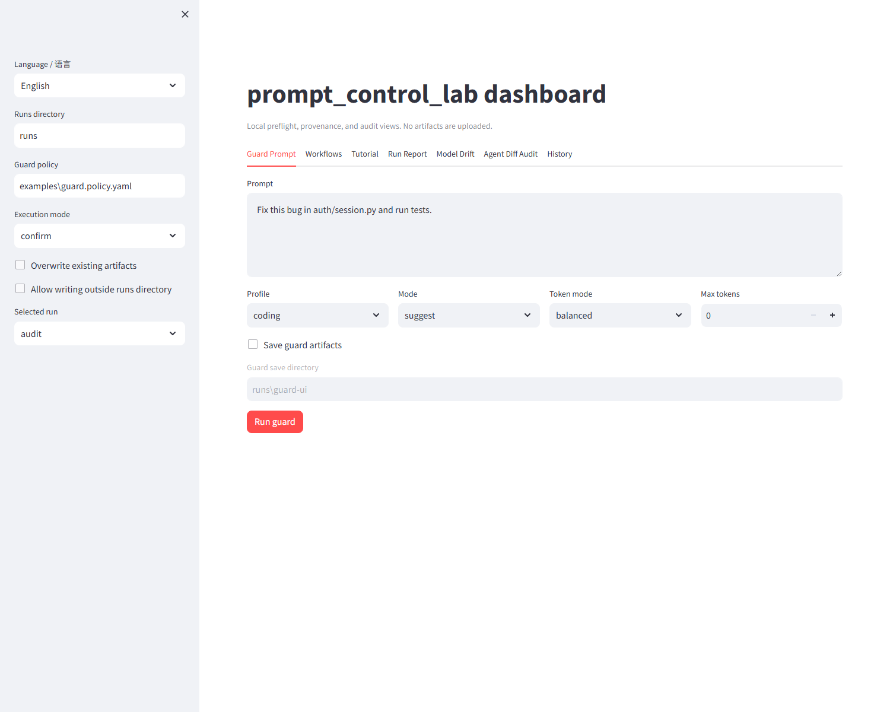

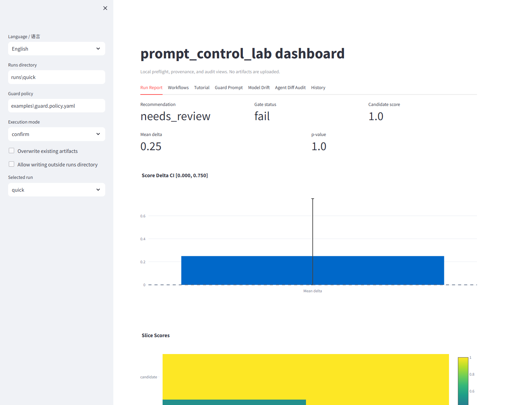

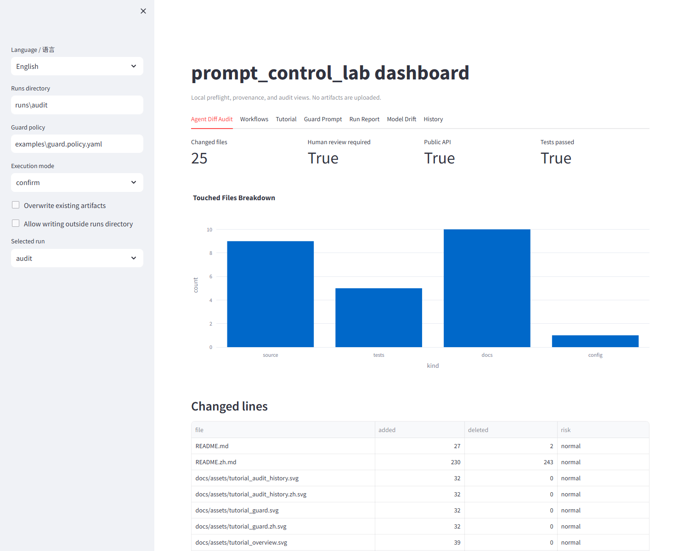

## Install IDE / CLI Plugins And Skills

All integrations are thin adapters around the same stable command:

```bash
pcl guard --prompt "Fix this bug" --profile coding --token-mode balanced --json
```

For local templates installed from a wheel, `pipx`, or `uvx`:

```bash
pcl install-plugin codex
pcl install-plugin cursor
pcl install-plugin claude-code
pcl install-plugin github-action
```

Existing files are not overwritten unless you pass `--force`. The adapters cover Claude Code hooks,
Cursor rules / MCP-style server, a Codex skill, generic shell wrappers, and a GitHub Action / PR
summary example. Detailed setup lives in [plugins/claude-code](plugins/claude-code),
[plugins/cursor](plugins/cursor), [plugins/codex](plugins/codex), and
[examples/github-action](examples/github-action/).

Boundary: `pcl guard` is a local heuristic and policy preflight. It catches obvious risk and missing
context, but it does not prove an agent action is safe.

## Command Cheat Sheet

For a detailed step-by-step tutorial, use [Tutorial](docs/tutorial.en.md) and
[Research From The Paper](docs/research_from_paper.en.md). The README keeps only the shortest paths.

| Goal | Command | What you get |
|---|---|---|
| Try the paper workflow | `pcl research-demo --out runs/research-demo` | synthetic tri-split, paired stats, validity, evidence card, claim check, evidence gate, soft-hard, trajectory, Riccati, and tv-soft artifacts |
| Run all paper diagnostics on your own artifacts | `pcl diagnose --run runs/research-demo` | one unified research diagnostic report |
| Improve one prompt | `pcl improve --prompt "Answer the user question."` | offline rewrite, token estimate, and diff |
| Guard an agent prompt | `pcl guard --prompt "Fix this bug" --profile coding --policy examples/guard.policy.yaml` | action, risk level, policy violations, improved prompt |
| Run quick evaluation | `pcl analyze --config promptcontrol.example.yaml --out runs/quick` | split, metrics, stats, explanation, gate, report |
| Check model provenance | `pcl model-detect --response response.json --provider openai` | public model id, provenance level, warnings |
| Audit model drift | `pcl model-drift --run runs/current --history runs/previous` | same/different model/provider and alias risk |
| Audit an agent diff | `pcl audit-diff --before HEAD~1 --after HEAD --out runs/audit` | touched files, changed lines, dangerous paths, tests, SARIF-ready findings |
| Build run history | `pcl history index --runs runs/ --out runs/history_index.json` | local run index for UI trends |
| Export reviewer bundle | `pcl export-report --run runs/quick --out runs/quick/report.zip` | zip of recognized artifacts |

Research diagnostics beyond output scores:

```bash
pcl soft-hard --soft soft_prompt.npz --vocab vocab_embeddings.npz --out runs/candidate/diagnostics
pcl extract-hidden --model Qwen/Qwen2.5-0.5B --prompts examples/tasks.jsonl --out runs/candidate/inputs/hidden_states.npz --max-items 32
pcl trajectory --states runs/candidate/inputs/hidden_states.npz --out runs/candidate/diagnostics
pcl riccati --matrices surrogate_mats.npz --out runs/candidate/diagnostics
pcl tv-soft --predictions method_predictions.jsonl --out runs/candidate/diagnostics
```

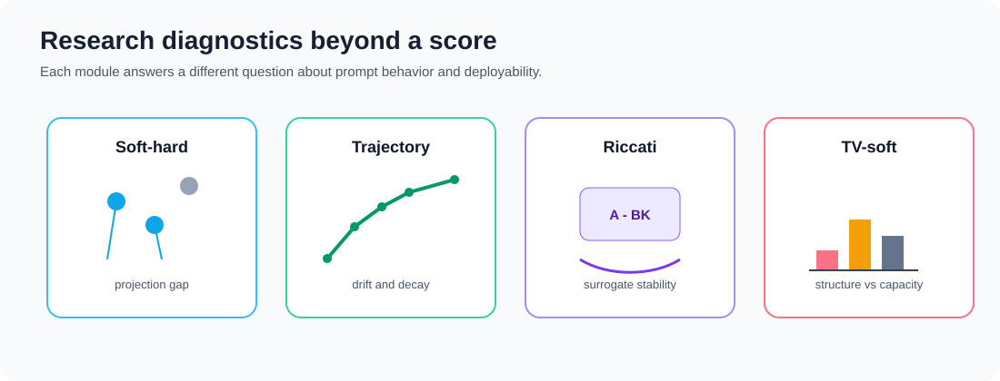

## Ecosystem Positioning 🌱

`prompt_control_lab` should not be read as another broad LLM dashboard or prompt manager. Its core
lane is **control-theoretic prompt diagnostics + reproducible prompt optimization evidence**.

Adjacent tools cover important neighboring layers:

- promptfoo and DeepEval focus on LLM evaluation, tests, red-team checks, and metrics.
- Langfuse, LangSmith, and Phoenix focus on traces, observability, experiments, and app-level evaluation.
- DSPy, TextGrad, and OpenPrompt focus on prompt/program optimization or prompt-learning workflows.
- `prompt_control_lab` adds paper-derived diagnostics around prompt optimization: tri-split
  protocol hygiene, paired statistical evidence, soft-hard deployment gap, hidden-state trajectory
  probes, Riccati surrogates, and time-varying soft-control comparisons.

The guard/policy/model-audit workflow remains useful, but it is an applied engineering layer around
the research diagnostics rather than the center of gravity.

The ecosystem bridge is deliberately narrow: import external eval/trace evidence first, then run
PCL's comparison validity and paper-derived diagnostics on top.
Use `pcl import ...` for a single external run and `pcl evidence-audit ...` when you need a
reviewer-facing evidence package that also checks source hashes, claim support, diagnostic gaps,
and bundle integrity.

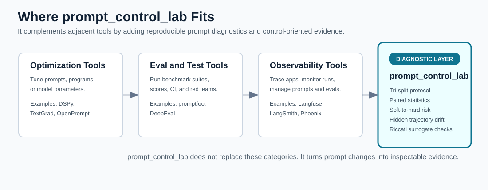

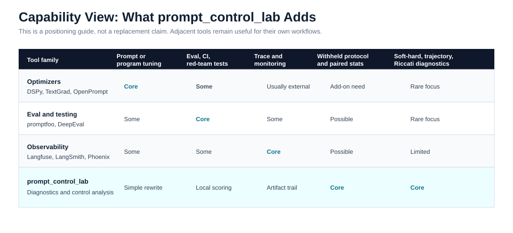

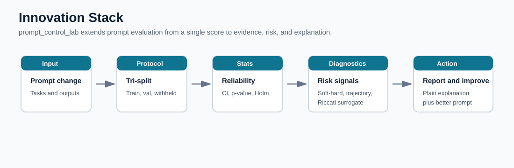

## Who It Is For 👥

- Researchers and reproducibility-focused teams comparing prompt methods with train/val/withheld
  splits and paired statistics.
- Prompt optimization and soft-prompt researchers studying soft-hard deployment risk,
  hidden-state trajectories, Riccati surrogates,
  and time-varying soft-control behavior.
- LLM teams that need prompt regression reports, model provenance, model drift warnings, and
  prompt-only comparison checks.
- Developers using Claude Code, Cursor, Codex, or shell-based coding agents who want to apply the
  same evidence trail to local agent runs.
- Engineering teams that need configurable prompt policy gates for risky, broad, destructive,
  security-sensitive, or untested coding requests.

## Documentation 📚

- [Background](docs/background.en.md)
- [Users](docs/users.en.md)
- [Tutorial](docs/tutorial.en.md)
- [Artifacts](docs/artifacts.en.md)
- [Research From The Paper](docs/research_from_paper.en.md)
- [Ecosystem Bridge](docs/ecosystem_bridge.en.md)
- [Comparison With Promptfoo, LangSmith, Langfuse, and Prompt Optimizer](docs/comparison.en.md)
- [Agent guard pilot case study](docs/case_studies/agent_guard_pilot.en.md)
- [Real paired agent pilot case study](docs/case_studies/agent_guard_paired_pilot.en.md)
- [Production pilot protocol](docs/production_pilot.en.md)
- [Release and install readiness](docs/release_install.en.md)
- [Innovation and Contribution](docs/innovation.en.md)
- [Decision Guide](docs/decision_guide.en.md)
- [Plugin adapters](plugins/)

## License 📄

Apache-2.0
