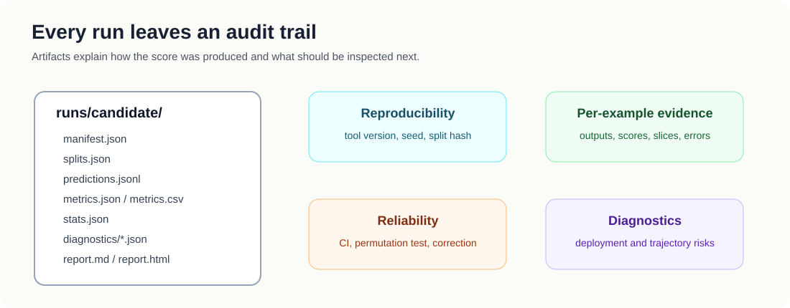
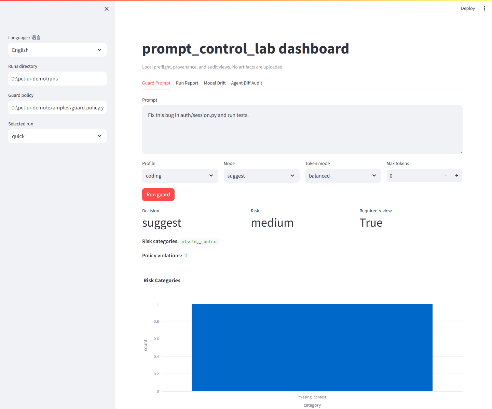
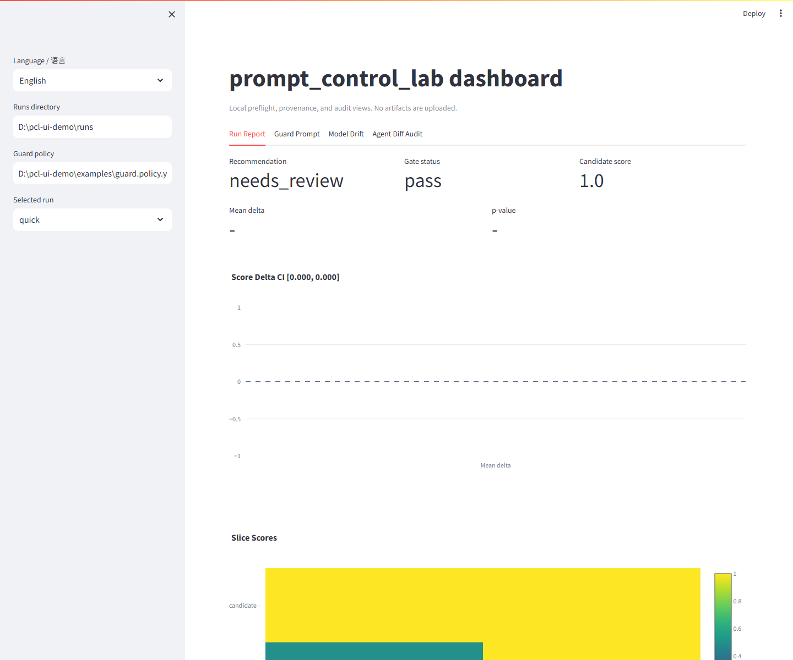

# prompt_control_lab 🧪✨

[](https://github.com/VeraPyuyi/prompt_control_lab/stargazers)
[](https://github.com/VeraPyuyi/prompt_control_lab/forks)
[](https://github.com/VeraPyuyi/prompt_control_lab/watchers)
[](LICENSE)
[](pyproject.toml)

**Preflight, provenance, and reproducible evaluation for AI coding agents.**

`prompt_control_lab` is not a generic prompt manager. It is a local safety belt for Claude Code,
Cursor, Codex, and other AI coding agents: before an agent spends tokens, edits files, or touches
your codebase, it checks whether the prompt is vague, risky, missing tests, too broad, or tied to
an untracked model change. ٩(ˊᗜˋ*)و

It also keeps prompt experiments reproducible: train/validation/withheld splits, paired
statistics, model provenance, model drift audits, readable reports, and optional research
diagnostics are saved as inspectable artifacts.

> 📌 The repository is currently private, so public badge services may show zero or unavailable
> counts until the repository is made public.

Chinese documentation is available in [README.zh.md](README.zh.md).

## Why This Exists 🚦

AI coding tools are already in the workflow, but trust has not caught up. Stack Overflow's 2025
Developer Survey reports that **84%** of developers use or plan to use AI tools in development,
while **46%** distrust AI output accuracy and **45%** say debugging AI-generated code is more
time-consuming ([AI survey](https://survey.stackoverflow.co/2025/ai),
[leaders summary](https://stackoverflow.co/internal/resources/2025-stack-overflow-developer-survey-for-leaders/ai-adoption/)).

That gap is where `prompt_control_lab` fits:

- **Before execution:** block or review vague, destructive, security-sensitive, broad, or
  over-budget prompts.
- **During evaluation:** check whether a candidate prompt really improves over a baseline, not
  just on a lucky validation slice.
- **After a run:** record which public model id/provider produced the result, and warn when model
  drift makes a prompt-only comparison invalid.

## Quick Map 🗺️
Use this order if you are new:

1. **Guard prompts before Claude Code / Cursor / Codex** → `pcl guard --policy`
2. **Audit model identity and drift** → `pcl model-detect` / `pcl model-drift`
3. **Generate a reproducible prompt report** → `pcl analyze` → `pcl gate`
4. **Audit what an agent changed** → `pcl audit-diff`
5. **Index and compare run history** → `pcl history index` / `pcl history compare`
6. **Check local setup** → `pcl doctor`
7. **Open the local dashboard** → `pcl ui`
8. **Improve one prompt in plain language** → `pcl improve`
9. **Install IDE / CLI adapters** → `plugins/` and Codex skills
10. **Control every evaluation step** → `split → eval → stats → report → explain → gate`
11. **Advanced / Research Mode** → `soft-hard → trajectory → riccati → tv-soft`

In this README, **Quick Mode** means the integrated `pcl analyze` path, while **Expert Mode**
means the flexible command-by-command workflow. Simple first, expert later.


The main idea is small and practical: do not let an AI coding agent run on trust alone. Keep the
prompt, policy decision, model record, split, outputs, statistics, explanations, and diagnostics as
inspectable artifacts.



## Two-Minute Demo: Stop Risky Agent Prompts Before They Run 🎬

Put `prompt_control_lab` between your prompt and the coding agent. Low-risk prompts pass with
clearer wording; medium-risk prompts ask for missing context; high-risk prompts can be blocked or
sent to human review.

### 0:00-0:15: start with a vague prompt

```text
Fix this bug.
```

Why this often fails: the agent does not know the target files, failing behavior, edit boundary,
or tests that should prove the fix.

### 0:15-0:45: run the local policy preflight

```bash
pcl guard \
  --prompt "Fix this bug" \
  --profile coding \
  --policy examples/guard.policy.yaml \
  --token-mode balanced \
  --json
```

Typical result:

```json
{
  "action": "suggest",
  "risk_level": "medium",
  "risk_categories": ["missing_context"],
  "required_review": true,
  "policy_violations": [
    {"id": "missing_target_files", "severity": "medium"}
  ],
  "improved_prompt": "Fix the reported bug with the smallest safe code change..."
}
```

### 0:45-1:10: block dangerous instructions

```bash
pcl guard \
  --prompt "Delete database and remove auth" \
  --profile coding \
  --policy examples/guard.policy.yaml \
  --mode gate \
  --json
```

The JSON output exposes `risk_level`, `risk_categories`, `policy_violations`,
`required_review`, and `action`, so Claude Code hooks, Cursor MCP-style tools, Codex skills, and
shell wrappers can stop the agent before it touches the repo.

### 1:10-1:40: compare raw vs guarded prompts

| item | raw prompt | guarded prompt |
|---|---|---|
| Scope | unclear | asks for failing behavior and relevant files |
| Edit boundary | missing | says not to refactor unrelated code |
| Tests | missing | asks the agent to list and run relevant tests |
| Model record | usually absent | can be attached to later eval artifacts |
| Token cost | uncontrolled | estimated and constrained by token mode |
| Agent risk | unchecked | reviewed before expensive execution |

Example guarded prompt:

```text
Fix the reported bug with the smallest safe code change.

Before editing:
1. Identify the failing behavior and relevant files.
2. State the likely root cause.
3. List the tests you will run.

Constraints:
- Do not refactor unrelated code.
- Do not change public APIs unless necessary.
- Keep the patch minimal and explain every changed file.

After editing:
1. Run the relevant tests.
2. Summarize the fix.
3. Mention any remaining uncertainty.
```

### 1:40-2:00: turn prompt changes into evidence

```bash
pcl init --path demo
cd demo
pcl analyze --config promptcontrol.example.yaml --out runs/quick
```

The smoke demo writes `runs/quick/report.md`, `report.html`, `stats.json`, and
`explanation.json`. It proves the pipeline works end to end; it is not a claim that every real
agent task improves.

## Install The CLI ⚙️

Python 3.10 or newer is required. On some machines the command is `python`,
on others it is `python3` or `py -3.10`. If `pip install -e .` fails because
Python is not found, try:

```bash
python --version
python3 --version
py -3.10 --version
```

### 1. Clone the repository

```bash
git clone https://github.com/VeraPyuyi/prompt_control_lab.git
cd prompt_control_lab
```

If you already have the repository locally, just enter the repo folder.

### 2. Install the lightweight CLI

```bash
pip install -e .
```

With `uv`:

```bash
uv pip install -e .
```

### 3. Install development and research extras

Use this when you want tests plus optional scientific diagnostics:

```bash
pip install -e ".[dev,research]"
```

With `uv`:

```bash
uv pip install -e ".[dev,research]"
```

### 4. Install local UI extras

Use this when you want the interactive dashboard:

```bash
pip install -e ".[ui]"
```

With `uv`:

```bash
uv pip install -e ".[ui]"
```

### 5. Check that the CLI works

```bash
pcl --help
pcl start --choice improve --prompt "Answer the user question."
pcl improve --prompt "Answer the user question."
pcl doctor
pcl ui --help
```

Expected result: `pcl --help` lists commands, `pcl start` shows the beginner path,
`pcl improve` prints an optimized prompt plus estimated token cost, and `pcl doctor` checks Python,
package import, CLI parser, guard policy parsing, Claude Code hook, Cursor MCP server, demo report
generation, API-key presence, and optional research dependencies.

## Open The Local UI Dashboard 🖥️

The UI is a local Streamlit dashboard. It reads artifacts from disk and does not upload prompts,
code, or reports.

```bash
pcl ui --runs runs/ --port 8501
```

For a first demo:

```bash
pcl init --path demo
cd demo
pcl analyze --config promptcontrol.example.yaml --out runs/quick
pcl ui --runs runs/ --policy examples/guard.policy.yaml --port 8501
```

The first MVP has four tabs:

- **Guard Prompt:** try `pcl guard` interactively and inspect risk, policy violations, token cost,
  and prompt diff.
- **Run Report:** read recommendation, gate status, score delta, confidence interval, p-value,
  slice scores, and model provenance.
- **Model Drift:** inspect provider/model records, alias risk, warnings, and drift artifacts.
- **Agent Diff Audit:** read `audit_result.json`, changed-file breakdown, dangerous paths, tests,
  and review requirement.





## Install IDE / CLI Plugins And Skills 🧩

All integrations are thin adapters around the same stable command:

```bash
pcl guard --prompt "Fix this bug" --profile coding --token-mode balanced --json
```

For hooks and wrappers, use stdin:

```bash
echo "Fix this bug" | pcl guard --stdin --profile coding --json
```

### Claude Code Hook 🪝

Claude Code supports `UserPromptSubmit` hooks. This repository includes a working hook:

```text
plugins/claude-code/hooks/prompt_guard.py
```

Install steps:

1. Install the CLI first with `pip install -e .`.
2. Open your Claude Code settings file.
3. Add a `UserPromptSubmit` hook like this:

```json
{
  "hooks": {
    "UserPromptSubmit": [
      {
        "hooks": [
          {
            "type": "command",
            "command": "python \"D:/path/to/prompt_control_lab/plugins/claude-code/hooks/prompt_guard.py\" --mode suggest --profile coding --token-mode balanced --max-tokens 300 --policy \"D:/path/to/prompt_control_lab/examples/guard.policy.yaml\""
          }
        ]
      }
    ]
  }
}
```

4. Adjust the path to your local checkout.
5. Test the hook manually:

```powershell
'{"hook_event_name":"UserPromptSubmit","prompt":"Fix this bug"}' |
  python plugins\claude-code\hooks\prompt_guard.py --mode suggest --profile coding
```

Expected result: JSON with `additionalContext`. In `--mode gate`, risky prompts can return
`decision: "block"` with a clear reason. (ง •̀_•́)ง

More details: [plugins/claude-code](plugins/claude-code).

### Cursor Rules 🖱️

Cursor can be used in two layers: a simple rules workflow, or an optional MCP-style
server that exposes `guard_prompt` as a callable tool.

Install steps inside a Cursor project:

```powershell
New-Item -ItemType Directory -Force .cursor\rules
Copy-Item plugins\cursor\rules\prompt_control_lab.mdc .cursor\rules\prompt_control_lab.mdc
```

Then ask Cursor to follow the rule, or run this before sending an expensive prompt:

```bash
pcl guard --prompt "Refactor this module" --profile coding --token-mode balanced
```

Expected result: Cursor has a project rule that nudges agents to use `pcl guard` for vague,
broad, risky, or expensive prompts. This is not full prompt interception yet; it is a practical
rules workflow.

Optional MCP-style server:

```bash
python plugins/cursor/mcp_server.py
```

Point your Cursor MCP configuration at that command if your Cursor setup supports local MCP
servers. Expected result: Cursor can call `guard_prompt` and display the returned
`plain_summary`, `risk_level`, `improved_prompt`, and token estimate.

More details: [plugins/cursor](plugins/cursor).

### Codex Skill 🛠️

The repository includes a local Codex skill template:

```text
plugins/codex/skills/prompt_control_lab/SKILL.md
```

Install steps on Windows PowerShell:

```powershell
New-Item -ItemType Directory -Force "$env:USERPROFILE\.codex\skills\prompt_control_lab"
Copy-Item -Recurse -Force .\plugins\codex\skills\prompt_control_lab\* "$env:USERPROFILE\.codex\skills\prompt_control_lab\"
```

Then restart Codex so it can discover the skill. Use it when you want Codex to guard a prompt
before doing expensive work:

```text
$prompt_control_lab Guard this prompt before implementation: "Build the feature"
```

Expected result: Codex should consult the skill instructions and use `pcl guard` before
turning the prompt into a larger coding task. (｡•̀ᴗ-)✧

More details: [plugins/codex](plugins/codex).

### Generic Shell Wrapper 🐚

Any CLI tool can use the JSON interface:

```bash
echo "Write tests for this feature" | pcl guard --stdin --profile coding --json
```

Use the `improved_prompt` field as the prompt sent to your agent, or use `action=block` as
a stop signal in gate mode.

Boundary: `pcl guard` is a local heuristic and policy preflight. It catches obvious risk and
missing context, but it does not prove an agent action is safe.

### GitHub Action / PR Comment Example 🧪

The repository includes a copy-ready workflow template:

```text
examples/github-action/prompt-control-lab-gate.yml
```

Copy it into `.github/workflows/` when you want PRs to run `pcl gate`, optionally audit the PR
diff with `pcl audit-diff`, and post a short PromptControlLab result comment.

## Feature Path: Simple To Expert 🚀

The sections below are ordered from direct, friendly workflows to more flexible research tools.

### 1. `pcl start`: beginner scenario menu 🌈

Operation:

```bash
pcl start
```

Non-interactive operation:

```bash
pcl start --choice improve --prompt "Answer the user question."
pcl start --choice guard --prompt "Fix this bug"
```

Result:

- a simple menu with three scenarios: improve, guard, or analyze
- plain-language output without needing to understand `profile`, `gate`, or JSON first
- all expert commands remain available after the beginner path

What it means:

Use this when you only know what you want in ordinary language: make the prompt clearer,
check whether it is too broad, or learn how to generate a full report.

### 2. `pcl improve`: rewrite one prompt directly ✨

Operation:

```bash
pcl improve --prompt "Answer the user question."
```

Token-conscious operation:

```bash
pcl improve --prompt "Answer the user question." --token-mode aggressive --max-tokens 80
```

Result:

- optimized prompt in the terminal
- estimated token count before and after rewriting
- with `--out runs/improve`: `improved_prompt.txt`, `prompt_improvement.json`, `prompt_diff.md`

What it means:

Use this when you only have a prompt string. It adds task goal, output-format constraints,
stability rules, and optional token-budget pressure without calling any external model.

### 3. `pcl guard`: protect prompts before IDE or CLI agents use them 🛡️

Operation:

```bash
pcl guard --prompt "Fix this bug" --profile coding --token-mode balanced --json
```

Gate operation:

```bash
echo "Answer the user question." | pcl guard --stdin --mode gate --max-tokens 80 --json
```

Team policy operation:

```bash
pcl guard --prompt "Fix this bug" \
  --profile coding \
  --policy examples/guard.policy.yaml \
  --json
```

Result:

- `plain_summary`: a human-readable sentence for non-technical users
- `action`: `suggest`, `auto`, or `block`
- `risk_level`: `low`, `medium`, or `high`
- `improved_prompt`: guarded prompt
- `token_report`: estimated token cost
- `reasons`: why the guard suggested or blocked
- `risk_categories`: examples include `destructive_change`, `security`, `production_path`,
  `broad_refactor`, `token_budget`, or team policy categories
- `policy_violations`: exact policy or built-in guard violations
- `required_review`: whether a human should review before execution

What it means:

Use this before Claude Code, Cursor, Codex, or a shell wrapper spends tokens. It catches vague,
over-budget, dangerous, or underspecified prompts early. With `--policy`, teams can turn it into
a configurable preflight gate for AI coding agents.

Policy files are dependency-free: the bundled example uses flat keys such as
`rule.destructive_action.patterns`, and v0.1 also accepts a small nested `rules:` form for users
who naturally write YAML lists.

### 4. `pcl analyze`: one command, one report 📦

Operation:

```bash
pcl init --path demo
cd demo
pcl analyze --config promptcontrol.example.yaml --out runs/quick
```

Result:

- `runs/quick/splits.json`
- `runs/quick/baseline/metrics.json`
- `runs/quick/candidate/metrics.json`
- `runs/quick/stats.json`
- `runs/quick/explanation.json`
- `runs/quick/report.md`
- `runs/quick/report.html`

What it means:

This is the easiest full evaluation path. It answers: did the candidate improve, is the
evidence reliable, did any task slice regress, and what should be checked next?

### 5. `pcl model-detect`: record model identity 🔎

Operations:

```bash
pcl model-detect --response response.json --provider openai
pcl model-detect --predictions examples/predictions_candidate.jsonl
pcl model-detect --model gpt-5.2 --provider openai --verify
```

Result:

```json
{
  "provider": "openai",
  "model_id": "gpt-5.2",
  "source": "response.model",
  "confidence": "high",
  "verified": false,
  "warnings": []
}
```

What it means:

This records the public model id declared in API responses, prediction files, or command-line
metadata. It helps answer whether a baseline and candidate were run on the same model. It does
not prove the provider's hidden internal weight build.

You can also attach model identity to evaluation artifacts:

```bash
pcl eval --data examples/tasks.jsonl \
  --predictions examples/predictions_candidate.jsonl \
  --out runs/candidate \
  --method candidate \
  --provider openai \
  --model gpt-5.2

pcl analyze --config promptcontrol.example.yaml \
  --baseline-model gpt-4o \
  --candidate-model gpt-5.2
```

If baseline and candidate use different model ids, `report.md` shows a warning because the
comparison is no longer prompt-only.

Model drift audit:

```bash
pcl model-drift --run runs/current --history runs/previous --out runs/current/model_drift.json
```

This reports whether a prompt comparison is clean or confounded by a model/provider change or
alias model id.

### 6. `pcl audit-diff`: inspect what the agent changed 🔎

Operation:

```bash
pcl audit-diff --before HEAD~1 --after HEAD --out runs/audit
```

Optional scope and tests:

```bash
pcl audit-diff \
  --before HEAD~1 \
  --after HEAD \
  --expected-path src \
  --test-command "pytest tests/test_session.py" \
  --out runs/audit
```

By default, `--test-command` runs without shell control syntax, records stdout/stderr snippets,
and times out per command. Prefer `--tests-run` / `--tests-passed` when tests were already run
elsewhere. Use `--allow-shell-test-command` only for trusted local input.

Result:

- `runs/audit/audit_result.json`
- `runs/audit/audit_summary.md`

What it means:

Use this after a coding agent runs. It records touched files, source/test/docs/config changes,
dangerous paths such as auth or billing code, public API changes, test evidence, unexpected file
edits, and whether human review is required.

### 7. `pcl history`: index and compare runs 🧭

Operations:

```bash
pcl history index --runs runs/ --out runs/history_index.json
pcl history compare --a runs/old --b runs/new --out runs/history_compare.json
```

What it means:

The index turns run directories into a small local history. The comparison highlights prompt
identity changes, model/provider changes, score deltas, gate status changes, slice regressions,
and new risk categories.

### 8. `pcl init`: create a runnable example 🌱

Operation:

```bash
pcl init --path demo
cd demo
```

Result:

- `examples/tasks.jsonl`
- `examples/predictions_baseline.jsonl`
- `examples/predictions_candidate.jsonl`
- `examples/guard.policy.yaml`
- `examples/gate.policy.yaml`
- `promptcontrol.example.yaml`

What it means:

These files show the minimal input format: task `id`, `input`, `expected`, `slice`, model
`output`, and optional `provider` / `model` provenance records.

### 9. `pcl report`, `pcl explain`, `pcl gate`: read and decide ✅

Operations:

```bash
pcl report --run runs/quick --title "Candidate Prompt Report"
pcl explain --run runs/quick --level plain
pcl gate --run runs/quick --policy examples/gate.policy.yaml
```

Result:

- `report.md` / `report.html`
- `explanation.json`
- `gate_result.json`
- a top-of-report deployment recommendation: `yes`, `no`, or `needs_review`

What it means:

These commands turn artifacts into decisions: keep the prompt, review it, or hold it.
The gate can check metrics, statistical evidence, soft-hard risk, and model provenance.

### 10. Expert evaluation: `split → eval → stats` 🧠

Operations:

```bash
pcl split --data examples/tasks.jsonl --out runs/candidate --seed 0
pcl eval --data examples/tasks.jsonl --predictions examples/predictions_candidate.jsonl --out runs/candidate --method candidate
pcl stats --baseline runs/baseline/predictions.jsonl --candidate runs/candidate/predictions.jsonl --out runs/candidate/stats.json
```

Result:

- reproducible train/val/withheld split
- scored predictions and slice metrics
- paired confidence intervals, permutation p-values, and Holm-adjusted p-values

What it means:

This is for users who want full control over protocol hygiene and statistical comparison.

### 11. Advanced / Research Mode diagnostics 🔬

Soft-to-hard risk:

```bash
pcl soft-hard --soft soft_prompt.npz --vocab vocab_embeddings.npz --out runs/candidate/diagnostics
```

Hidden-state trajectory:

```bash
pcl trajectory --states hidden_states.npz --out runs/candidate/diagnostics
```

Riccati surrogate:

```bash
pcl riccati --matrices surrogate_mats.npz --out runs/candidate/diagnostics
```

Time-varying soft-control lane:

```bash
pcl tv-soft --predictions method_predictions.jsonl --out runs/candidate/diagnostics
```

What it means:

These commands move beyond output scores. They inspect soft-to-hard deployment risk,
hidden-state drift, fitted surrogate stability, and whether time-varying gains look like
temporal structure or just extra capacity.


## Ecosystem Positioning 🌱

`prompt_control_lab` should not be read as another broad LLM dashboard. Its narrow, practical lane
is **agent prompt preflight + model provenance + reproducible prompt regression**.

Adjacent tools cover important neighboring layers:

- promptfoo and DeepEval focus on LLM evaluation, tests, red-team checks, and metrics.
- Langfuse, LangSmith, and Phoenix focus on traces, observability, experiments, and app-level evaluation.
- DSPy, TextGrad, and OpenPrompt focus on prompt/program optimization or prompt-learning workflows.
- `prompt_control_lab` adds a lightweight local gate before AI coding agents execute, then records
  prompt-only comparison validity, model provenance, statistical evidence, and research diagnostics.

The research modules connect to the control-theoretic framing behind the project, but the most
practical engineering value is the guard/policy/model-audit workflow around real coding agents.


## Who It Is For 👥

- Developers using Claude Code, Cursor, Codex, or shell-based coding agents who want a local
  preflight before prompts reach the agent.
- Engineering teams that need configurable prompt policy gates for risky, broad, destructive,
  security-sensitive, or untested coding requests.
- LLM teams that need prompt regression reports, model provenance, model drift warnings, and
  prompt-only comparison checks.
- Researchers and reproducibility-focused teams comparing prompt methods with train/val/withheld
  splits and paired statistics.
- Advanced users studying soft-hard deployment risk, hidden-state trajectories, Riccati surrogates,
  and time-varying soft-control behavior.

## Documentation 📚

- [Background](docs/background.en.md)
- [Users](docs/users.en.md)
- [Tutorial](docs/tutorial.en.md)
- [Artifacts](docs/artifacts.en.md)
- [Agent guard pilot case study](docs/case_studies/agent_guard_pilot.en.md)
- [Innovation and Contribution](docs/innovation.en.md)
- [Decision Guide](docs/decision_guide.en.md)
- [Plugin adapters](plugins/)

## License 📄

Apache-2.0
