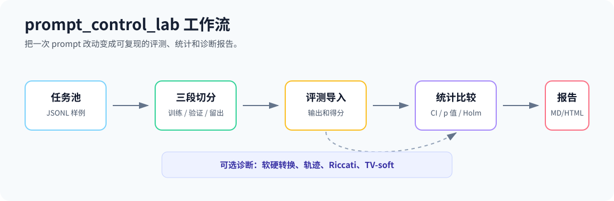
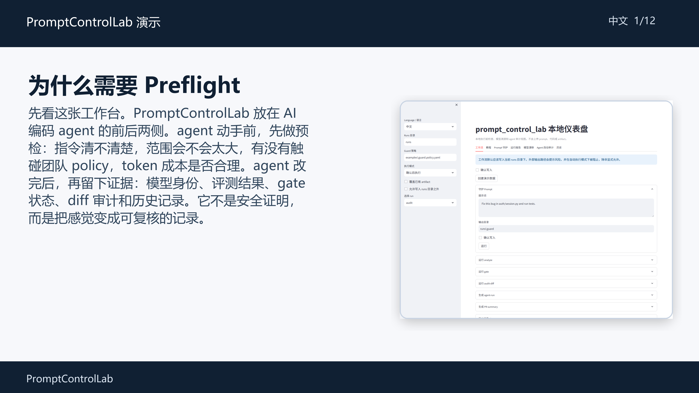
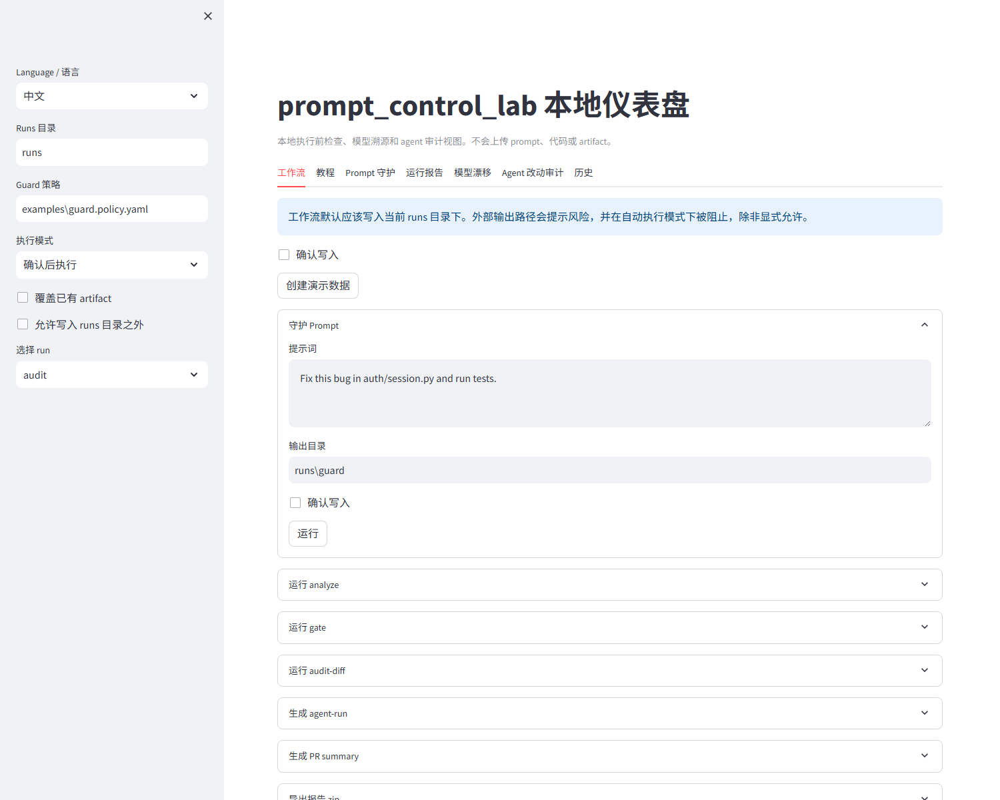
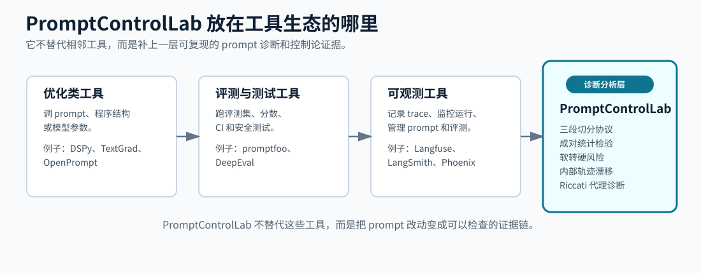

# prompt_control_lab

[](https://github.com/VeraPyuyi/prompt_control_lab/stargazers)
[](https://github.com/VeraPyuyi/prompt_control_lab/forks)
[](https://github.com/VeraPyuyi/prompt_control_lab/watchers)
[](LICENSE)
[](pyproject.toml)

**AI 编程 Agent 的执行前检查、模型溯源和可复现评测工具。**

`prompt_control_lab` 是 Claude Code、Cursor、Codex 和 shell 型 coding agent 的本地治理层。Agent 花 token 或改仓库之前，它可以先检查 prompt、应用团队策略、记录公开模型身份、审计 diff，并把运行过程保存成可复核 artifact。

Python 包名是 `promptcontrollab`。仓库和项目品牌名是 `prompt_control_lab`。

English documentation is available in [README.md](README.md).

## 2 分钟上手

```bash
# 1. 在 agent 执行前检查高风险 prompt。
pcl guard --prompt "Fix this bug" --profile coding --policy examples/guard.policy.yaml --json

# 2. 生成可复现 prompt 报告。
pcl analyze --config promptcontrol.example.yaml --out runs/quick

# 3. 打开本地仪表盘。
pcl ui --runs runs/ --policy examples/guard.policy.yaml --port 8501
```

你会得到：prompt 风险、guarded prompt、模型溯源、metrics、stats、gate 结果、diff 审计、报告 artifact 和本地 UI。仪表盘不会上传 prompt、代码或 artifact。

## 为什么需要它

AI 编程工具已经进入开发工作流，但信任还没有完全跟上。Stack Overflow 2025 Developer Survey 显示，**84%** 的开发者正在使用或计划使用 AI 工具，但 **46%** 不信任 AI 输出准确性，**45%** 认为 debug AI 生成代码更耗时（[AI survey](https://survey.stackoverflow.co/2025/ai)，[leaders summary](https://stackoverflow.co/internal/resources/2025-stack-overflow-developer-survey-for-leaders/ai-adoption/)）。

`prompt_control_lab` 聚焦一个很窄但实用的缺口：本地 agent prompt preflight、模型溯源、可复现 prompt regression，以及 agent 执行后的 diff 审计。



## 本地 Case Study

仓库包含一个小样本本地 preflight 试点：[agent_guard_pilot.csv](docs/case_studies/agent_guard_pilot.csv)。它记录 20 条原始 coding prompt，以及通过 `pcl guard --profile coding --policy examples/guard.policy.yaml --token-mode balanced` 得到的 guarded prompt。

| 指标 | 本地 preflight 试点 |
|---|---:|
| 成对 prompt 数 | 20 |
| 中风险 prompt | 17 |
| 高风险 prompt | 3 |
| 标记出的策略违规 | 84 |
| 原始 prompt 平均估算 token | 22.75 |
| guarded prompt 平均估算 token | 86.75 |

这不是通用 benchmark，也不声称任务成功率提升。本批次没有执行 raw-agent vs guarded-agent 双跑，所以成功率、测试、文件改动字段都明确标记为 `not_run`。它说明的是：guard 在执行前如何改写和分类这批 prompt。

仓库还包含一个真实成对试点：[agent_guard_paired_pilot.csv](docs/case_studies/agent_guard_paired_pilot.csv)。它让本地 Codex 对每个任务运行两次：一次使用 raw prompt，一次使用 guarded prompt，并且两侧都从同一个干净 fixture repo 开始。

| 指标 | Raw agent | Guarded agent |
|---|---:|---:|
| 完成任务 | 6/6 | 6/6 |
| 测试通过 | 6/6 | 6/6 |
| 平均触碰文件数 | 1.17 | 1.17 |
| 非预期文件改动总数 | 1 | 1 |
| 平均估算 prompt token | 5.17 | 83.17 |
| 平均耗时秒数 | 149.02 | 114.36 |

解读：在这组小型 fixture 任务里，guarded prompt **没有提升成功率**，因为 raw Codex 已经完成全部 6 个任务；guarded prompt 在本次样本中平均更快，但 prompt token 用量更多。完整说明见 [agent_guard_paired_pilot.zh.md](docs/case_studies/agent_guard_paired_pilot.zh.md)。

## 安装

需要 Python 3.10 或更新版本。

```bash
git clone https://github.com/VeraPyuyi/prompt_control_lab.git
cd prompt_control_lab
pip install -e .
pcl doctor
```

安装本地 UI：

```bash
pip install -e ".[ui]"
pcl ui --runs runs/ --policy examples/guard.policy.yaml --port 8501
```

本地构建 wheel 后，可以用 `pipx` 安装：

```bash
python -m build
pipx install dist/promptcontrollab-0.1.0-py3-none-any.whl
pcl doctor
```

如果没有发布到 PyPI，请使用本地 wheel 或源码安装，不要把 `prompt_control_lab` 当成 pip 包名；Python 包名是 `promptcontrollab`。

## 演示视频和 UI

仓库包含 4K 实操型双语演示视频，由真实 UI 截图和脚本化操作回放生成。

[](docs/assets/demo/prompt_control_lab_demo.zh.mp4)

- [中文 MP4](docs/assets/demo/prompt_control_lab_demo.zh.mp4)
- [中文字幕](docs/assets/demo/prompt_control_lab_demo.zh.srt)
- [English MP4](docs/assets/demo/prompt_control_lab_demo.en.mp4)
- [English subtitles](docs/assets/demo/prompt_control_lab_demo.en.srt)



## 功能地图

| 场景 | 命令 | 说明 |
|---|---|---|
| 新手菜单 | `pcl start` | 选择 improve、guard 或 analyze。 |
| 执行前门禁 | `pcl guard` | 检查模糊、危险、过宽、缺测试或超预算 prompt。 |
| 直接优化 prompt | `pcl improve` | 输入一句 prompt，得到更清晰的版本。 |
| 可复现评测 | `pcl analyze` -> `pcl gate` | 生成 split、metrics、stats、explanation、report 和 gate。 |
| 模型溯源 | `pcl model-detect` / `pcl model-drift` | 记录公开模型 id、可信等级、漂移 warning。 |
| Agent diff 审计 | `pcl audit-diff` | 检查改动文件、危险路径、secret、依赖、workflow、SARIF。 |
| 历史视图 | `pcl history` | 索引和比较多次 run。 |
| 本地仪表盘 | `pcl ui` | 交互式 guard、report、drift、audit、history、tutorial。 |
| 插件模板 | `pcl install-plugin` | 安装 Claude Code、Cursor、Codex、GitHub Action 模板。 |
| 研究诊断 | `soft-hard` / `trajectory` / `riccati` / `tv-soft` | 论文相关的高级诊断。 |

## 模型追溯边界

`pcl model-detect` 记录的是公开模型 id 和证据，不声称能证明服务商隐藏的内部权重版本。

可信等级包括：

| 等级 | 含义 |
|---|---|
| `level_0_declared_by_user` | 用户或配置声明的 model id。 |
| `level_1_observed_in_response` | 从 response 或 prediction artifact 观察到的 model id。 |
| `level_2_provider_metadata_verified` | 通过 provider metadata 接口确认公开 model object。 |
| `level_3_provider_log_reference_recorded` | 记录了 provider 侧日志引用。 |
| `level_4_signed_receipt_recorded` | 记录了签名收据引用；这不等于已经完成签名验真。 |

如果中间人能篡改 response，单独的 `response.model` 不再是强证据。应结合 TLS、request id、response hash、provider log 和签名收据来提高可信度。

## 插件和 CI

```bash
pcl install-plugin codex
pcl install-plugin cursor
pcl install-plugin claude-code
pcl install-plugin github-action
```

这些模板都围绕 `pcl guard --json` 和 policy gate 工作。GitHub Action 示例可以运行 `pcl gate`、可选 `pcl audit-diff`，并发布 PR summary。

## 生态定位

`prompt_control_lab` 不应该被理解成另一个宽泛 LLM dashboard。它的定位是：

**agent prompt preflight + model provenance + reproducible prompt regression + agent diff audit。**

它与 promptfoo、DeepEval、LangSmith、Langfuse 互补：那些工具更偏 eval、red-team、observability 或 prompt management；`prompt_control_lab` 更偏本地 coding agent 执行前门禁和运行证据。



## 文档

- [使用背景](docs/background.zh.md)
- [面向用户](docs/users.zh.md)
- [一步一步教程](docs/tutorial.zh.md)
- [Artifact 说明](docs/artifacts.zh.md)
- [创新点和贡献](docs/innovation.zh.md)
- [决策指南](docs/decision_guide.zh.md)
- [Agent guard 试点 case study](docs/case_studies/agent_guard_pilot.zh.md)
- [真实成对 agent 试点 case study](docs/case_studies/agent_guard_paired_pilot.zh.md)

## License

Apache-2.0。见 [LICENSE](LICENSE)。
