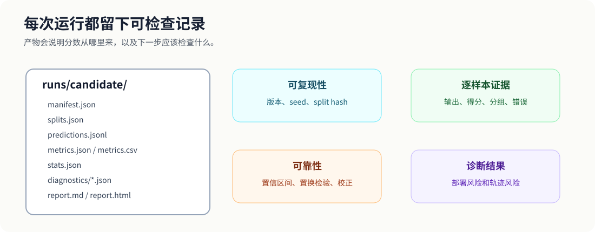
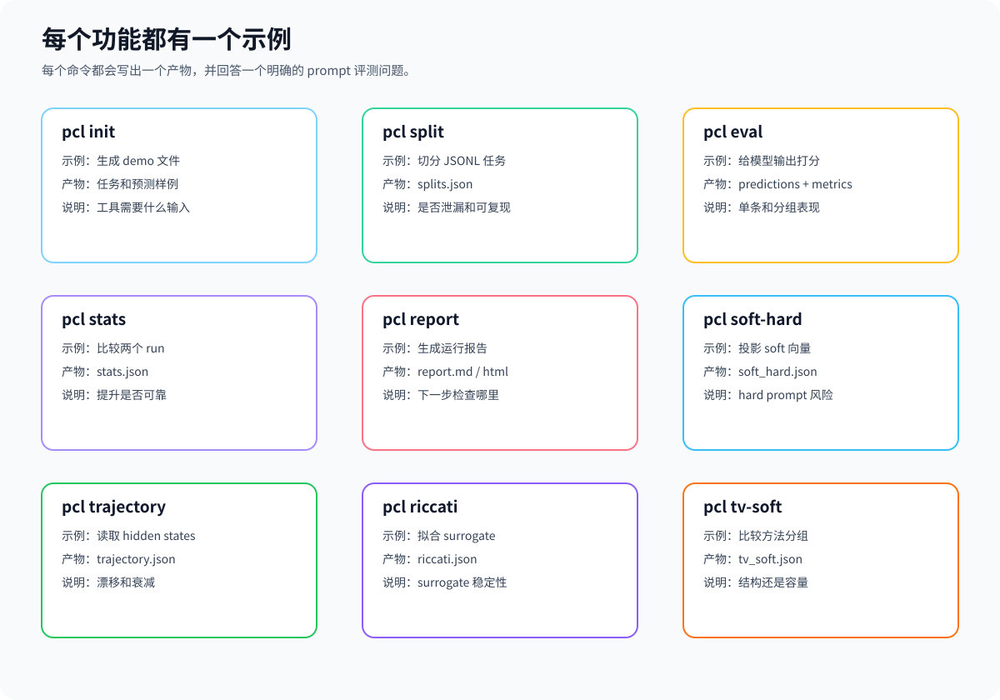
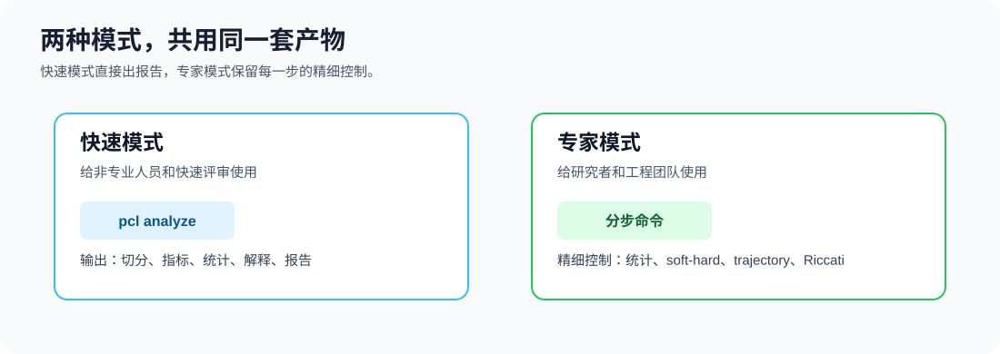
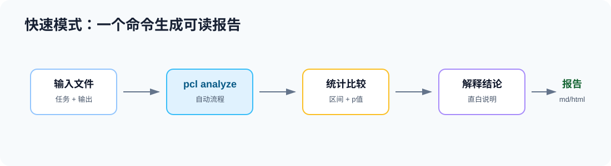
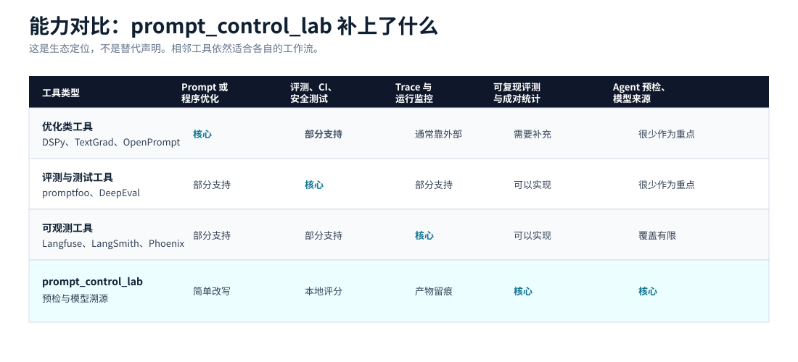
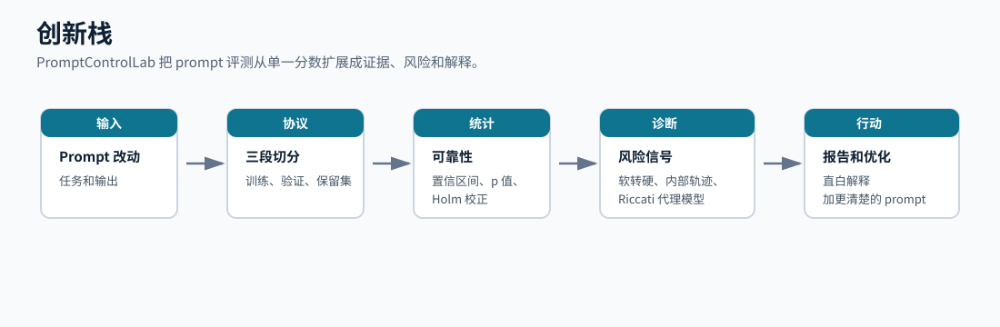
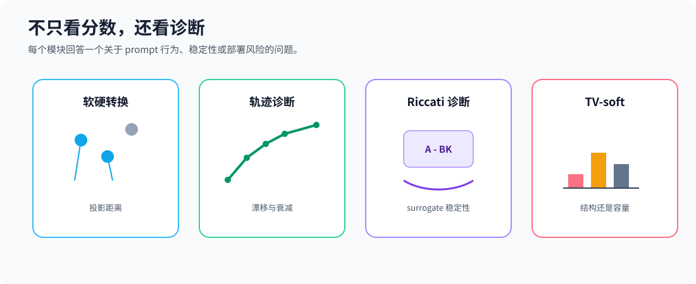

# Prompt_Control_Lab

Prompt_Control_Lab 是一个开源工具包，用于 prompt 评测、诊断、复现和控制论分析。

它帮助研究者和工程团队回答这些问题：

- prompt 改动后，效果是否真的变好？
- 结果是否只是验证集过拟合？
- train / val / withheld 是否被干净隔离？
- soft prompt 转成 hard prompt 后风险有多大？
- hidden-state trajectory 是否出现漂移、不稳定或 turnpike-like 信号？
- time-varying prompt 的收益来自时序结构，还是只是参数更多？

它不是只输出一个分数的表格，而是生成一套可复现的实验产物：数据怎么切、输出怎么评、差异是否可靠、哪些风险需要检查。

## 图示概览


工具的主流程很直接：准备任务池，生成干净的 train/val/withheld 切分，评测 baseline 和 candidate 输出，做 paired statistics，最后生成报告。如果有 soft prompt 或 hidden states，再追加研究诊断。



每次运行都会留下一个小型 audit trail。这些文件既方便人阅读，也方便脚本、论文复现和后续工具继续消费。



下面每个功能都给出一个具体示例，格式统一为：怎么操作、得到什么结果、这个结果能说明什么问题。



## 两种模式

PromptControlLab 现在把同一套开源能力分成两种使用方式。



**Quick Mode（快速模式）** 面向非专业人员。你只需要准备任务文件、baseline 输出和 candidate 输出，然后运行 `pcl analyze`。它会自动完成切分、打分、统计比较、解释和报告生成。


**Expert Mode（专家模式）** 面向研究者和工程师。你可以继续使用单个命令精细控制切分比例、评测指标、统计采样、soft-hard 分析、trajectory 分析、Riccati 诊断和 time-varying soft-control 对比。

## 生态定位、优势和创新点

PromptControlLab 放在现有 LLM 工具旁边使用。它不是要替代 prompt 优化器、评测框架或可观测平台，而是专门补上一层更直白的诊断能力：prompt 改了之后，结果是否可复现、是否可靠、是否适合部署、内部行为是否需要继续检查。


相邻工具各有自己的重点：

- [DSPy](https://dspy.ai/learn/optimization/optimizers/) 主要提供 optimizer，用指标驱动 prompt 或语言模型程序的优化。
- [TextGrad](https://github.com/zou-group/textgrad) 主要探索 textual gradient，也就是用类似自动微分的方式优化文本。
- [OpenPrompt](https://github.com/thunlp/OpenPrompt) 主要提供 prompt-learning 的流程和组件。
- [promptfoo](https://www.promptfoo.dev/docs/intro/) 主要做 LLM 评测、测试、红队和 CI 工作流。
- [DeepEval](https://deepeval.com/docs/getting-started) 主要提供 LLM 应用的评测指标和测试用例。
- [Langfuse](https://langfuse.com/docs) 和 [LangSmith](https://docs.smith.langchain.com/) 更强调 trace、可观测性、prompt 管理、实验和评测工作流。

PromptControlLab 的不同点在于：它把“诊断层”放在核心位置，不只问分数是多少，还问这个分数是否可信、是否有数据泄漏风险、是否能部署、是否稳定。



| 维度 | 很多相邻工具更强调什么 | PromptControlLab 补上什么 |
| --- | --- | --- |
| Prompt 改写 | 找到或改写更好的 prompt / 程序。 | `pcl improve` 给出离线、简单、可读的 prompt 改写，并解释为什么这么改。 |
| 评测比较 | 在样本上打分，比较不同运行结果。 | `pcl split`、`pcl stats`、`pcl report` 固化 train/val/withheld 隔离，并报告成对统计不确定性。 |
| 可复现性 | 保存配置、prompt、trace 或实验记录。 | 每次运行都写出 split hash、metrics、explanation、report 等明确产物。 |
| 部署风险 | 通常通过输出层测试检查。 | `pcl soft-hard` 专门检查 soft prompt 转 hard prompt 的风险。 |
| 内部行为 | 通常不是普通 prompt 评测流程的重点。 | `pcl trajectory` 在有 hidden states 时检查漂移、衰减和 turnpike-like 信号。 |
| 控制论分析 | 很少作为可复用 prompt 工具暴露。 | `pcl riccati` 和 `pcl tv-soft` 提供代理稳定性和 time-varying control 诊断。 |

它的核心创新可以理解为下面这条链路：一次 prompt 改动，不再只得到一个分数，而是得到一套可以检查的证据包。



对相关领域的贡献可以概括为四点：

- 把 train/val/withheld 协议做成工具，降低验证集过拟合和测试泄漏风险。
- 用成对统计、置信区间和校正报告，让 prompt 改动是否可靠更容易判断。
- 系统报告 soft-to-hard gap，让 soft prompt 研究更容易走向部署分析。
- 把 hidden-state trajectory、turnpike-like decay、Riccati surrogate 和 time-varying control 变成可复用诊断能力，推动 prompt engineering 向 prompt control diagnostics 发展。

## 最简单的 prompt 优化

如果你只有一段 prompt 字符串，只想直接得到一个更清楚的版本，可以运行：

```bash
pcl improve --prompt "回答下面的问题"
```

如果想更明显地减少 prompt token 成本：

```bash
pcl improve --prompt "回答下面的问题" --token-mode aggressive --max-tokens 80
```

得到：

- 终端里直接打印优化后的 prompt。
- 如果加上 `--out runs/improve`，还会写出 `improved_prompt.txt`、`prompt_improvement.json` 和 `prompt_diff.md`。
- 终端和 JSON 里会给出不依赖外部 tokenizer 的 estimated token 数。默认 `balanced`
  会尽量保留关键约束并压缩措辞；`aggressive` 会更短，更偏向降低成本。

说明什么问题：

这个命令不调用外部模型，只用离线规则改写 prompt。它会补充任务目标、输出格式约束和稳定性要求。如果再加上 `--run runs/quick`，它会读取已有检测报告，把退化的任务 slice、变差样本和风险提示加入 prompt。`--max-tokens` 是估算预算，不是某个模型 tokenizer 的精确保证。

## 面向谁

- prompt optimization 研究者：需要干净的 train/val/withheld 协议。
- LLM 工程团队：需要本地 prompt regression report。
- soft prompt 研究者：需要 soft-to-hard 部署风险分析。
- 模型迁移和评测团队：需要可复现的 artifact trail。
- 研究 hidden-state trajectory、turnpike-like 行为和 Riccati surrogate 的研究者。

## 安装

```bash
pip install -e ".[dev,research]"
```

使用 uv：

```bash
uv pip install -e ".[dev,research]"
```

核心命令只依赖 Python 标准库。`soft-hard`、`trajectory`、`riccati` 等研究诊断命令使用可选科学计算依赖。

## 功能示例

### 1. `pcl init`：生成可运行示例

操作：

```bash
pcl init --path demo
cd demo
```

得到：

- `examples/tasks.jsonl`
- `examples/predictions_baseline.jsonl`
- `examples/predictions_candidate.jsonl`
- `promptcontrol.example.yaml`

说明什么问题：

这些文件展示了最小输入格式。任务文件包含 `id`、`input`、`expected` 和 `slice`。预测文件用同一个 `id` 对应模型输出 `output`。

### 2. `pcl improve`：直接改写一个 prompt

操作：

```bash
pcl improve --prompt "回答下面的问题"
```

控制 token 成本的操作：

```bash
pcl improve --prompt "回答下面的问题" --token-mode aggressive --max-tokens 80
```

结合已有检测报告：

```bash
pcl improve --prompt-file prompts/current.txt --run runs/quick --out runs/improve
```

得到：

- 终端输出优化后的 prompt
- `runs/improve/improved_prompt.txt`
- `runs/improve/prompt_improvement.json`
- `runs/improve/prompt_diff.md`
- 终端、JSON 和 Markdown diff 里的 estimated token 数

说明什么问题：

这个命令会给出一个更清楚的 prompt，包含任务目标、输出格式要求和稳定性要求。结合 `--run` 时，它还会根据已有报告加入退化 slice、变差样本和部署风险提示。默认 token 模式是 `balanced`：尽量保留有用约束，同时避免不必要措辞。`aggressive` 更短、更省成本，但可能减少一部分保护性规则。

### 3. `pcl analyze`：一键运行快速模式

操作：

```bash
pcl analyze `
  --data examples/tasks.jsonl `
  --baseline-predictions examples/predictions_baseline.jsonl `
  --candidate-predictions examples/predictions_candidate.jsonl `
  --metric exact_match `
  --out runs/quick `
  --explain-level plain
```

也可以使用配置文件：

```bash
pcl analyze --config promptcontrol.example.yaml --out runs/quick
```

得到：

- `runs/quick/splits.json`
- `runs/quick/baseline/metrics.json`
- `runs/quick/candidate/metrics.json`
- `runs/quick/stats.json`
- `runs/quick/explanation.json`
- `runs/quick/report.md`
- `runs/quick/report.html`

说明什么问题：

这是给非专业人员的最快路径。它直接回答：candidate prompt 是否变好、证据是否可靠、是否有任务子类退化、下一步应该保留还是继续检查。

### 4. `pcl split`：切分 train、validation 和 withheld

操作：

```bash
pcl split --data examples/tasks.jsonl --out runs/candidate --seed 0
```

得到：

- `runs/candidate/splits.json`

说明什么问题：

这个文件包含 train、validation、withheld 的样本 id、split hash 和 leakage report。如果 `has_leakage` 是 false，说明三组样本没有交叉。split hash 可以用来复现同一次切分。

### 5. `pcl eval`：给模型输出打分

操作：

```bash
pcl eval --data examples/tasks.jsonl `
  --predictions examples/predictions_baseline.jsonl `
  --out runs/baseline `
  --metric exact_match `
  --method baseline

pcl eval --data examples/tasks.jsonl `
  --predictions examples/predictions_candidate.jsonl `
  --out runs/candidate `
  --metric exact_match `
  --method candidate
```

得到：

- `runs/baseline/predictions.jsonl`
- `runs/baseline/metrics.json`
- `runs/candidate/predictions.jsonl`
- `runs/candidate/metrics.json`

说明什么问题：

`predictions.jsonl` 说明每条样本的输出、期望答案、得分、slice 和错误信息。`metrics.json` 说明总体平均分和每个 slice 的平均分。这样可以发现“平均分变好，但某类任务变差”的情况。

### 6. `pcl stats`：判断提升是否可靠

操作：

```bash
pcl stats --baseline runs/baseline/predictions.jsonl `
  --candidate runs/candidate/predictions.jsonl `
  --out runs/candidate/stats.json
```

得到：

- `runs/candidate/stats.json`

说明什么问题：

这个文件包含 baseline 均值、candidate 均值、mean delta、bootstrap 置信区间、paired permutation p-value 和 Holm-adjusted p-value。如果置信区间跨过 0，说明提升还不稳。如果区间在 0 以上且 adjusted p-value 很小，说明 candidate 的提升更可靠。

### 7. `pcl report`：把产物汇总成人能读的报告

操作：

```bash
pcl report --run runs/candidate --title "Candidate Prompt Report"
```

得到：

- `runs/candidate/report.md`
- `runs/candidate/report.html`

说明什么问题：

报告会汇总 split hygiene、metrics、统计比较，以及已经写入 `diagnostics/` 的诊断结果。它能直白说明这次 prompt 改动是否值得保留，以及下一步应该检查哪里。

### 8. `pcl explain`：把产物解释成直白结论

操作：

```bash
pcl explain --run runs/quick --level plain
pcl explain --run runs/quick --level technical
```

得到：

- `runs/quick/explanation.json`

说明什么问题：

`plain` 适合只想看结论的人，会直白说明是否值得保留、证据是否可靠、哪些样本变好或变差。`technical` 适合专业用户，会保留 artifact path 和原始统计比较细节。

### 9. `pcl gate`：用策略阈值判断是否通过

操作：

```bash
pcl gate --run runs/quick --policy examples/gate.policy.yaml
```

得到：

- `runs/quick/gate_result.json`

说明什么问题：

结果会是 `pass`、`needs_review` 或 `fail`。它会解释 candidate 分数、退化幅度、adjusted p-value，以及可选诊断风险是否满足策略。

### 10. `pcl soft-hard`：检查 soft prompt 转 hard prompt 的风险

操作：

```bash
pcl soft-hard --soft soft_prompt.npz `
  --vocab vocab_embeddings.npz `
  --out runs/candidate/diagnostics
```

输入格式：

- `soft_prompt.npz` 里必须有一个二维数组 `soft`。
- `vocab_embeddings.npz` 里必须有一个二维数组 `embeddings`。

得到：

- `runs/candidate/diagnostics/soft_hard.json`

说明什么问题：

这个文件会给出 nearest-token index、平均投影距离、最大投影距离和风险等级。距离越大，说明 soft prompt 学到的向量越不像真实 token embedding，转成 hard prompt 后越可能丢失行为。

## 研究诊断命令



### 11. `pcl trajectory`：分析 hidden-state 轨迹漂移和衰减

操作：

```bash
pcl trajectory --states hidden_states.npz --out runs/candidate/diagnostics
```

输入格式：

- `hidden_states.npz` 里必须有一个二维数组 `states`，形状是 `[steps, hidden_dim]`。

得到：

- `runs/candidate/diagnostics/trajectory.json`

说明什么问题：

这个文件会给出 mean step drift、max step drift、log-decay slope、拟合质量和 turnpike-like signal。如果 slope 为负且拟合质量较好，说明轨迹可能向某个稳定区域靠近。如果 drift 高或拟合弱，说明内部行为可能更异质或更不稳定。

### 12. `pcl riccati`：检查有限维 surrogate 是否稳定

操作：

```bash
pcl riccati --trajectory hidden_states.npz --out runs/candidate/diagnostics
```

也可以直接提供矩阵：

```bash
pcl riccati --matrices matrices.npz --out runs/candidate/diagnostics
```

输入格式：

- `--trajectory` 读取包含 `states` 的 `hidden_states.npz`。
- `--matrices` 读取包含 `A`、`B`、`Q`、`R` 的 `matrices.npz`。

得到：

- `runs/candidate/diagnostics/riccati.json`

说明什么问题：

这个文件会给出 closed-loop spectral radius、diagnostic decay rate 和 surrogate 是否稳定。它只是在检查拟合出的有限维 surrogate 是否自洽稳定，不是对完整语言模型的数学证明。

### 13. `pcl tv-soft`：比较 static 和 time-varying 方法组

操作：

```bash
pcl tv-soft --predictions scored_methods.jsonl --out runs/candidate/diagnostics
```

输入格式：

- `scored_methods.jsonl` 使用已经打分的 prediction record，字段包括 `id`、`output`、`expected`、`score`、`slice` 和 `method`。
- 常见 `method` 名称包括 `static`、`time_varying`、`shuffled_tv` 和 `random_tv`。

得到：

- `runs/candidate/diagnostics/tv_soft.json`

说明什么问题：

如果 `time_varying` 明显优于 `static`，但 `shuffled_tv` 和 `random_tv` 没有同样提升，收益更可能来自时序结构。如果 shuffled 或 random 也提升，应该检查参数容量和选择效应。

## 文档

- [使用背景](docs/background.zh.md)
- [面向群体](docs/users.zh.md)
- [一步一步教程](docs/tutorial.zh.md)
- [产物说明](docs/artifacts.zh.md)
- [创新点和贡献](docs/innovation.zh.md)

## License

Apache-2.0。
