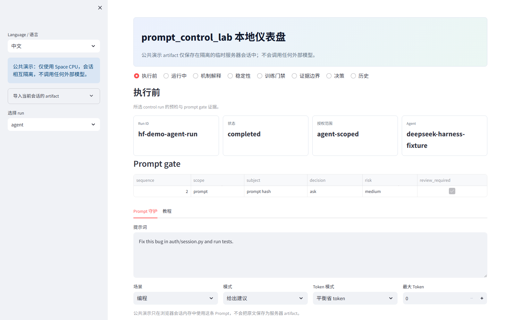
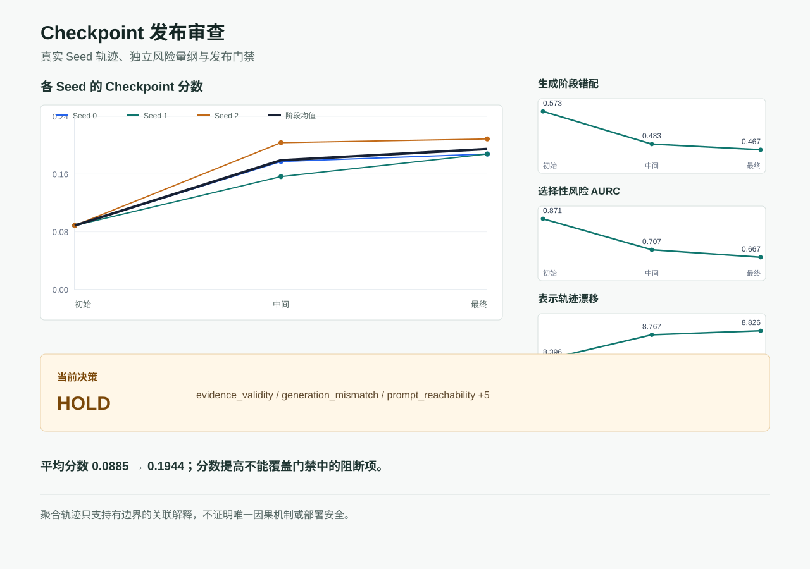

# PromptControlLab
**在本地评测提示词、搜索改进，并理解结果的依据。**
> `0.3.0a2` 预发布候选：在本地实验工作台上新增研究材料导入、可恢复分析和版本化诊断。已验证与待验证项目见[验收记录](docs/releases/0.3.0a2-validation.md)；对外发布是独立步骤。

## 从一次实验开始

源码安装：`python -m pip install -e ".[ui,optimize,research]"`，然后运行 `pcl ui --runs runs --language zh`。使用构建好的 wheel 时，安装 `python -m pip install "./promptcontrollab-0.3.0a2-py3-none-any.whl[ui,optimize,research]"`；日常使用无需 Node 或源码目录。

点击 **先体验离线样例**，即可用预置合成结果完成一次比较，无需模型调用。之后可以编辑提示词、上传 CSV/JSONL 数据，选择实际评测、导入已有输出或运行有预算上限的 GEPA 搜索。比较条件、效果、覆盖情况与成本分别呈现，结果包可导出并换目录复算。

[实验使用指南](docs/experiments.zh.md) · [五类科研工具](examples/research-tools/README.zh.md) · [实验配置样例](examples/experiments/README.md) · [English guide](docs/experiments.en.md)

打开 **研究工具**，载入合成样例，或导入 JSON、CSV、NPZ、数据 ZIP。页面会说明材料能支持哪些分析；选择后即可查看进度、中英文解释并导出重放包。已有汇总、统计重算与原始记录诊断分别标明，已完成套件在取消或进程退出后仍会保留。 [研究流程指南](docs/research.zh.md) · [第二版输入样例](examples/research/a2/README.md)

## 2 分钟 Change Review

```bash
python -m pip install -e ".[ui]"
pcl review --baseline docs/case_studies/checkpoint_change_review/baseline --candidate docs/case_studies/checkpoint_change_review/candidate --out runs/checkpoint-review
pcl ui --runs runs/checkpoint-review --language zh
```

Change Review 默认使用 `shadow` 模式：只读取已有 artifact，写出有边界的解释和决策轨迹，不改变 baseline 或 candidate。需要在执行前检查 Prompt 时，再使用 `pcl control --authorization inspect`。

已有 Agent telemetry 可先用 `pcl trace import --input traces.jsonl --format auto --out runs/imported` 导入，再用 `pcl review --baseline runs/old --candidate runs/imported --kind auto --out runs/change-review` 比较。Trace 导入支持 OpenTelemetry GenAI 与 OpenInference JSONL，默认排序、去重并脱敏。

## 在 Hugging Face 体验
<p><a href="https://huggingface.co/spaces/VeraPyuyi/prompt-control-lab"></a> <a href="https://huggingface.co/spaces/VeraPyuyi/prompt-control-lab"></a></p>
公开 Space 使用免费 CPU，不需要 API key，可体验离线 Guard/Prompt 改进、预置报告、审计、History、控制证书和受限 JSON/JSONL 上传，每个浏览器会话使用独立临时目录。[本地完整版](docs/huggingface_space.zh.md)另有可持久化 run、真实仓库审计、Provider、插件、DeepSeek Harness 和后训练工作流；边界详见 [`deploy/huggingface/README.md`](deploy/huggingface/README.md)。GitHub 仍是源码、Issue、PR 和 Release 的唯一主仓库。

## 先看示例结果
<p><strong>统一 Change Review。</strong> 三个旗舰案例用同一流程审查 Agent、模型与 Checkpoint 变更：60 次真实 Codex 执行案例在完成率相同的情况下记录到更低的完整运行 Token 和工具调用；Qwen/Mistral 历史聚合案例因任务切片方向不同且缺少逐样本配对而保持 <code>needs_review</code>；三 Seed Checkpoint 案例则在分数提高后仍保留 <code>hold</code>。</p>
<p><a href="docs/case_studies/agent_change_review/README.zh.md">Agent 运行案例</a> | <a href="docs/case_studies/model_change_review/README.zh.md">模型切换案例</a> | <a href="docs/case_studies/checkpoint_change_review/README.zh.md">Checkpoint 案例</a>。</p><p><a href="docs/case_studies/checkpoint_change_review/README.zh.md"></a></p><p><strong>改了什么：</strong>在三个 Seed 上比较聚合 Initial 与 Final Checkpoint。<strong>观察到了什么：</strong>平均分数从 <code>0.0885</code> 提高到 <code>0.1944</code>，生成阶段错配和选择性风险下降，但表示轨迹漂移增加。<strong>可以解释什么、不能证明什么：</strong>训练阶段与性能和风险画像变化存在关联，但不能证明唯一因果机制或部署安全。<strong>下一步：</strong>保留 <code>hold</code>，直到触发的稳定性、生成和读出证据得到解决或合理解释。</p>
<p><strong>Quickstart 报告。</strong> 固定合成样例给出 <code>needs_review</code>：分数更高，但置信区间跨 0、Prompt 身份不完整、模型 alias 未锁定。运行 <code>pcl quickstart --out demo --language zh --open-report</code> 即可生成；它验证报告链路，不是普遍提升证明。</p>
<p><a href="docs/quickstart.zh.md"></a></p>
<p><strong>研究诊断。</strong> 真实三 seed SFT 试点中，平均分数提高、生成 Token 减少，但稳定性与生成错配/读出检查没有通过，因此 checkpoint gate 给出 <code>hold</code>。查看<a href="docs/case_studies/sft_checkpoint_pilot/README.zh.md">完整案例</a>，或运行 <code>pcl research-quickstart --out demo-research --language zh</code>。</p>
<p><a href="docs/case_studies/sft_checkpoint_pilot/README.zh.md"></a></p>

## 核心诊断闭环

```bash
pcl evidence scan --root /path/to/evidence --profile prompt-reach-v2 --out manifest.json
pcl evidence import --manifest manifest.json --out runs/prompt-reach-v2 --portable
pcl posttrain-gate --baseline runs/checkpoint-000 --candidate runs/checkpoint-500 --policy examples/posttrain.policy.yaml --out runs/posttrain-gate
```

这三步把分散的实验 artifact 归入 Prompt 可达性、读出对齐、路由、投影和稳定性五类证据。公开安全的 [371 项 prompt-reach-v2 案例](docs/case_studies/prompt_reach_v2/README.zh.md)中有四类已观测、一类需要重新分析。如需有边界的控制检查，可使用 `pcl terminal-sensitivity`、`pcl green-certificate` 和 `pcl posterior-certificate`，区分经验趋势、有限维 surrogate 一致性与有 premise 支持的局部证书。详见[控制证书指南](docs/control_certificates.zh.md)；任何等级都不等于对完整线上语言模型的证明。

## 旗舰集成：DeepSeek Harness

[原生 Cordis 集成](docs/deepseek_harness.zh.md)可以在模型请求和工具执行前 gate，并通过一个持久本地 bridge 写入脱敏生命周期证据；兼容性锁定到 Harness `0.1.1-rc.2`、commit `b150a551...`。[可公开真实会话案例](docs/case_studies/deepseek_harness/README.zh.md)记录了 4 组模型请求/响应、2 次终态读取、1 次有界修改、1 次退出码为 `0` 的测试调用和 3/3 测试通过。经过严格协议验收的真实运行是 `low` risk、`converging`，最终仍保守给出 `suggest`；生命周期验收不被包装成安全证明。
## 支持范围
Provider 包括 OpenAI、Anthropic、Gemini、DeepSeek、Qwen/DashScope、Kimi/Moonshot 和 OpenAI-compatible endpoint；Agent 包括 DeepSeek Harness 原生控制以及 Codex、Cursor、Claude Code、GitHub Action adapter。版本化 `prompt_control_lab.control_event.v1` 协议连接 Change Review、最终目标影响、局部稳定边界、局部解可信范围与本地 UI：变更审查 / 执行前 / 运行 / 原因 / 执行后 / 决策 / 历史 / 稳定性与可信度。参见 [control benchmark](docs/control_benchmark.zh.md)。
## Documentation

[架构与模块](docs/modules/README.zh.md) | [五分钟快速上手](docs/quickstart.zh.md) | [控制证书](docs/control_certificates.zh.md) | [证据与可解释性](docs/server_evidence.zh.md) | [后训练诊断](docs/posttraining.zh.md) | [控制闭环](docs/control_loop.zh.md) | [DeepSeek Harness](docs/deepseek_harness.zh.md) | [Provider](docs/providers.zh.md) | [本地 UI](docs/control_ui.zh.md)

安装与已有流程：[发布安装说明](docs/release_install.zh.md)、`pcl start --guide --language zh`、`pcl quickstart --language zh --out demo --open-report`、`pcl start --choice demo --language zh --out demo`、`pcl choose --need "<你的目标>" --language zh`。

外部证据仍可通过 `pcl import promptfoo --input results.json --out runs/from-promptfoo --prompt-id candidate` 导入（`pcl ingest` 是向后兼容别名）；详见[工具选择](docs/choice_guide.zh.md)。

工程参考：[production protocol](docs/production_pilot.zh.md)、[preflight pilot](docs/case_studies/agent_guard_pilot.zh.md)、[Codex 成对试点](docs/case_studies/agent_guard_paired_pilot.zh.md)、[生态 scorecard](docs/assets/ecosystem_scorecard.zh.svg)和[证据矩阵](docs/assets/ecosystem_evidence_matrix.zh.svg)。这些小样本试点不是通用 benchmark。
## 方法来源与结论边界

PEOC 提供控制论框架和若干诊断方法；产品层将其推广到 Prompt、checkpoint 与 Agent 证据。`soft-hard`、`trajectory`、`riccati`、`tv-soft` 属于基于观测或拟合 surrogate 的解释，不能当作线上 LLM 的数学安全证明。参见[方法映射](docs/research_from_paper.zh.md)和 [PEOC 导入说明](docs/research_import_peoc.zh.md)。

终端目标敏感性、长时域稳定性和 Riccati surrogate 诊断的一项数学基础是 Pyuyi Chufeng Huang 与 Zikang Song（2026）的论文 [*Horizon-Uniform Sensitivity and Decay of Terminal Reward Perturbations in Discrete-Time Pontryagin Systems*](https://arxiv.org/abs/2606.17762)。该论文在明确的正则性、双曲性和边界横截条件下，给出了时域一致的 Green estimate、终端奖励敏感性的指数衰减、后验存在性检查和 Riccati 收敛结果。PromptControlLab 将这些思想转化为面向 Prompt、checkpoint 和 Agent run 证据的有边界诊断；除非相关假设得到独立验证，否则这些输出仍属于观测证据或有限维 surrogate 证据，而不是关于线上语言模型的定理。
欢迎参与贡献：[中文贡献指南](CONTRIBUTING.zh.md)、[安全策略](SECURITY.md)和 [v0.2.0-alpha.1 发布检查表](docs/release_checklist_v0.2.0-alpha.1.md)。

Apache-2.0。见 [LICENSE](LICENSE)。
