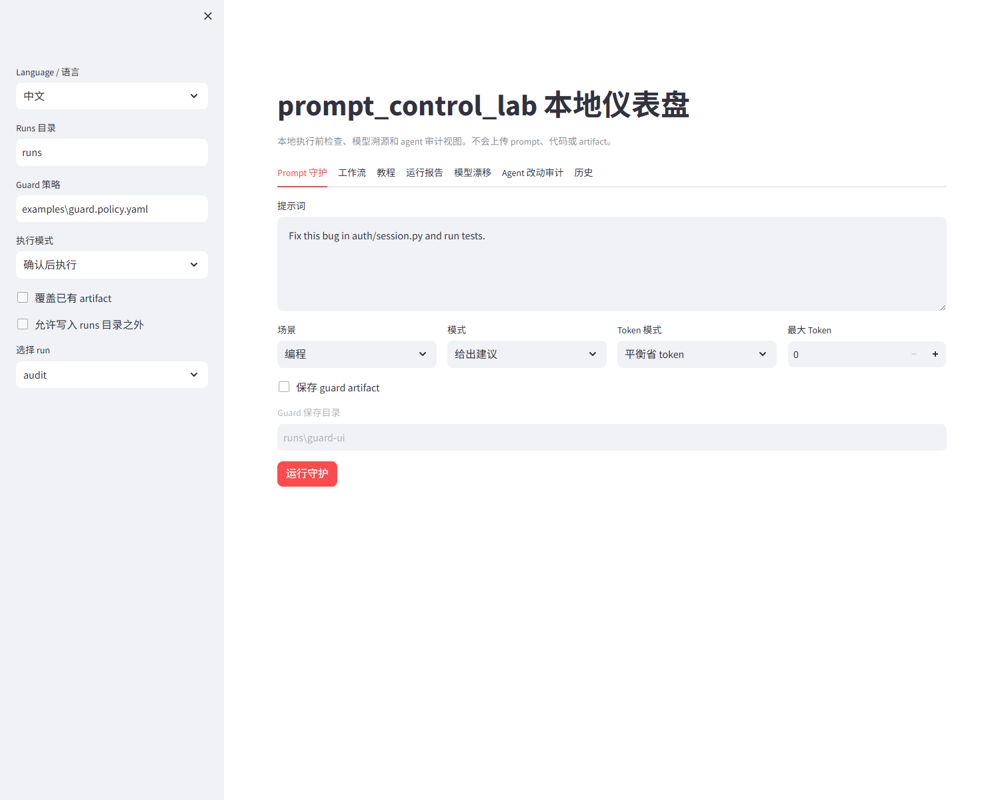
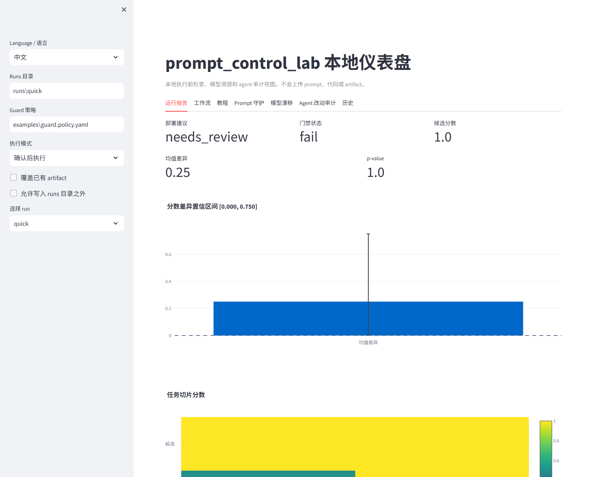
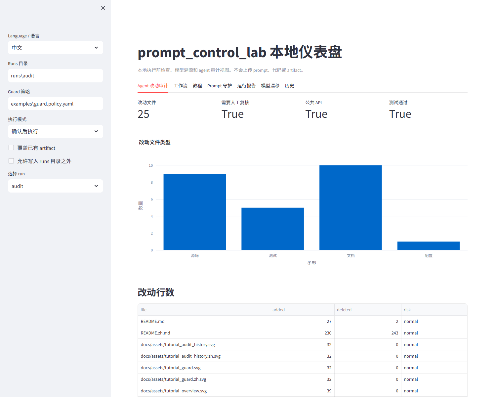

# prompt_control_lab 🧪✨

[](https://github.com/VeraPyuyi/prompt_control_lab/stargazers)
[](https://github.com/VeraPyuyi/prompt_control_lab/forks)
[](https://github.com/VeraPyuyi/prompt_control_lab/watchers)
[](LICENSE)
[](pyproject.toml)

**面向 AI 编程 Agent 的执行前检查、模型溯源和可复现评测工具。**

`prompt_control_lab` 不是普通 prompt 管理器。它更像 Claude Code、Cursor、Codex 等
AI 编程 Agent 的本地安全带：在 agent 花 token、改文件、影响代码库之前，先检查 prompt
是否模糊、危险、缺少测试计划、范围过宽，或者是否混入了没有记录的模型变化。(๑•̀ㅂ•́)و✧

它也会把 prompt 实验变得可复现：train / validation / withheld 切分、成对统计检验、
模型来源、模型漂移审计、可读报告和可选研究诊断都会保存成可检查的 artifact。

> 📌 当前仓库仍可能是 private，所以公开 badge 服务在仓库公开前可能显示 0 或不可用。

English documentation is available in [README.md](README.md).

## 为什么需要它 🚦

AI 编程工具已经进入开发工作流，但信任还没有完全跟上。Stack Overflow 2025 Developer
Survey 显示，**84%** 的开发者正在使用或计划使用 AI 工具，但 **46%** 不信任 AI 输出准确性，
**45%** 认为 debug AI 生成代码更耗时：
[AI survey](https://survey.stackoverflow.co/2025/ai)，
[leaders summary](https://stackoverflow.co/internal/resources/2025-stack-overflow-developer-survey-for-leaders/ai-adoption/)。

`prompt_control_lab` 解决的就是这个缺口：

- **执行前：** 阻断或复核模糊、破坏性、安全敏感、范围过宽或 token 超预算的 prompt。
- **评测中：** 检查 candidate prompt 是否真的比 baseline 更好，而不是只在某个验证切片上偶然变好。
- **运行后：** 记录公开模型 id / provider，并在模型变化导致 prompt-only 比较失效时给出 warning。

## 快速地图 🗺️

如果你是第一次使用，建议按这个顺序看：

1. **在 Claude Code / Cursor / Codex 执行前守护 prompt** -> `pcl guard --policy`
2. **审计模型身份和模型漂移** -> `pcl model-detect` / `pcl model-drift`
3. **生成可复现 prompt 报告** -> `pcl analyze` -> `pcl gate`
4. **审计 agent 到底改了什么** -> `pcl audit-diff`
5. **索引和比较运行历史** -> `pcl history index` / `pcl history compare`
6. **检查本地环境** -> `pcl doctor`
7. **打开本地可视化仪表盘** -> `pcl ui`
8. **用最简单方式优化一句 prompt** -> `pcl improve`
9. **安装 IDE / CLI 适配器** -> `pcl install-plugin`
10. **总结 PR 风险** -> `pcl pr-summary` / `pcl github-app serve`
11. **精细控制评测流程** -> `split -> eval -> stats -> report -> explain -> gate`
12. **Advanced / Research Mode** -> `soft-hard -> trajectory -> riccati -> tv-soft`

在这份 README 里，**Quick Mode** 指集成式的 `pcl analyze` 流程；**Expert Mode** 指每一步都能单独控制的命令式流程。先简单上手，再深入控制。


核心思想很小也很实用：不要让 AI 编程 Agent 只靠信任直接运行。把 prompt、策略决策、模型记录、数据切分、输出、统计、解释和诊断都留下可检查的 artifact。


## 两分钟 Demo：在 Agent 执行前拦住高风险 Prompt 🎬

把 `prompt_control_lab` 放在 prompt 和编程 agent 之间。低风险 prompt 会得到更清晰的写法；
中风险 prompt 会要求补上下文；高风险 prompt 可以被阻断或交给人工复核。

### 0:00-0:15：从模糊 prompt 开始

```text
Fix this bug.
```

为什么它经常失败：agent 不知道目标文件、失败行为、修改边界，也不知道应该跑哪些测试来证明修复有效。

### 0:15-0:45：运行本地策略检查

```bash
pcl guard \
  --prompt "Fix this bug" \
  --profile coding \
  --policy examples/guard.policy.yaml \
  --token-mode balanced \
  --json
```

典型结果：

```json
{
  "action": "suggest",
  "risk_level": "medium",
  "risk_categories": ["missing_context"],
  "required_review": true,
  "policy_violations": [
    {"id": "missing_target_files", "severity": "medium"}
  ],
  "improved_prompt": "Fix the reported bug with the smallest safe code change..."
}
```

### 0:45-1:10：阻断危险指令

```bash
pcl guard \
  --prompt "Delete database and remove auth" \
  --profile coding \
  --policy examples/guard.policy.yaml \
  --mode gate \
  --json
```

JSON 会暴露 `risk_level`、`risk_categories`、`policy_violations`、`required_review` 和
`action`。Claude Code hook、Cursor MCP-style tool、Codex skill 和 shell wrapper 都可以据此在
agent 改代码前停止执行。

### 1:10-1:40：对比原始 prompt 和守护后的 prompt

| 项目 | 原始 prompt | 守护后的 prompt |
|---|---|---|
| 范围 | 不清楚 | 要求说明失败行为和相关文件 |
| 修改边界 | 缺失 | 明确不要重构无关代码 |
| 测试 | 缺失 | 要求列出并运行相关测试 |
| 模型记录 | 通常没有 | 后续可写入 eval artifact |
| token 成本 | 不受控 | 可估算并受 token mode 约束 |
| agent 风险 | 未检查 | 执行前先复核 |

守护后的 prompt 示例：

```text
Fix the reported bug with the smallest safe code change.

Before editing:
1. Identify the failing behavior and relevant files.
2. State the likely root cause.
3. List the tests you will run.

Constraints:
- Do not refactor unrelated code.
- Do not change public APIs unless necessary.
- Keep the patch minimal and explain every changed file.

After editing:
1. Run the relevant tests.
2. Summarize the fix.
3. Mention any remaining uncertainty.
```

### 1:40-2:00：把 prompt 改动变成证据

```bash
pcl init --path demo
cd demo
pcl analyze --config promptcontrol.example.yaml --out runs/quick
```

这个 smoke demo 会生成 `runs/quick/report.md`、`report.html`、`stats.json` 和
`explanation.json`。它证明流程能端到端跑通；它不是“所有真实 agent 任务都会提升”的声明。

## 安装 CLI ⚙️

需要 Python 3.10 或更新版本。有些机器命令叫 `python`，有些叫 `python3` 或 `py -3.10`。
如果 `pip install -e .` 因为找不到 Python 失败，可以先试：

```bash
python --version
python3 --version
py -3.10 --version
```

### 1. 克隆仓库

```bash
git clone https://github.com/VeraPyuyi/prompt_control_lab.git
cd prompt_control_lab
```

如果你已经有本地仓库，进入仓库目录即可。

### 2. 安装轻量 CLI

```bash
pip install -e .
```

使用 `uv`：

```bash
uv pip install -e .
```

### 3. 安装开发和研究 extras

如果需要测试和可选科学诊断：

```bash
pip install -e ".[dev,research]"
```

使用 `uv`：

```bash
uv pip install -e ".[dev,research]"
```

### 4. 安装本地 UI extras

如果需要交互式仪表盘：

```bash
pip install -e ".[ui]"
```

使用 `uv`：

```bash
uv pip install -e ".[ui]"
```

### 5. 检查 CLI 是否可用

```bash
pcl --help
pcl start --choice improve --prompt "Answer the user question."
pcl improve --prompt "Answer the user question."
pcl doctor
pcl ui --help
```

预期结果：`pcl --help` 会列出命令；`pcl start` 会进入新手路径；
`pcl improve` 会输出优化后的 prompt 和估算 token 成本；`pcl doctor` 会检查 Python、包导入、
CLI parser、guard policy、Claude Code hook、Cursor MCP server、demo report、API key 和可选研究依赖。

## 可选项目默认配置 ⚙️

`pcl init` 会在 `promptcontrol.example.yaml` 旁边写入 `.promptcontrol.yaml`。这个项目级配置保存日常命令默认值：

```yaml
guard_policy: examples/guard.policy.yaml
gate_policy: examples/gate.policy.yaml
runs_dir: runs
expected_paths:
  - src
  - tests
test_commands:
  - pytest
allowed_models: gpt-4o,gpt-5.2
ui.default_view: workflows
```

命令行参数仍然优先。优先级是：显式 CLI 参数 -> `promptcontrol.example.yaml` 这类命令专用配置 -> `.promptcontrol.yaml` -> 内置默认值。

## 观看演示视频 🎬

仓库里已经包含两条 11 分 40 秒的 AI 配音演示视频。中文和英文视频演示同一套本地流程：prompt 守护、prompt 改写、analyze/gate/report、模型溯源、agent diff 审计、历史视图、插件、CI，以及高级研究诊断命令。

[](docs/assets/demo/prompt_control_lab_demo.zh.mp4)

- [中文 MP4](docs/assets/demo/prompt_control_lab_demo.zh.mp4)
- [中文字幕](docs/assets/demo/prompt_control_lab_demo.zh.srt)
- [中文分镜脚本](docs/demo/storyboard.zh.md)

[](docs/assets/demo/prompt_control_lab_demo.en.mp4)

- [English MP4](docs/assets/demo/prompt_control_lab_demo.en.mp4)
- [English subtitles](docs/assets/demo/prompt_control_lab_demo.en.srt)
- [English storyboard](docs/demo/storyboard.en.md)

视频由 [video_manifest.json](docs/demo/video_manifest.json) 可复现生成：

```bash
python scripts/build_demo_video.py
```

## 打开本地可视化仪表盘 🖥️

UI 是一个本地 Streamlit 仪表盘。它只读取本机磁盘上的 artifacts，不会上传 prompt、代码或报告。

```bash
pcl ui --runs runs/ --port 8501
```

第一次体验可以这样跑：

```bash
pcl init --path demo
cd demo
pcl analyze --config promptcontrol.example.yaml --out runs/quick
pcl ui --runs runs/ --policy examples/guard.policy.yaml --port 8501
```

本地 UI 现在包含七个 tab。**教程** tab 会用当前页面截图一步一步说明完整流程；**工作流** tab 可以在浏览器里触发本地动作：守护 prompt、运行 analyze、运行 gate、审计 git diff、生成 `agent_run.json`、生成 PR summary，以及导出报告 zip。默认执行模式是 `confirm`，会先预览将要写入的文件；高级用户可以切换到 `auto` 或 `command`。

导出 zip 的 CLI 等价命令：

```bash
pcl export-report --run runs/quick --out runs/quick/report.zip
```

- **工作流：** 触发 allowlisted 本地工作流，并在写入文件前预览输出。
- **教程：** 按“页面截图 -> 操作步骤 -> 得到什么 -> 说明什么问题 -> 下一步”学习每个功能，并配有中英文同步的当前 UI 截图。
- **守护 Prompt：** 交互式运行 `pcl guard`，查看风险、策略违规、token 成本和 prompt diff。
- **运行报告：** 查看部署建议、gate 状态、分数变化、置信区间、p-value、slice 分数和模型来源。
- **模型漂移：** 查看 provider/model 记录、alias 风险、warning 和 drift artifact。
- **Agent 改动审计：** 查看 `audit_result.json`、文件类型分布、危险路径、测试和人工复核要求。
- **历史：** 查看 `history_index.json` 时间线、门禁趋势、分数趋势、模型变化、prompt 身份和风险类别变化。








## 安装 IDE / CLI 插件和 Skills 🧩

所有集成都是同一个稳定命令的薄适配层：

```bash
pcl guard --prompt "修复这个 bug" --profile coding --token-mode balanced --json
```

给 hook 或 wrapper 使用时，推荐走 stdin：

```bash
echo "修复这个 bug" | pcl guard --stdin --profile coding --json
```

### Claude Code Hook 🪝

Claude Code 支持 `UserPromptSubmit` hook。本仓库提供可运行 hook：

```text
plugins/claude-code/hooks/prompt_guard.py
```

安装步骤：

1. 先用 `pip install -e .` 安装 CLI。
2. 打开 Claude Code settings 文件。
3. 添加一个 `UserPromptSubmit` hook：

```json
{
  "hooks": {
    "UserPromptSubmit": [
      {
        "hooks": [
          {
            "type": "command",
            "command": "python \"D:/path/to/prompt_control_lab/plugins/claude-code/hooks/prompt_guard.py\" --mode suggest --profile coding --token-mode balanced --max-tokens 300 --policy \"D:/path/to/prompt_control_lab/examples/guard.policy.yaml\""
          }
        ]
      }
    ]
  }
}
```

4. 把路径改成你的本地仓库路径。
5. 手动测试 hook：

```powershell
'{"hook_event_name":"UserPromptSubmit","prompt":"Fix this bug"}' |
  python plugins\claude-code\hooks\prompt_guard.py --mode suggest --profile coding
```

预期结果：返回包含 `additionalContext` 的 JSON。在 `--mode gate` 下，高风险 prompt 可以返回
`decision: "block"` 和明确原因。

更多细节见：[plugins/claude-code](plugins/claude-code)。

### Cursor Rules 🖱️

Cursor 可以分两层使用：简单 rules 工作流，或可选 MCP-style server，把 `guard_prompt` 暴露成可调用工具。

在 Cursor 项目内安装 rules：

```powershell
New-Item -ItemType Directory -Force .cursor\rules
Copy-Item plugins\cursor\rules\prompt_control_lab.mdc .cursor\rules\prompt_control_lab.mdc
```

然后让 Cursor 遵守该 rule，或者在发送昂贵 prompt 前先运行：

```bash
pcl guard --prompt "Refactor this module" --profile coding --token-mode balanced
```

预期结果：Cursor 项目规则会提醒 agent 对模糊、过宽、危险或高成本 prompt 使用 `pcl guard`。
这还不是完整输入拦截，而是一个实用 rules 工作流。

可选 MCP-style server：

```bash
python plugins/cursor/mcp_server.py
```

如果你的 Cursor 配置支持本地 MCP server，可以指向这个命令。预期结果：Cursor 可以调用
`guard_prompt`，并显示 `plain_summary`、`risk_level`、`improved_prompt` 和 token 估算。

更多细节见：[plugins/cursor](plugins/cursor)。

### Codex Skill 🛠️

仓库包含本地 Codex skill 模板：

```text
plugins/codex/skills/prompt_control_lab/SKILL.md
```

Windows PowerShell 安装：

```powershell
New-Item -ItemType Directory -Force "$env:USERPROFILE\.codex\skills\prompt_control_lab"
Copy-Item -Recurse -Force .\plugins\codex\skills\prompt_control_lab\* "$env:USERPROFILE\.codex\skills\prompt_control_lab\"
```

然后重启 Codex，让它发现 skill。你可以在昂贵任务前让 Codex 先守护 prompt：

```text
$prompt_control_lab Guard this prompt before implementation: "Build the feature"
```

预期结果：Codex 会根据 skill 指令使用 `pcl guard`，再把 prompt 变成更大的编码任务。

如果你是从 wheel、`pipx` 或 `uvx` 安装，可以用下面的命令安装适配器模板：

```bash
pcl install-plugin codex
pcl install-plugin cursor
pcl install-plugin claude-code
pcl install-plugin github-action
```

已有文件默认不会覆盖；只有传入 `--force` 才会覆盖。

### 通用 Shell Wrapper 🐚

任何 CLI 工具都可以使用 JSON 接口：

```bash
echo "Write tests for this feature" | pcl guard --stdin --profile coding --json
```

你可以把 `improved_prompt` 发给 agent，也可以在 gate mode 下把 `action=block` 作为停止信号。

边界说明：`pcl guard` 是本地启发式 preflight 和 policy gate。它能降低明显风险和缺上下文问题，但不能证明 agent 行为一定安全。

### GitHub Action / PR Comment 示例 🧪

仓库提供可复制的 workflow 模板：

```text
examples/github-action/prompt-control-lab-gate.yml
```

如果你希望 PR 自动运行 `pcl gate`，可选用 `pcl audit-diff` 审计 PR diff，并发布简短结果评论，可以把它复制到 `.github/workflows/`。

生成可复用的本地 PR summary artifact：

```bash
pcl pr-summary \
  --audit runs/agent-audit/audit_result.json \
  --gate runs/quick/gate_result.json \
  --out runs/pr_summary.md \
  --json-out runs/pr_summary.json
```

自托管 GitHub App webhook：

```bash
pcl github-app serve --host 0.0.0.0 --port 8080
```

## 功能路径：从简单到专家 🚀

下面的功能按“普通用户更容易上手 -> 专业用户更灵活控制”的顺序排列。

### 1. `pcl start`：新手场景菜单 🌈

操作：

```bash
pcl start
```

非交互操作：

```bash
pcl start --choice improve --prompt "Answer the user question."
pcl start --choice guard --prompt "Fix this bug"
```

结果：

- 一个简单菜单：improve、guard、analyze 三种场景
- 不需要先理解 `profile`、`gate` 或 JSON
- 新手路径之后仍然可以继续使用专家命令

说明：

当你只知道“想让 prompt 更清楚”、“想检查是不是太宽泛”、“想生成完整报告”时，用它最省心。

### 2. `pcl improve`：直接改写一句 prompt ✨

操作：

```bash
pcl improve --prompt "Answer the user question."
```

控制 token 的操作：

```bash
pcl improve --prompt "Answer the user question." --token-mode aggressive --max-tokens 80
```

结果：

- 终端输出优化后的 prompt
- 输出改写前后的估算 token 数
- 如果加 `--out runs/improve`，会写入 `improved_prompt.txt`、`prompt_improvement.json`、`prompt_diff.md`

说明：

适合只有一个 prompt 字符串的场景。它会补充任务目标、输出格式约束、稳定性规则和可选 token 预算压力，不调用外部模型。

### 3. `pcl guard`：在 IDE 或 CLI agent 使用前保护 prompt 🛡️

操作：

```bash
pcl guard --prompt "Fix this bug" --profile coding --token-mode balanced --json
```

Gate 操作：

```bash
echo "Answer the user question." | pcl guard --stdin --mode gate --max-tokens 80 --json
```

团队 policy 操作：

```bash
pcl guard --prompt "Fix this bug" \
  --profile coding \
  --policy examples/guard.policy.yaml \
  --json
```

结果：

- `plain_summary`：给非技术用户看的简短解释
- `action`：`suggest`、`auto` 或 `block`
- `risk_level`：`low`、`medium` 或 `high`
- `improved_prompt`：守护后的 prompt
- `token_report`：估算 token 成本
- `reasons`：为什么建议或阻断
- `risk_categories`：如 `destructive_change`、`security`、`production_path`、`broad_refactor`、`token_budget`
- `policy_violations`：策略或内置规则违规
- `required_review`：是否需要人工复核

说明：

在 Claude Code、Cursor、Codex 或 shell wrapper 花 token 之前使用。它能提前发现模糊、超预算、危险或缺上下文的 prompt。配合 `--policy`，可以变成团队可配置的 AI 编程 Agent 执行前门禁。

Policy 文件保持 dependency-free：示例使用 `rule.destructive_action.patterns` 这类扁平 key；v0.1 也支持一小部分自然的嵌套 `rules:` YAML 列表写法。

### 4. `pcl analyze`：一条命令生成一份报告 📦

操作：

```bash
pcl init --path demo
cd demo
pcl analyze --config promptcontrol.example.yaml --out runs/quick
```

结果：

- `runs/quick/splits.json`
- `runs/quick/baseline/metrics.json`
- `runs/quick/candidate/metrics.json`
- `runs/quick/stats.json`
- `runs/quick/explanation.json`
- `runs/quick/report.md`
- `runs/quick/report.html`

说明：

这是最简单的完整评测路径。它回答：candidate 是否提升、证据是否可靠、是否有任务切片退化、下一步应该检查哪里。

### 5. `pcl model-detect`：记录模型身份 🔎

操作：

```bash
pcl model-detect --response response.json --provider openai
pcl model-detect --predictions examples/predictions_candidate.jsonl
pcl model-detect --model gpt-5.2 --provider openai --verify
```

结果示例：

```json
{
  "provider": "openai",
  "model_id": "gpt-5.2",
  "source": "response.model",
  "confidence": "high",
  "verified": false,
  "warnings": []
}
```

说明：

它记录 API response、prediction 文件或命令行元数据中的公开模型 id，帮助判断 baseline 和 candidate 是否在同一模型下运行。它不能证明服务商隐藏的内部权重版本。

把模型身份写入评测 artifact：

```bash
pcl eval --data examples/tasks.jsonl \
  --predictions examples/predictions_candidate.jsonl \
  --out runs/candidate \
  --method candidate \
  --provider openai \
  --model gpt-5.2

pcl analyze --config promptcontrol.example.yaml \
  --baseline-model gpt-4o \
  --candidate-model gpt-5.2
```

如果 baseline 和 candidate 使用不同模型 id，`report.md` 会提示 warning，因为比较不再是干净的 prompt-only 比较。

模型漂移审计：

```bash
pcl model-drift --run runs/current --history runs/previous --out runs/current/model_drift.json
```

它会报告 prompt 比较是否被 provider/model 变化或 alias model id 混淆。

### 6. `pcl audit-diff`：检查 agent 改了什么 🔎

操作：

```bash
pcl audit-diff --before HEAD~1 --after HEAD --out runs/audit
```

带范围和测试的操作：

```bash
pcl audit-diff \
  --before HEAD~1 \
  --after HEAD \
  --expected-path src \
  --test-command "pytest tests/test_session.py" \
  --out runs/audit
```

默认情况下，`--test-command` 不允许 shell 控制语法，会记录 stdout/stderr 摘要，并对每个命令设置 timeout。如果测试已经在其他地方跑过，优先用 `--tests-run` / `--tests-passed` 记录。只有在可信本地输入下才使用 `--allow-shell-test-command`。

结果：

- `runs/audit/audit_result.json`
- `runs/audit/audit_summary.md`

说明：

在 coding agent 完成后使用。它会记录改动文件、source/test/docs/config 变化、auth/billing 等危险路径、公共 API 变化、测试证据、意外文件改动，以及是否需要人工复核。

把 prompt 身份、模型来源、gate 状态和 audit 证据连接成一个 artifact：

```bash
pcl agent-run build --run runs/quick --audit runs/audit --agent codex --out runs/agent_run.json
```

### 7. `pcl history`：索引和比较运行历史 🧭

操作：

```bash
pcl history index --runs runs/ --out runs/history_index.json
pcl history compare --a runs/old --b runs/new --out runs/history_compare.json
```

说明：

`history index` 会把 run 目录变成一个本地历史视图。`history compare` 会突出 prompt 身份变化、provider/model 变化、分数变化、gate 状态变化、slice 退化和新增风险类别。

### 8. `pcl init`：创建可运行示例 🌱

操作：

```bash
pcl init --path demo
cd demo
```

结果：

- `examples/tasks.jsonl`
- `examples/predictions_baseline.jsonl`
- `examples/predictions_candidate.jsonl`
- `examples/guard.policy.yaml`
- `examples/gate.policy.yaml`
- `promptcontrol.example.yaml`

说明：

这些文件展示最小输入格式：任务 `id`、`input`、`expected`、`slice`，模型 `output`，以及可选 `provider` / `model` 溯源记录。

### 9. `pcl report`、`pcl explain`、`pcl gate`：读取并决策 ✅

操作：

```bash
pcl report --run runs/quick --title "Candidate Prompt Report"
pcl explain --run runs/quick --level plain
pcl gate --run runs/quick --policy examples/gate.policy.yaml
```

结果：

- `report.md` / `report.html`
- `explanation.json`
- `gate_result.json`
- 报告顶部的部署建议：`yes`、`no` 或 `needs_review`

说明：

这些命令把 artifact 变成决策：保留 prompt、复核 prompt，或暂缓使用。Gate 可以检查指标、统计证据、soft-hard 风险和模型溯源。

### 10. 专家评测：`split -> eval -> stats` 🧠

操作：

```bash
pcl split --data examples/tasks.jsonl --out runs/candidate --seed 0
pcl eval --data examples/tasks.jsonl --predictions examples/predictions_candidate.jsonl --out runs/candidate --method candidate
pcl stats --baseline runs/baseline/predictions.jsonl --candidate runs/candidate/predictions.jsonl --out runs/candidate/stats.json
```

结果：

- 可复现 train / val / withheld 切分
- 带分数的 predictions 和 slice metrics
- 成对置信区间、permutation p-value 和 Holm-adjusted p-value

说明：

适合需要精细控制协议洁净度和统计比较的用户。

### 11. Advanced / Research Mode 诊断 🔬

Soft-to-hard 风险：

```bash
pcl soft-hard --soft soft_prompt.npz --vocab vocab_embeddings.npz --out runs/candidate/diagnostics
```

Hidden-state trajectory：

```bash
pcl trajectory --states hidden_states.npz --out runs/candidate/diagnostics
```

Riccati surrogate：

```bash
pcl riccati --matrices surrogate_mats.npz --out runs/candidate/diagnostics
```

Time-varying soft-control lane：

```bash
pcl tv-soft --predictions method_predictions.jsonl --out runs/candidate/diagnostics
```

说明：

这些命令不只看输出分数，还会检查 soft-to-hard 部署风险、hidden-state drift、fitted surrogate stability，以及 time-varying 收益更像时序结构还是额外容量。


## 生态定位 🌱

`prompt_control_lab` 不应该被理解成又一个宽泛 LLM dashboard。它的窄而实用的定位是：
**agent prompt preflight + model provenance + reproducible prompt regression**。

相邻工具覆盖的是不同层：

- promptfoo 和 DeepEval 偏 LLM eval、测试、red-team 和指标。
- Langfuse、LangSmith、Phoenix 偏 tracing、observability、experiments 和应用级评测。
- DSPy、TextGrad、OpenPrompt 偏 prompt/program optimization 或 prompt-learning workflow。
- `prompt_control_lab` 增加的是 AI 编程 Agent 执行前的轻量本地门禁，并记录 prompt-only 比较有效性、模型溯源、统计证据和研究诊断。

研究模块和项目背后的控制论 framing 有联系；但对工程团队最实用的是 guard / policy / model-audit 这条围绕真实 coding agent 的工作流。


## 面向谁 👥

- 使用 Claude Code、Cursor、Codex 或 shell-based coding agent 的开发者。
- 需要对危险、过宽、破坏性、安全敏感或无测试请求做策略门禁的工程团队。
- 需要 prompt regression report、model provenance、model drift warning 和 prompt-only 比较检查的 LLM 团队。
- 需要 train / val / withheld 切分和成对统计检验的研究者与复现团队。
- 研究 soft-hard 部署风险、hidden-state trajectory、Riccati surrogate 和 time-varying soft-control 行为的高级用户。

## 文档 📚

- [使用背景](docs/background.zh.md)
- [面向用户](docs/users.zh.md)
- [一步一步教程](docs/tutorial.zh.md)
- [Artifacts 说明](docs/artifacts.zh.md)
- [Agent guard 试点 case study](docs/case_studies/agent_guard_pilot.zh.md)
- [创新点和贡献](docs/innovation.zh.md)
- [决策指南](docs/decision_guide.zh.md)
- [Plugin adapters](plugins/)

## License 📄

Apache-2.0
