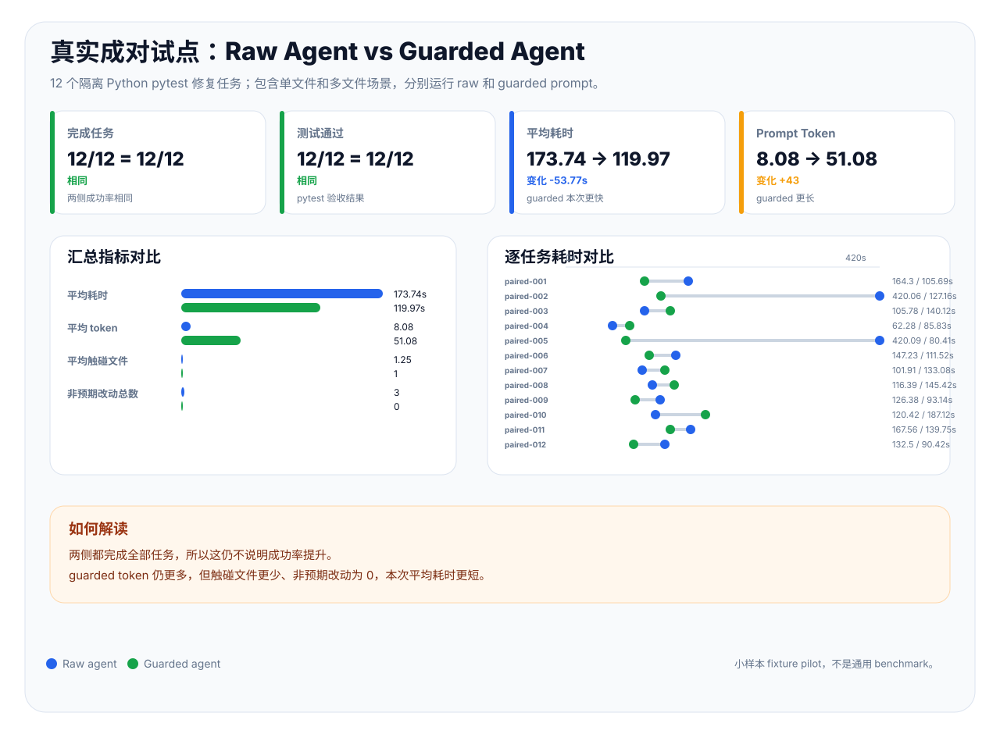

# prompt_control_lab

[](https://github.com/VeraPyuyi/prompt_control_lab/stargazers)
[](https://github.com/VeraPyuyi/prompt_control_lab/forks)
[](https://github.com/VeraPyuyi/prompt_control_lab/watchers)
[](LICENSE)
[](pyproject.toml)

**面向 prompt 优化的控制论诊断与可复现评测工具。**

`prompt_control_lab` 是 Prompt-Engineering-Optimal-Control 项目的开源工具包。
它的研究内核是把 prompt 优化实验变成可复现的切分、成对统计、soft-to-hard 部署诊断、
hidden-state trajectory 探针、Riccati surrogate 检查和 time-varying soft-control 对比。

它也保留面向 AI 编程 Agent 的工程应用层：prompt 策略门禁、公开模型溯源、diff 审计、
PR summary、插件模板和本地 UI。但这些是论文研究流程的应用外壳，不是项目的主身份。

Python 包名是 `promptcontrollab`。仓库和项目品牌名是 `prompt_control_lab`。

English documentation is available in [README.md](README.md).

## 2 分钟上手

```bash
# 0. 安装本段教程需要的 research / UI extras。
pip install -e ".[research,ui]"

# 1. 运行一套论文风格的研究诊断 demo。
pcl research-demo --out runs/research-demo

# 2. 从 demo inputs 重新生成统一诊断报告。
pcl diagnose --run runs/research-demo

# 3. 创建一个可复现 prompt 评测 demo。
pcl init --path demo
cd demo

# 4. 运行 tri-split 评测、统计和报告流程。
pcl analyze --config promptcontrol.example.yaml --out runs/quick

# 5. 打开本地 UI 查看报告和研究诊断。
pcl ui --runs runs/ --policy examples/guard.policy.yaml --port 8501
```

你会得到：split hash、train/validation/withheld 隔离记录、predictions、metrics、成对统计、
explanation、gate 结果、报告 artifact 和本地 UI。仪表盘不会上传 prompt、代码或 artifact。

## 为什么需要它

很多 prompt 优化实验最后只剩一个输出分数。这样会盖住更关键的问题：

- train / validation / withheld 是否干净隔离？
- candidate prompt 的提升是否真的可靠，还是只是在一个 split 上碰巧更好？
- soft prompt 的收益能否转成 hard token 部署？
- hidden-state trajectory 是更稳定，还是更漂移？
- time-varying prompt 的收益来自时序结构，还是来自更多参数容量？
- 拟合出的 Riccati surrogate 是否自洽稳定？这个结论的边界在哪里？

`prompt_control_lab` 的目标是把这些问题变成可执行、可复现、可审计的工具流程。


## 研究内核

下面这些是项目最初来自论文框架的核心能力：

| 论文概念 | 命令 / artifact | 能说明什么问题 |
|---|---|---|
| 三段切分 withheld protocol | `pcl split`、`pcl analyze`、`splits.json` | 评测是否避免了 train / validation / withheld 泄漏。 |
| 成对统计比较 | `pcl stats`、`stats.json` | prompt 改动是否在 bootstrap CI、permutation p-value 和 Holm correction 下仍然可靠。 |
| soft-to-hard 部署 gap | `pcl soft-hard`、`diagnostics/soft_hard.json` | soft prompt 的收益转成 hard token 后损失多大。 |
| hidden-state trajectory 诊断 | `pcl trajectory`、`diagnostics/trajectory.json` | 内部轨迹是否出现 drift、decay 或 turnpike-like signal。 |
| Riccati surrogate 诊断 | `pcl riccati`、`diagnostics/riccati.json` | 拟合出的有限维 surrogate 是否自洽稳定。 |
| time-varying soft-control lane | `pcl tv-soft`、`diagnostics/tv_soft.json` | time-varying 收益更像来自时序结构，还是参数容量。 |

如果想先体验整套论文诊断流程，不需要自己准备模型 artifact，可以运行
`pcl research-demo --out runs/research-demo`。如果已经有自己的 soft prompt、hidden states、
surrogate matrices 或 method predictions，可以用 `pcl diagnose` 统一生成诊断报告。

完整对应关系见 [论文功能映射](docs/research_from_paper.zh.md)。

## 工程应用层

Agent guard、模型溯源、diff audit、GitHub Action、插件和 UI 是围绕研究内核做出的工程应用。
它们让 Claude Code、Cursor、Codex 等 coding agent 的使用过程也能留下同样的证据链。

## 本地 Case Study

仓库包含一个小样本本地 preflight 试点：[agent_guard_pilot.csv](docs/case_studies/agent_guard_pilot.csv)。它记录 20 条原始 coding prompt，以及通过 `pcl guard --profile coding --policy examples/guard.policy.yaml --token-mode balanced` 得到的 guarded prompt。

| 指标 | 本地 preflight 试点 |
|---|---:|
| 成对 prompt 数 | 20 |
| 中风险 prompt | 17 |
| 高风险 prompt | 3 |
| 标记出的策略违规 | 84 |
| 原始 prompt 平均估算 token | 8.75 |
| guarded prompt 平均估算 token | 51.75 |

这不是通用 benchmark，也不声称任务成功率提升。本批次没有执行 raw-agent vs guarded-agent 双跑，所以成功率、测试、文件改动字段都明确标记为 `not_run`。它说明的是：guard 在执行前如何改写和分类这批 prompt。

仓库还包含一个真实成对试点：[agent_guard_paired_pilot.csv](docs/case_studies/agent_guard_paired_pilot.csv)。它让本地 Codex 对每个任务运行两次：一次使用 raw prompt，一次使用 guarded prompt，并且两侧都从同一个干净 fixture repo 开始。当前任务集包含 12 个隔离 Python 任务，包括多文件和有状态 bugfix 场景。

| 指标 | Raw agent | Guarded agent |
|---|---:|---:|
| 完成任务 | 12/12 | 12/12 |
| 测试通过 | 12/12 | 12/12 |
| 平均触碰文件数 | 1.25 | 1.0 |
| 非预期文件改动总数 | 3 | 0 |
| 平均估算 prompt token | 8.08 | 51.08 |
| 平均耗时秒数 | 173.74 | 119.97 |



解读：在这组扩展到 12 个任务的 fixture 任务里，guarded prompt **没有提升成功率**，因为 raw Codex 也完成了全部任务；但 guarded runs 平均触碰文件更少、非预期文件改动为 0、平均耗时更短。guarded prompt 仍比 raw prompt 消耗更多 token，但已经从旧版长模板明显压缩。完整说明见 [agent_guard_paired_pilot.zh.md](docs/case_studies/agent_guard_paired_pilot.zh.md)。

## 安装

需要 Python 3.10 或更新版本。

```bash
git clone https://github.com/VeraPyuyi/prompt_control_lab.git
cd prompt_control_lab
pip install -e .
pcl doctor
```

安装本地 UI：

```bash
pip install -e ".[ui]"
pcl ui --runs runs/ --policy examples/guard.policy.yaml --port 8501
```

本地构建 wheel 后，可以用 `pipx` 安装：

```bash
python -m build
pipx install dist/promptcontrollab-0.1.0-py3-none-any.whl
pcl doctor
```

如果没有发布到 PyPI，请使用本地 wheel 或源码安装，不要把 `prompt_control_lab` 当成 pip 包名；Python 包名是 `promptcontrollab`。

## 演示视频和 UI

仓库包含 4K 实操型双语演示视频，由真实 UI 截图和脚本化操作回放生成。

[](docs/assets/demo/prompt_control_lab_demo.zh.mp4)

- [中文 MP4](docs/assets/demo/prompt_control_lab_demo.zh.mp4)
- [中文字幕](docs/assets/demo/prompt_control_lab_demo.zh.srt)
- [English MP4](docs/assets/demo/prompt_control_lab_demo.en.mp4)
- [English subtitles](docs/assets/demo/prompt_control_lab_demo.en.srt)


## 功能地图

| 场景 | 命令 | 说明 |
|---|---|---|
| 论文 demo | `pcl research-demo` | 生成 synthetic inputs，并一键跑完研究诊断。 |
| 统一诊断 | `pcl diagnose` | 把 soft-hard、trajectory、Riccati、tv-soft 合成一份诊断报告。 |
| 三段切分评测 | `pcl split` / `pcl analyze` | 固化 train / validation / withheld 协议并生成报告。 |
| 成对统计 | `pcl stats` | 输出 bootstrap CI、permutation p-value 和 Holm correction。 |
| soft-to-hard 风险 | `pcl soft-hard` | 检查 soft prompt 转 hard token 后的 projection gap。 |
| 内部轨迹诊断 | `pcl trajectory` | 分析 hidden-state drift、decay slope 和 turnpike-like signal。 |
| Riccati 诊断 | `pcl riccati` | 检查有限维 surrogate 的 Riccati / DARE 稳定性。 |
| time-varying control | `pcl tv-soft` | 比较 static、time-varying、shuffled、random control lane。 |
| 报告和解释 | `pcl report` / `pcl explain` / `pcl gate` | 把 artifact 转成可读结论和策略判断。 |
| Agent 应用层 | `pcl guard` / `pcl audit-diff` | 把研究证据链应用到 coding agent 的执行前后。 |

## 模型追溯边界

`pcl model-detect` 记录的是公开模型 id 和证据，不声称能证明服务商隐藏的内部权重版本。

可信等级包括：

| 等级 | 含义 |
|---|---|
| `level_0_declared_by_user` | 用户或配置声明的 model id。 |
| `level_1_observed_in_response` | 从 response 或 prediction artifact 观察到的 model id。 |
| `level_2_provider_metadata_verified` | 通过 provider metadata 接口确认公开 model object。 |
| `level_3_provider_log_reference_recorded` | 记录了 provider 侧日志引用。 |
| `level_4_signed_receipt_recorded` | 记录了签名收据引用；这不等于已经完成签名验真。 |

如果中间人能篡改 response，单独的 `response.model` 不再是强证据。应结合 TLS、request id、response hash、provider log 和签名收据来提高可信度。

## 插件和 CI

```bash
pcl install-plugin codex
pcl install-plugin cursor
pcl install-plugin claude-code
pcl install-plugin github-action
```

这些模板都围绕 `pcl guard --json` 和 policy gate 工作。GitHub Action 示例可以运行 `pcl gate`、可选 `pcl audit-diff`，并发布 PR summary。

## 生态定位

`prompt_control_lab` 不应该被理解成另一个宽泛 LLM dashboard 或 prompt manager。它的核心定位是：

**控制论 prompt 诊断 + 可复现 prompt optimization 证据。**

它与 promptfoo、DeepEval、LangSmith、Langfuse 互补：那些工具更偏 eval、red-team、observability 或 prompt management；`prompt_control_lab` 更偏论文所述的 prompt optimization 诊断，包括 tri-split 协议、成对统计、soft-hard gap、hidden-state trajectory、Riccati surrogate 和 time-varying soft-control。

Agent guard、model provenance、diff audit 和插件仍然有价值，但它们是围绕研究诊断做出的工程应用层，不是项目重心。


## 文档

- [使用背景](docs/background.zh.md)
- [面向用户](docs/users.zh.md)
- [一步一步教程](docs/tutorial.zh.md)
- [Artifact 说明](docs/artifacts.zh.md)
- [论文功能映射](docs/research_from_paper.zh.md)
- [创新点和贡献](docs/innovation.zh.md)
- [决策指南](docs/decision_guide.zh.md)
- [Agent guard 试点 case study](docs/case_studies/agent_guard_pilot.zh.md)
- [真实成对 agent 试点 case study](docs/case_studies/agent_guard_paired_pilot.zh.md)
- [生产级试点协议](docs/production_pilot.zh.md)
- [发布和安装验证清单](docs/release_install.zh.md)

## License

Apache-2.0。见 [LICENSE](LICENSE)。
