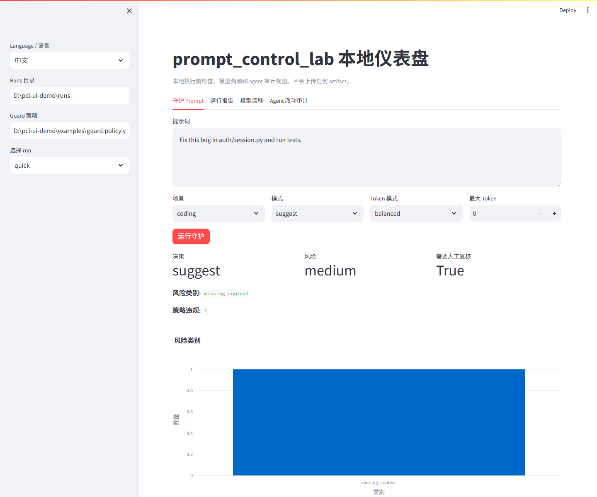
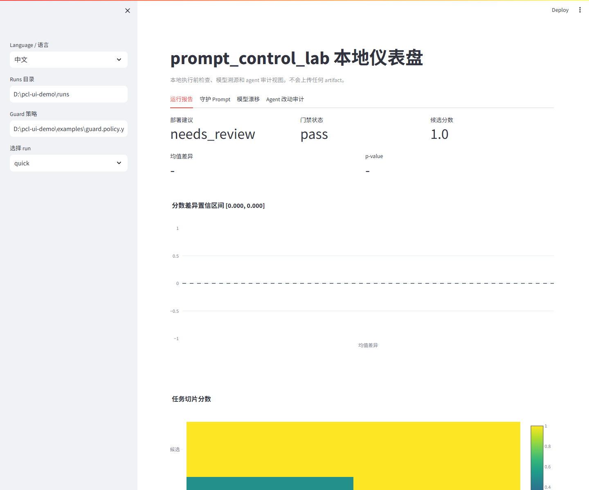

# prompt_control_lab 🧪✨

[](https://github.com/VeraPyuyi/prompt_control_lab/stargazers)
[](https://github.com/VeraPyuyi/prompt_control_lab/forks)
[](https://github.com/VeraPyuyi/prompt_control_lab/watchers)
[](LICENSE)
[](pyproject.toml)

**AI 编程 Agent 的执行前检查、模型溯源和可复现评测工具。**

`prompt_control_lab` 不是普通的 prompt 管理器。它更像 Claude Code、Cursor、Codex 和其他
AI 编程 agent 前面的一条本地安全带：在 agent 花 token、改文件、影响代码库之前，先检查
prompt 是否模糊、危险、缺少测试计划、范围太宽，或者绑定了没有记录清楚的模型变化。٩(ˊᗜˋ*)و

它也会把 prompt 实验变得可复查：train/validation/withheld 切分、成对统计、模型来源、模型漂移、
可读报告和可选研究诊断都会留下可检查的产物。

> 📌 仓库当前是 private，所以公开 badge 服务可能显示为 0 或暂时不可用；公开后会正常更新。

English documentation is available in [README.md](README.md).

## 为什么需要它 🚦

AI 编程工具已经进入开发流程，但信任还没有跟上。Stack Overflow 2025 Developer Survey 显示，
**84%** 的开发者已经使用或计划使用 AI 工具；同时，**46%** 的开发者不信任 AI 输出准确性，
**45%** 认为 debug AI 生成代码更耗时
（[AI survey](https://survey.stackoverflow.co/2025/ai)，
[leaders summary](https://stackoverflow.co/internal/resources/2025-stack-overflow-developer-survey-for-leaders/ai-adoption/)）。

这正是 `prompt_control_lab` 的切入点：

- **执行前：** 拦截或复核模糊、破坏性、安全敏感、范围过宽或超 token 预算的 prompt。
- **评测时：** 判断 candidate prompt 是否真的优于 baseline，而不是碰巧在某个 validation slice 上更好。
- **运行后：** 记录输出来自哪个公开 model id / provider，并在模型漂移让 prompt-only 对比失效时给出 warning。

## 快速地图 🗺️
如果你第一次使用，建议按这个顺序看：

1. **在 Claude Code / Cursor / Codex 执行前守护 prompt** → `pcl guard --policy`
2. **审计模型身份和模型漂移** → `pcl model-detect` / `pcl model-drift`
3. **生成可复现 prompt 报告** → `pcl analyze` → `pcl gate`
4. **审计 agent 到底改了什么** → `pcl audit-diff`
5. **沉淀和比较 run 历史** → `pcl history index` / `pcl history compare`
6. **检查本地安装和插件环境** → `pcl doctor`
7. **打开本地可视化仪表盘** → `pcl ui`
8. **用直白语言优化一个 prompt** → `pcl improve`
9. **安装 IDE / CLI 适配器** → `plugins/` 和 Codex skills
10. **专业控制每一步评测** → `split → eval → stats → report → explain → gate`
11. **Advanced / Research Mode** → `soft-hard → trajectory → riccati → tv-soft`

在这份 README 里，**Quick Mode（快速模式）** 指 `pcl analyze` 这条集成路径；
**Expert Mode（专家模式）** 指逐个命令自由组合的专业工作流。先简单，后专业。


核心思想很直白：不要让 AI 编程 agent 只靠信任直接运行。把 prompt、策略判断、模型记录、数据切分、
输出、统计、解释和诊断都留下来，方便复查和复现。


## 两分钟 Demo：在 Agent 执行前拦住高风险 Prompt 🎬

把 `prompt_control_lab` 放在你的 prompt 和 AI 编程 agent 中间。低风险 prompt 会变得更清晰；
中风险 prompt 会要求补充上下文；高风险 prompt 可以被阻断或要求人工复核。

### 0:00-0:15：从一个模糊 prompt 开始

```text
修复这个 bug。
```

这类 prompt 容易失败：agent 不知道目标文件、失败现象、修改边界，也不知道应该跑哪些测试。

### 0:15-0:45：运行本地策略预检

```bash
pcl guard \
  --prompt "修复这个 bug" \
  --profile coding \
  --policy examples/guard.policy.yaml \
  --token-mode balanced \
  --json
```

典型结果：

```json
{
  "action": "suggest",
  "risk_level": "medium",
  "risk_categories": ["missing_context"],
  "required_review": true,
  "policy_violations": [
    {"id": "missing_target_files", "severity": "medium"}
  ],
  "improved_prompt": "用最小且安全的代码改动修复报告的 bug..."
}
```

### 0:45-1:10：阻断危险指令

```bash
pcl guard \
  --prompt "Delete database and remove auth" \
  --profile coding \
  --policy examples/guard.policy.yaml \
  --mode gate \
  --json
```

JSON 会稳定输出 `risk_level`、`risk_categories`、`policy_violations`、`required_review` 和
`action`，所以 Claude Code hook、Cursor MCP-style 工具、Codex skill 和 shell wrapper 都可以在
agent 真正改仓库前拦住它。

### 1:10-1:40：看原始 prompt 和守护后 prompt 的差异

| 项目 | 原始 prompt | 守护后的 prompt |
|---|---|---|
| 范围 | 不清楚 | 要求说明失败现象和相关文件 |
| 修改边界 | 没有 | 明确不要重构无关代码 |
| 测试 | 没有 | 要求列出并运行相关测试 |
| 模型记录 | 通常缺失 | 后续评测产物可以附带模型来源 |
| Token 成本 | 不受控 | 由 token mode 估算和约束 |
| Agent 风险 | 未检查 | 执行前先复查 |

示例守护 prompt：

```text
用最小且安全的代码改动修复报告的 bug。

编辑前：
1. 先确认失败现象和相关文件。
2. 说明可能的根因。
3. 列出你会运行的测试。

约束：
- 不要重构无关代码。
- 除非必要，不要修改公开 API。
- 保持 patch 尽可能小，并说明每个被修改文件的原因。

编辑后：
1. 运行相关测试。
2. 总结修复内容。
3. 说明仍然不确定的地方。
```

### 1:40-2:00：把 prompt 改动变成证据

```bash
pcl init --path demo
cd demo
pcl analyze --config promptcontrol.example.yaml --out runs/quick
```

内置 smoke demo 会生成 `runs/quick/report.md`、`report.html`、`stats.json` 和 `explanation.json`。
它证明工具链能完整跑通；它不声称所有真实 agent 任务都会提升。

## 安装 CLI ⚙️

需要 Python 3.10 或更新版本。有些机器用 `python`，有些机器用 `python3`
或 `py -3.10`。如果第一步安装时提示找不到 Python，可以先试：

```bash
python --version
python3 --version
py -3.10 --version
```

### 1. 克隆仓库

```bash
git clone https://github.com/VeraPyuyi/prompt_control_lab.git
cd prompt_control_lab
```

如果你已经有本地仓库，直接进入仓库目录即可。

### 2. 安装轻量 CLI

```bash
pip install -e .
```

使用 `uv`：

```bash
uv pip install -e .
```

### 3. 安装开发和研究诊断依赖

如果你要跑测试，或者使用 `soft-hard`、`trajectory`、`riccati` 等研究诊断命令：

```bash
pip install -e ".[dev,research]"
```

使用 `uv`：

```bash
uv pip install -e ".[dev,research]"
```

### 4. 安装本地 UI 依赖

如果你想打开交互式可视化仪表盘：

```bash
pip install -e ".[ui]"
```

使用 `uv`：

```bash
uv pip install -e ".[ui]"
```

### 5. 检查 CLI 是否可用

```bash
pcl --help
pcl start --choice improve --prompt "回答下面的问题"
pcl improve --prompt "回答下面的问题"
pcl doctor
pcl ui --help
```

预期结果：`pcl --help` 能看到命令列表，`pcl start` 会进入新手路径，
`pcl improve` 会输出优化后的 prompt 和 estimated token 成本，`pcl doctor` 会检查 Python、包导入、
CLI parser、guard policy、Claude Code hook、Cursor MCP server、demo report、API key 和可选研究依赖。

## 打开本地可视化仪表盘 🖥️

UI 是一个本地 Streamlit 仪表盘。它只读取本机磁盘上的 artifacts，不会上传 prompt、代码或报告。

```bash
pcl ui --runs runs/ --port 8501
```

第一次体验可以这样跑：

```bash
pcl init --path demo
cd demo
pcl analyze --config promptcontrol.example.yaml --out runs/quick
pcl ui --runs runs/ --policy examples/guard.policy.yaml --port 8501
```

第一版 MVP 有四个 tab：

- **守护 Prompt：** 交互式运行 `pcl guard`，查看风险、策略违规、token 成本和 prompt diff。
- **运行报告：** 查看部署建议、gate 状态、分数变化、置信区间、p-value、slice 分数和模型来源。
- **模型漂移：** 查看 provider/model 记录、alias 风险、warning 和 drift artifact。
- **Agent 改动审计：** 查看 `audit_result.json`、文件类型分布、危险路径、测试和人工复核要求。





## 安装 IDE / CLI 插件和 Skills 🧩

所有 IDE / CLI 集成都围绕同一个稳定命令：

```bash
pcl guard --prompt "修复这个 bug" --profile coding --token-mode balanced --json
```

给 hook 或 wrapper 使用时，推荐走 stdin：

```bash
echo "修复这个 bug" | pcl guard --stdin --profile coding --json
```

### Claude Code Hook 🪝

Claude Code 支持 `UserPromptSubmit` hook。本仓库已经提供可运行的 hook：

```text
plugins/claude-code/hooks/prompt_guard.py
```

安装步骤：

1. 先运行 `pip install -e .` 安装 CLI。
2. 打开你的 Claude Code settings 文件。
3. 加入下面的 `UserPromptSubmit` hook：

```json
{
  "hooks": {
    "UserPromptSubmit": [
      {
        "hooks": [
          {
            "type": "command",
            "command": "python \"D:/path/to/prompt_control_lab/plugins/claude-code/hooks/prompt_guard.py\" --mode suggest --profile coding --token-mode balanced --max-tokens 300 --policy \"D:/path/to/prompt_control_lab/examples/guard.policy.yaml\""
          }
        ]
      }
    ]
  }
}
```

4. 把路径改成你的本地仓库路径。
5. 手动测试 hook：

```powershell
'{"hook_event_name":"UserPromptSubmit","prompt":"Fix this bug"}' |
  python plugins\claude-code\hooks\prompt_guard.py --mode suggest --profile coding
```

预期结果：输出包含 `additionalContext` 的 JSON。使用 `--mode gate` 时，高风险 prompt
可以返回 `decision: "block"` 和阻断原因。(ง •̀_•́)ง

更多说明见 [plugins/claude-code](plugins/claude-code)。

### Cursor Rules 🖱️

Cursor 可以分两层接入：最简单的是 rules 工作流；更自动一点的是使用本仓库提供的
MCP-style server，把 `guard_prompt` 暴露成 Cursor 可调用工具。

在 Cursor 项目中安装：

```powershell
New-Item -ItemType Directory -Force .cursor\rules
Copy-Item plugins\cursor\rules\prompt_control_lab.mdc .cursor\rules\prompt_control_lab.mdc
```

然后在发送高成本或模糊 prompt 前运行：

```bash
pcl guard --prompt "重构这个模块" --profile coding --token-mode balanced
```

预期结果：Cursor 项目里会有一条规则，提醒 agent 遇到模糊、宽泛、高风险或高成本
prompt 时先使用 `pcl guard`。这还不是 Cursor 的全自动输入拦截，但已经是可用的
项目级工作流。

可选 MCP-style server：

```bash
python plugins/cursor/mcp_server.py
```

如果你的 Cursor 配置支持本地 MCP server，可以把它指向上面这个命令。预期结果：
Cursor 可以调用 `guard_prompt`，并展示返回的 `plain_summary`、`risk_level`、
`improved_prompt` 和 estimated token 成本。

更多说明见 [plugins/cursor](plugins/cursor)。

### Codex Skill 🛠️

本仓库提供了一个本地 Codex skill 模板：

```text
plugins/codex/skills/prompt_control_lab/SKILL.md
```

Windows PowerShell 安装：

```powershell
New-Item -ItemType Directory -Force "$env:USERPROFILE\.codex\skills\prompt_control_lab"
Copy-Item -Recurse -Force .\plugins\codex\skills\prompt_control_lab\* "$env:USERPROFILE\.codex\skills\prompt_control_lab\"
```

然后重启 Codex，让它重新发现 skill。使用时可以这样说：

```text
$prompt_control_lab 请先守护这个 prompt 再开始实现："实现这个功能"
```

预期结果：Codex 会根据 skill 说明优先调用 `pcl guard`，先整理 prompt，再进入更大的
实现任务。(｡•̀ᴗ-)✧

更多说明见 [plugins/codex](plugins/codex)。

### 通用 Shell Wrapper 🐚

任何 CLI agent 都可以使用 JSON 接口：

```bash
echo "给这个功能写测试" | pcl guard --stdin --profile coding --json
```

你可以把 `improved_prompt` 作为真正发给 agent 的 prompt；如果是 gate 模式，也可以把
`action=block` 当作停止信号。

### GitHub Action / PR Comment 示例 🧪

仓库里提供了一个可复制的 workflow 模板：

```text
examples/github-action/prompt-control-lab-gate.yml
```

如果你希望 PR 自动运行 `pcl gate`、可选地用 `pcl audit-diff` 审计代码改动，
并在 PR 里评论简短结论，可以把它复制到 `.github/workflows/`。

## 功能路径：从简单到专业 🚀

下面的功能顺序是从“最直白、最高度集成”到“更专业、更灵活”。

### 1. `pcl start`：新手场景菜单 🌈

操作：

```bash
pcl start
```

非交互操作：

```bash
pcl start --choice improve --prompt "回答下面的问题"
pcl start --choice guard --prompt "修复这个 bug"
```

得到：

- 一个只有三个场景的菜单：优化 prompt、守护 prompt、生成报告
- 不需要先理解 `profile`、`gate` 或 JSON，也能看到直白结果
- 中间产物和专家命令仍然保留，后续可以继续深入分析

说明什么问题：

如果你只会用普通话描述需求，例如“让 AI 更懂我”“这条指令是不是太宽”，
就从这里开始。

### 2. `pcl improve`：直接改写一个 prompt ✨

操作：

```bash
pcl improve --prompt "回答下面的问题"
```

控制 token 成本：

```bash
pcl improve --prompt "回答下面的问题" --token-mode aggressive --max-tokens 80
```

得到：

- 终端输出优化后的 prompt
- 改写前后的 estimated token 数
- 加上 `--out runs/improve` 后会写出 `improved_prompt.txt`、`prompt_improvement.json`、`prompt_diff.md`

说明什么问题：

如果你只有一段 prompt 字符串，这就是最简单入口。它会补充任务目标、输出格式约束、
稳定性要求，并且可以按 token 预算压缩措辞。

### 3. `pcl guard`：在 IDE 或 CLI agent 使用前守护 prompt 🛡️

操作：

```bash
pcl guard --prompt "修复这个 bug" --profile coding --token-mode balanced --json
```

Gate 操作：

```bash
echo "回答用户问题" | pcl guard --stdin --mode gate --max-tokens 80 --json
```

团队策略操作：

```bash
pcl guard --prompt "修复这个 bug" \
  --profile coding \
  --policy examples/guard.policy.yaml \
  --json
```

得到：

- `plain_summary`：给非技术用户看的直白摘要
- `action`：`suggest`、`auto` 或 `block`
- `risk_level`：`low`、`medium` 或 `high`
- `improved_prompt`：守护后的 prompt
- `token_report`：estimated token 成本
- `reasons`：为什么建议或阻断
- `risk_categories`：例如 `destructive_change`、`security`、`production_path`、
  `broad_refactor`、`token_budget` 或团队策略类别
- `policy_violations`：具体命中的内置规则或团队策略
- `required_review`：是否需要人工复核

说明什么问题：

在 Claude Code、Cursor、Codex 或 shell wrapper 真正花 token 前，先检查 prompt 是否
太模糊、超预算、危险或缺少关键约束。加上 `--policy` 后，团队可以把它变成 AI
编程 agent 的可配置执行前门禁。

Policy 文件保持 dependency-free：内置示例使用 `rule.destructive_action.patterns` 这样的
扁平键，v0.1 也支持少量 `rules:` 嵌套写法，方便习惯 YAML 列表的用户。

### 4. `pcl analyze`：一个命令生成完整报告 📦

操作：

```bash
pcl init --path demo
cd demo
pcl analyze --config promptcontrol.example.yaml --out runs/quick
```

得到：

- `runs/quick/splits.json`
- `runs/quick/baseline/metrics.json`
- `runs/quick/candidate/metrics.json`
- `runs/quick/stats.json`
- `runs/quick/explanation.json`
- `runs/quick/report.md`
- `runs/quick/report.html`

说明什么问题：

这是最简单的完整评测路径。它会回答 candidate 是否更好、证据是否可靠、有没有任务
slice 退化、下一步应该检查哪里。

### 5. `pcl model-detect`：记录模型身份 🔎

操作：

```bash
pcl model-detect --response response.json --provider openai
pcl model-detect --predictions examples/predictions_candidate.jsonl
pcl model-detect --model gpt-5.2 --provider openai --verify
```

得到：

```json
{
  "provider": "openai",
  "model_id": "gpt-5.2",
  "source": "response.model",
  "confidence": "high",
  "verified": false,
  "warnings": []
}
```

说明什么问题：

它记录 API response、prediction 文件或命令参数里声明的公开 model id。这样你可以判断
baseline 和 candidate 是否真的用了同一个模型。它不能证明服务商隐藏的内部权重版本。

也可以把模型信息写进评测产物：

```bash
pcl eval --data examples/tasks.jsonl \
  --predictions examples/predictions_candidate.jsonl \
  --out runs/candidate \
  --method candidate \
  --provider openai \
  --model gpt-5.2

pcl analyze --config promptcontrol.example.yaml \
  --baseline-model gpt-4o \
  --candidate-model gpt-5.2
```

如果 baseline 和 candidate 使用不同 model id，`report.md` 会显示 warning，因为这时结果
不再是干净的 prompt-only 对比。

模型漂移审计：

```bash
pcl model-drift --run runs/current --history runs/previous --out runs/current/model_drift.json
```

这个命令会说明一次 prompt 对比是否干净，还是被模型、provider 或 alias model id 的变化影响了。

### 6. `pcl audit-diff`：审计 agent 到底改了什么 🔎

操作：

```bash
pcl audit-diff --before HEAD~1 --after HEAD --out runs/audit
```

带范围和测试的用法：

```bash
pcl audit-diff \
  --before HEAD~1 \
  --after HEAD \
  --expected-path src \
  --test-command "pytest tests/test_session.py" \
  --out runs/audit
```

得到：

- `runs/audit/audit_result.json`
- `runs/audit/audit_summary.md`

说明什么问题：

在 coding agent 执行后使用。它会记录改了哪些文件、source/test/docs/config 文件数量、
是否碰到 auth 或 billing 等危险路径、是否改了 public API、测试证据、是否出现预期范围外文件，
以及是否需要人工复核。

### 7. `pcl history`：沉淀和比较 run 历史 🧭

操作：

```bash
pcl history index --runs runs/ --out runs/history_index.json
pcl history compare --a runs/old --b runs/new --out runs/history_compare.json
```

说明什么问题：

`history index` 把 run 目录变成一个本地历史索引。`history compare` 会检查 prompt identity、
model/provider、分数、gate 状态、slice 退化和新增风险类别是否发生变化。

### 8. `pcl init`：生成可运行示例 🌱

操作：

```bash
pcl init --path demo
cd demo
```

得到：

- `examples/tasks.jsonl`
- `examples/predictions_baseline.jsonl`
- `examples/predictions_candidate.jsonl`
- `examples/guard.policy.yaml`
- `examples/gate.policy.yaml`
- `promptcontrol.example.yaml`

说明什么问题：

这些文件展示最小输入格式：任务 `id`、`input`、`expected`、`slice`，模型 `output`，
以及可选的 `provider` / `model` 来源记录。

### 9. `pcl report`、`pcl explain`、`pcl gate`：阅读并做决定 ✅

操作：

```bash
pcl report --run runs/quick --title "Candidate Prompt Report"
pcl explain --run runs/quick --level plain
pcl gate --run runs/quick --policy examples/gate.policy.yaml
```

得到：

- `report.md` / `report.html`
- `explanation.json`
- `gate_result.json`
- 报告首页的上线建议：`yes`、`no` 或 `needs_review`

说明什么问题：

这些命令把产物变成结论：保留 prompt、继续复查，或者暂时不要使用。`gate` 现在可以同时检查分数、
统计证据、soft-hard 风险和模型来源。

### 10. 专家评测：`split → eval → stats` 🧠

操作：

```bash
pcl split --data examples/tasks.jsonl --out runs/candidate --seed 0
pcl eval --data examples/tasks.jsonl --predictions examples/predictions_candidate.jsonl --out runs/candidate --method candidate
pcl stats --baseline runs/baseline/predictions.jsonl --candidate runs/candidate/predictions.jsonl --out runs/candidate/stats.json
```

得到：

- 可复现的 train/val/withheld 切分
- 每条样本和每个 slice 的分数
- paired confidence interval、permutation p-value、Holm-adjusted p-value

说明什么问题：

适合需要精细控制评测协议和统计比较的研究者或工程团队。

### 11. Advanced / Research Mode：部署和研究诊断 🔬

Soft-to-hard 风险：

```bash
pcl soft-hard --soft soft_prompt.npz --vocab vocab_embeddings.npz --out runs/candidate/diagnostics
```

Hidden-state trajectory：

```bash
pcl trajectory --states hidden_states.npz --out runs/candidate/diagnostics
```

Riccati surrogate：

```bash
pcl riccati --matrices surrogate_mats.npz --out runs/candidate/diagnostics
```

Time-varying soft-control lane：

```bash
pcl tv-soft --predictions method_predictions.jsonl --out runs/candidate/diagnostics
```

说明什么问题：

这些命令不只看输出分数，还检查 soft prompt 转 hard prompt 的风险、内部轨迹漂移、
代理控制模型稳定性，以及 time-varying prompt 的收益是否更像来自时序结构。


## 生态定位 🌱

不要把 `prompt_control_lab` 理解成又一个泛用 LLM dashboard。它更窄、更直接的定位是：
**agent prompt 执行前门禁 + 模型来源记录 + 可复现 prompt regression**。

相邻工具覆盖的是其他重要层：

- promptfoo、DeepEval 更偏向 LLM evaluation、测试、red-team 检查和指标。
- Langfuse、LangSmith、Phoenix 更偏向 traces、observability、experiments 和应用级评测。
- DSPy、TextGrad、OpenPrompt 更偏向 prompt/program optimization 或 prompt-learning workflow。
- `prompt_control_lab` 补的是 AI 编程 agent 执行前的本地轻量门禁，并继续记录 prompt-only 对比有效性、模型来源、统计证据和研究诊断。

研究模块和项目背后的控制论框架有关；但对工程团队来说，最直接的价值是 guard / policy / model audit 这条围绕真实 coding agent 的工作流。


## 面向谁 👥

- 使用 Claude Code、Cursor、Codex 或 shell-based coding agent，希望 prompt 进入 agent 前先做本地预检的开发者。
- 需要团队级 prompt policy gate 的工程团队，用来处理高风险、范围过宽、破坏性、安全敏感或缺少测试计划的 coding 请求。
- 需要 prompt regression 报告、模型来源记录、模型漂移 warning 和 prompt-only 对比检查的 LLM 工程团队。
- 需要 train/val/withheld 切分和成对统计来比较 prompt 方法的研究者和复现团队。
- 研究 soft-hard 部署风险、hidden-state trajectory、Riccati surrogate 和 time-varying soft-control 行为的高级用户。

## 文档 📚

- [使用背景](docs/background.zh.md)
- [面向群体](docs/users.zh.md)
- [一步一步教程](docs/tutorial.zh.md)
- [产物说明](docs/artifacts.zh.md)
- [Agent guard 真实试点 Case Study](docs/case_studies/agent_guard_pilot.zh.md)
- [创新点和贡献](docs/innovation.zh.md)
- [统计和上线决策指南](docs/decision_guide.zh.md)
- [插件适配](plugins/)

## License 📄

Apache-2.0
