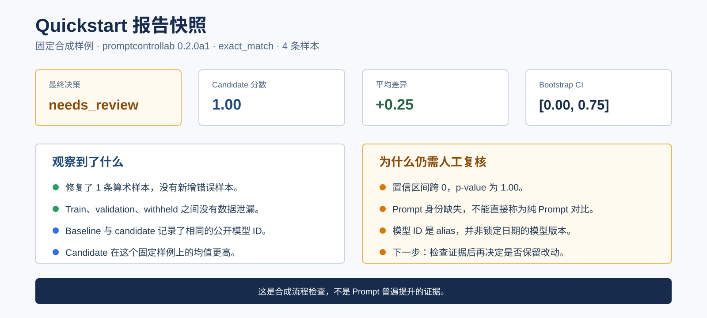
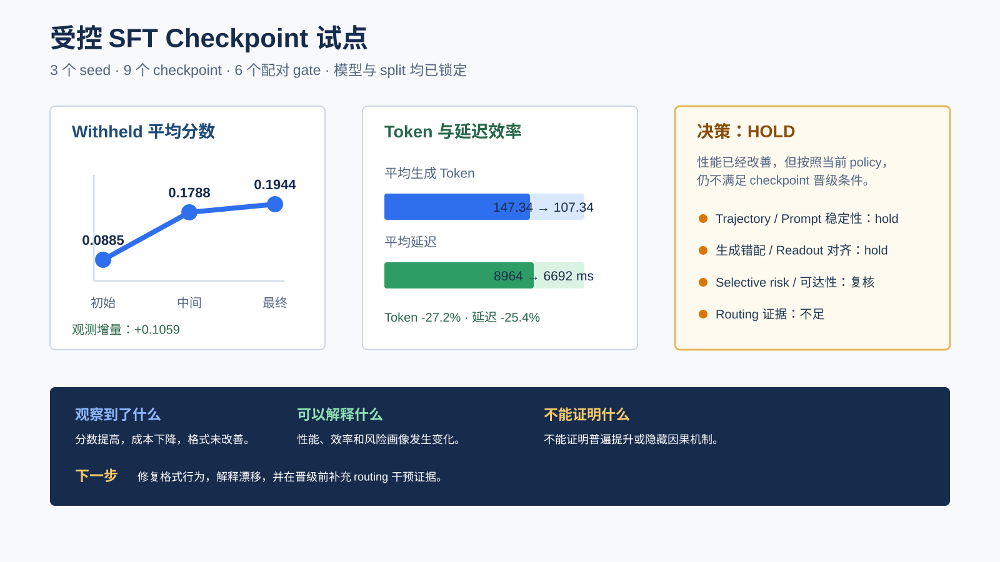

# PromptControlLab

**Prompt、Checkpoint 与 AI Agent 的本地证据、诊断和控制闭环。**

> Alpha 包候选版本：`promptcontrollab 0.2.0a1`。两项真实验收已经完成；公开前仍需轮换凭据、验证候选 commit CI、完成维护者检查，并执行失败即回退的可见性与安全设置切换。

PromptControlLab 是一个开源、本地优先的框架，用来解释结果为什么变化、比较是否有效、观察到的行为是否稳定，以及 Prompt、checkpoint 或 Agent run 是否值得继续。它把执行前控制与 trajectory、soft-hard、generation mismatch、selective-risk 和拟合 surrogate 证据连接起来。英文：[README.md](README.md)。

## 2 分钟 Control Demo

```bash
python -m pip install -e ".[ui]"
pcl control --prompt "检查这个请求，并提出边界清楚的计划。" --authorization inspect --out runs/first-control --json
pcl ui --runs runs --language zh
```

`inspect` 只运行本地 preflight 并写出完整 control run，不调用模型，也不启动 Agent。

## 先看示例结果
<p><strong>Quickstart 报告。</strong> 固定合成样例给出 <code>needs_review</code>：分数更高，但置信区间跨 0、Prompt 身份不完整、模型 alias 未锁定。运行 <code>pcl quickstart --out demo --language zh --open-report</code> 即可生成；它验证报告链路，不是普遍提升证明。</p>
<p><a href="docs/quickstart.zh.md"></a></p>
<p><strong>研究诊断。</strong> 真实三 seed SFT 试点中，平均分数提高、生成 Token 减少，但稳定性与生成错配/读出检查没有通过，因此 checkpoint gate 给出 <code>hold</code>。查看<a href="docs/case_studies/sft_checkpoint_pilot/README.zh.md">完整案例</a>，或运行 <code>pcl research-quickstart --out demo-research --language zh</code>。</p>
<p><a href="docs/case_studies/sft_checkpoint_pilot/README.zh.md"></a></p>

## 核心诊断闭环

```bash
pcl evidence scan --root /path/to/evidence --profile prompt-reach-v2 --out manifest.json
pcl evidence import --manifest manifest.json --out runs/prompt-reach-v2 --portable
pcl posttrain-gate --baseline runs/checkpoint-000 --candidate runs/checkpoint-500 --policy examples/posttrain.policy.yaml --out runs/posttrain-gate
```

这三步把分散的实验 artifact 归入 Prompt 可达性、读出对齐、路由、投影和稳定性五类证据。公开安全的 [371 项 prompt-reach-v2 案例](docs/case_studies/prompt_reach_v2/README.zh.md)中有四类已观测、一类需要重新分析。

真实的[三 seed SFT checkpoint 案例](docs/case_studies/sft_checkpoint_pilot/README.zh.md)包含 9 个 checkpoint 和 6 个配对 gate。平均分数从 0.0885 提高到 0.1944，平均生成 token 减少 27.2%。格式 slice 独立地保持为 0；真正触发 `hold` 的是 trajectory/prompt stability 与 generation mismatch/readout 检查，routing 证据则仍然不足。这是有边界的真实工作流结果，不是普遍提升声明。参见[证据导入说明](docs/server_evidence.zh.md)和[后训练门禁](docs/posttraining.zh.md)。

## 旗舰集成：DeepSeek Harness

[原生 Cordis 集成](docs/deepseek_harness.zh.md)可以在模型请求和工具执行前 gate，并通过一个持久本地 bridge 写入脱敏生命周期证据；兼容性锁定到 Harness `0.1.1-rc.2`、commit `b150a551...`。[可公开真实会话案例](docs/case_studies/deepseek_harness/README.zh.md)记录了 4 组模型请求/响应、2 次终态读取、1 次有界修改、1 次退出码为 `0` 的测试调用和 3/3 测试通过。经过严格协议验收的真实运行是 `low` risk、`converging`，最终仍保守给出 `suggest`；生命周期验收不被包装成安全证明。

## 支持范围

| 范围 | 当前 adapter |
|---|---|
| Provider | OpenAI、Anthropic、Gemini、DeepSeek、Qwen / DashScope、Kimi / Moonshot、OpenAI-compatible endpoint |
| Agent | DeepSeek Harness 原生控制；Codex、Cursor、Claude Code、GitHub Action prompt-guard adapter |
| 开放协议 | 版本化 `prompt_control_lab.control_event.v1` JSONL 协议与确定性 [control benchmark](docs/control_benchmark.zh.md) |
| 诊断证据 | Trajectory/turnpike、Riccati/DARE surrogate、soft-hard/time-varying control、generation mismatch、selective risk、checkpoint gate |
| 本地 UI | 执行前 / 运行中 / 机制解释 / 稳定性 / 训练门禁 / 证据边界 / 决策 / 历史 |

## Documentation

[五分钟快速上手](docs/quickstart.zh.md) | [证据与可解释性](docs/server_evidence.zh.md) | [后训练诊断](docs/posttraining.zh.md) | [控制闭环](docs/control_loop.zh.md) | [DeepSeek Harness](docs/deepseek_harness.zh.md) | [Provider](docs/providers.zh.md) | [本地 UI](docs/control_ui.zh.md)

安装与已有流程：[发布安装说明](docs/release_install.zh.md)、`pcl start --guide --language zh`、`pcl quickstart --language zh --out demo --open-report`、`pcl start --choice demo --language zh --out demo`、`pcl choose --need "<你的目标>" --language zh`。

外部证据仍可通过 `pcl import promptfoo --input results.json --out runs/from-promptfoo --prompt-id candidate` 导入（`pcl ingest` 是向后兼容别名）；详见[工具选择](docs/choice_guide.zh.md)。

工程参考：[production protocol](docs/production_pilot.zh.md)、[preflight pilot](docs/case_studies/agent_guard_pilot.zh.md)、[Codex 成对试点](docs/case_studies/agent_guard_paired_pilot.zh.md)、[生态 scorecard](docs/assets/ecosystem_scorecard.zh.svg)和[证据矩阵](docs/assets/ecosystem_evidence_matrix.zh.svg)。这些小样本试点不是通用 benchmark。

## 方法来源与结论边界

PEOC 提供控制论框架和若干诊断方法；产品层将其推广到 Prompt、checkpoint 与 Agent 证据。`soft-hard`、`trajectory`、`riccati`、`tv-soft` 属于基于观测或拟合 surrogate 的解释，不能当作线上 LLM 的数学安全证明。参见[方法映射](docs/research_from_paper.zh.md)和 [PEOC 导入说明](docs/research_import_peoc.zh.md)。

终端目标敏感性、长时域稳定性和 Riccati surrogate 诊断的一项数学基础是 Pyuyi Chufeng Huang 与 Zikang Song（2026）的论文 [*Horizon-Uniform Sensitivity and Decay of Terminal Reward Perturbations in Discrete-Time Pontryagin Systems*](https://arxiv.org/abs/2606.17762)。该论文在明确的正则性、双曲性和边界横截条件下，给出了时域一致的 Green estimate、终端奖励敏感性的指数衰减、后验存在性检查和 Riccati 收敛结果。PromptControlLab 将这些思想转化为面向 Prompt、checkpoint 和 Agent run 证据的有边界诊断；除非相关假设得到独立验证，否则这些输出仍属于观测证据或有限维 surrogate 证据，而不是关于线上语言模型的定理。

欢迎参与贡献：[中文贡献指南](CONTRIBUTING.zh.md)、[安全策略](SECURITY.md)和
[v0.2.0-alpha.1 发布检查表](docs/release_checklist_v0.2.0-alpha.1.md)。

Apache-2.0。见 [LICENSE](LICENSE)。
