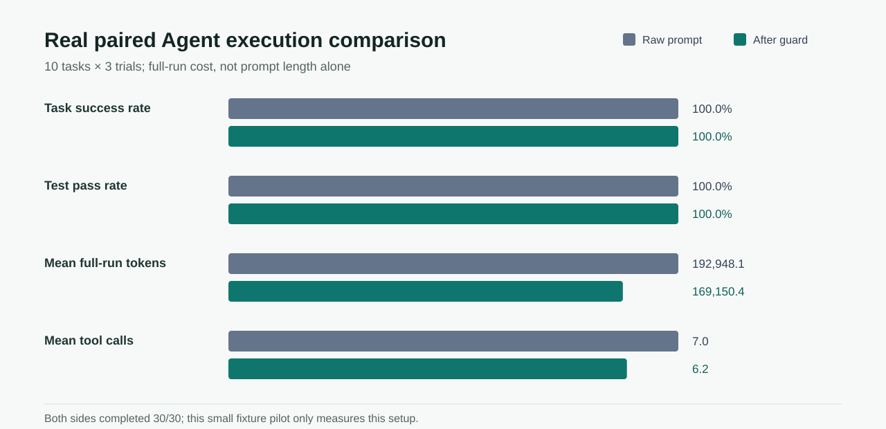

# Repeated Agent Change Review

[中文](README.zh.md)

This public-safe case compares a raw coding prompt with its PromptControlLab-guarded version across 10 controlled Python tasks, 3 trials per task, and 60 real Codex executions. Every execution used an isolated Git repository and a task-specific pytest acceptance check.



## Observed Result

| Metric | Raw prompt | After guard |
|---|---:|---:|
| Completed tasks | 30/30 | 30/30 |
| Tests passed | 30/30 | 30/30 |
| Mean estimated prompt tokens | 7.6 | 50.6 |
| Mean full-run tokens reported by Codex | 192,948.1 | 169,150.4 |
| Mean tool calls | 7.0 | 6.2 |
| Mean touched files | 1.0 | 1.0 |
| Unnecessary file edits | 0 | 0 |
| Mean duration | 57.38 s | 54.96 s |

The guarded prompt is longer, but complete-run tokens were 12.3% lower and tool calls were 11.4% lower on this fixture set. This is why PromptControlLab reports total execution cost rather than treating prompt length as total cost. Both sides already completed every task, so this pilot does **not** show a success-rate improvement.

The Change Review returns `needs_review`: the prompt change is recorded, but the underlying Codex model identity was not captured and aggregate independent runs cannot establish within-run convergence. That boundary is preserved in [`comparison_validity.json`](review/comparison_validity.json) and [`stability.json`](review/stability.json).

## Reproduce The Review

The committed [`pilot.csv`](pilot.csv) is the redacted source table. Regenerate the public case without rerunning an Agent:

```bash
python scripts/build_change_review_cases.py
pcl ui --runs docs/case_studies/agent_change_review/review --language en
```

To repeat all 60 Agent executions locally, use `scripts/run_agent_guard_paired_pilot.py`; this invokes Codex and can consume substantial time and model quota. Raw Agent logs and temporary repositories are deliberately not committed.

## Claim Boundary

These are real Agent processes on small controlled coding fixtures, not production repositories or a universal benchmark. The result supports an execution-efficiency observation for this task set; it does not prove that guarding always reduces tokens, improves success, or transfers to another Agent/model version.
