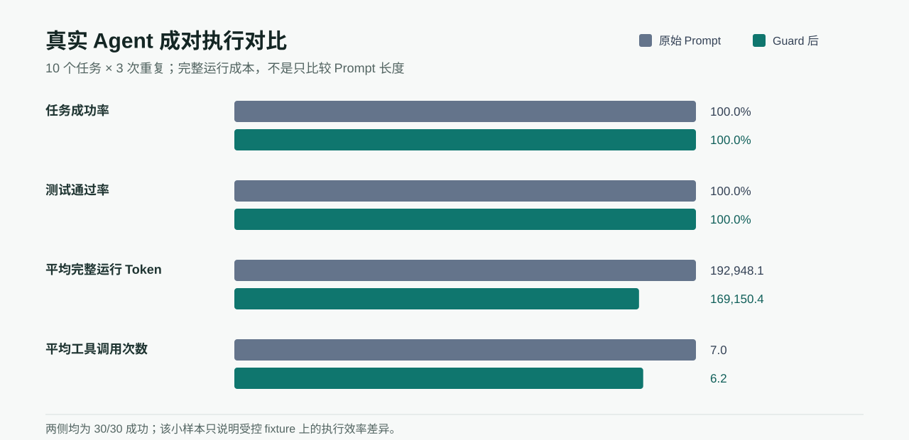

# 重复 Agent Change Review

[English](README.md)

这个公开安全案例比较原始 coding prompt 与 PromptControlLab Guard 后的版本，包含 10 个受控 Python 任务、每个任务 3 次重复，共 60 次真实 Codex 执行。每次执行都位于独立 Git 仓库，并使用任务专属的 pytest 验收测试。



## 观察结果

| 指标 | 原始 Prompt | Guard 后 |
|---|---:|---:|
| 完成任务 | 30/30 | 30/30 |
| 测试通过 | 30/30 | 30/30 |
| 平均估算 Prompt Token | 7.6 | 50.6 |
| Codex 报告的平均完整运行 Token | 192,948.1 | 169,150.4 |
| 平均工具调用次数 | 7.0 | 6.2 |
| 平均改动文件数 | 1.0 | 1.0 |
| 非必要文件改动 | 0 | 0 |
| 平均运行时长 | 57.38 秒 | 54.96 秒 |

Guard 后的 Prompt 更长，但在这组 fixture 中，完整运行 Token 降低 12.3%，工具调用减少 11.4%。这说明不能把 Prompt 长度直接当成总成本，应该统计 Agent 完整执行和返工。两侧本来就全部成功，因此这个试点**没有证明成功率提升**。

Change Review 最终给出 `needs_review`：Prompt 变化已经记录，但底层 Codex 模型身份没有被捕获，而且独立运行的汇总数据不能证明单次运行内部是否收敛。这个边界原样保留在 [`comparison_validity.json`](review/comparison_validity.json) 与 [`stability.json`](review/stability.json) 中。

## 复核结果

提交到仓库的 [`pilot.csv`](pilot.csv) 是脱敏源表。不重新执行 Agent 也可以生成公开案例：

```bash
python scripts/build_change_review_cases.py
pcl ui --runs docs/case_studies/agent_change_review/review --language zh
```

如需在本地重新执行全部 60 次 Agent run，可使用 `scripts/run_agent_guard_paired_pilot.py`；它会调用 Codex，并消耗较多时间与模型额度。原始 Agent 日志和临时仓库不会提交到公开仓库。

## 结论边界

这些是真实 Agent 进程，但任务是小型受控 coding fixture，不是生产仓库，也不是通用 benchmark。结果只支持当前任务集上的执行效率观察，不能证明 Guard 总会节省 Token、提高成功率，或能直接迁移到其他 Agent/模型版本。
