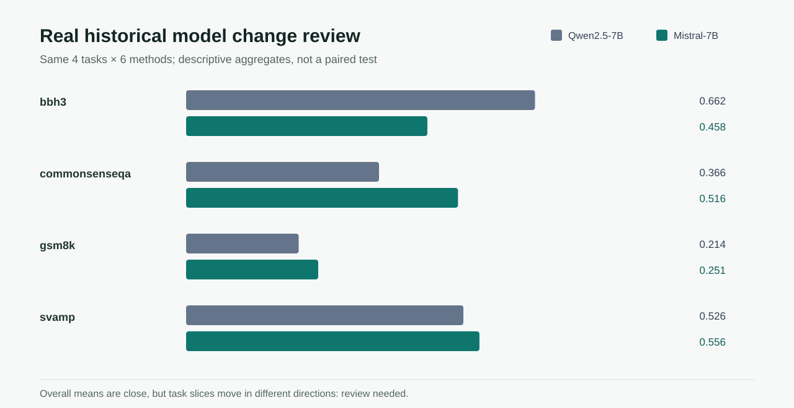

# Model Change Review

[中文](README.zh.md)

This public-safe case compares recorded aggregate results for `Qwen/Qwen2.5-7B-Instruct` and `mistralai/Mistral-7B-Instruct-v0.3`. Both sides cover the same four task slices and six methods: 24 task-method cells per model, with `n=10` recorded for every cell.



## Observed Result

| Task slice | Qwen2.5-7B | Mistral-7B | Descriptive delta |
|---|---:|---:|---:|
| BBH3 | 0.6618 | 0.4576 | -0.2042 |
| CommonsenseQA | 0.3659 | 0.5157 | +0.1498 |
| GSM8K | 0.2135 | 0.2506 | +0.0370 |
| SVAMP | 0.5259 | 0.5564 | +0.0305 |
| Overall | 0.4418 | 0.4451 | +0.0033 |

The overall means are close, while the task slices move in different directions. The candidate is therefore not treated as a general model improvement.

## Why The Decision Is `needs_review`

The source is real historical aggregate evidence, but it does not contain paired per-example outputs or a shared recorded Prompt hash. PromptControlLab can show the model association and slice heterogeneity, but it cannot calculate a defensible paired significance test or isolate model identity as the unique cause.

The committed [`comparison.csv`](comparison.csv) can be recomputed from [`../peoc_real/research_case_study.json`](../peoc_real/research_case_study.json). No source script, private Prompt, generation text, server path, or model weight is included.

## Reproduce The Review

```bash
python scripts/build_change_review_cases.py
pcl ui --runs docs/case_studies --language en
```

The future controlled paired run is specified in [`paired_model_pilot.protocol.json`](paired_model_pilot.protocol.json). It is intentionally marked `not_executed`; it must not be presented as collected evidence until both models run the same ten fixtures three times under the same Agent, Prompt, policy, and acceptance checks.

## Claim Boundary

This case supports a descriptive comparison of recorded model aggregates. It does not establish per-example significance, prompt-only validity, a causal model advantage, or production performance.
