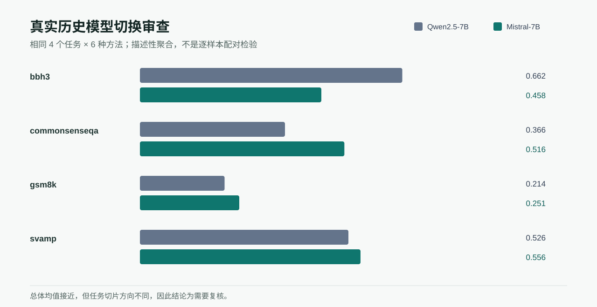

# 模型切换审查

[English](README.md)

这个公开安全案例比较 `Qwen/Qwen2.5-7B-Instruct` 与 `mistralai/Mistral-7B-Instruct-v0.3` 的真实历史聚合记录。两侧覆盖相同的四个任务切片与六种方法：每个模型 24 个“任务 × 方法”聚合单元，每个单元均记录 `n=10`。



## 观察结果

| 任务切片 | Qwen2.5-7B | Mistral-7B | 描述性变化 |
|---|---:|---:|---:|
| BBH3 | 0.6618 | 0.4576 | -0.2042 |
| CommonsenseQA | 0.3659 | 0.5157 | +0.1498 |
| GSM8K | 0.2135 | 0.2506 | +0.0370 |
| SVAMP | 0.5259 | 0.5564 | +0.0305 |
| 总体 | 0.4418 | 0.4451 | +0.0033 |

两侧总体均值很接近，但任务切片的变化方向明显不同，因此不能把 Candidate 写成“模型整体提升”。

## 为什么结论是 `needs_review`

来源是真实历史聚合证据，但没有逐样本配对输出，也没有两侧共用的已记录 Prompt hash。PromptControlLab 可以展示模型关联和任务异质性，却不能据此计算可靠的配对显著性，也不能把差异唯一归因于模型身份。

仓库中的 [`comparison.csv`](comparison.csv) 可以从 [`../peoc_real/research_case_study.json`](../peoc_real/research_case_study.json) 重新计算。案例不包含来源脚本、私有 Prompt、生成正文、服务器路径或模型权重。

## 复核案例

```bash
python scripts/build_change_review_cases.py
pcl ui --runs docs/case_studies --language zh
```

未来的受控配对实跑定义在 [`paired_model_pilot.protocol.json`](paired_model_pilot.protocol.json) 中。它明确标记为 `not_executed`；在两个模型使用同一 Agent、Prompt、Policy 和验收测试，对相同十个 fixture 各运行三次之前，不能把它当成已经采集的数据。

## 结论边界

这个案例只支持对已记录模型聚合结果的描述性比较，不能证明逐样本显著性、Prompt-only 有效性、模型因果优势或生产性能。
