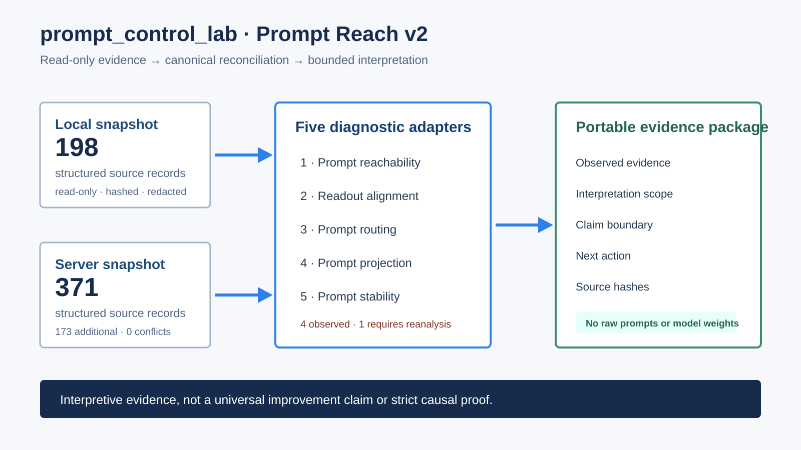

# Prompt Reach v2 evidence case

This case shows how `prompt_control_lab` turns two read-only experiment snapshots into a portable, reviewable diagnostic package. It is an evidence-integration case, not a paper reproduction and not a universal improvement benchmark.

## What was reconciled

| Evidence fact | Recorded result |
|---|---:|
| Public-safe source records | 371 |
| Canonically equivalent local/server records | 198 |
| Additional server records | 173 |
| Conflicting records | 0 |
| Snapshot digest | `sha256:a9622c1f3e4738799229504cdd59896c80db3857a194ecaa954f7395f0a08329` |

Only hashes, allowlisted numeric summaries, classifications, and claim boundaries are included. No model weights, dataset rows, prompt text, gold answers, predictions, generations, credentials, or private absolute paths are stored here.

## What the five diagnostics say

| Diagnostic | Sources | Status | Interpretation |
|---|---:|---|---|
| Prompt reachability | 156 | `observed` | Characterizes which prompt-conditioned representation regions were recorded across matched conditions. |
| Readout alignment | 32 | `observed` | Relates representation/readout measurements to answer-space changes. |
| Prompt routing | 24 | `observed` | Summarizes routing and intervention-related measurements where available. |
| Prompt projection | 4 | `observed` | Measures the boundary between continuous prompt controls and deployable projections. |
| Prompt stability | 155 | `requires_reanalysis` | Sources exist, but the safe adapter could not extract a supported common numeric metric from the current format. |

The stability row is deliberately not promoted to an observed result. It records a concrete source-format gap and the need for matched reanalysis.

## How to read one finding

1. **Observed:** the raw support status, counts, summary statistics, and source hashes.
2. **Explains:** the mechanism, boundary, stability, uncertainty, or decision question the evidence can inform.
3. **Does not prove:** the limit of the evidence. These associations are not a strict causal proof of a unique hidden mechanism.
4. **Next action:** the smallest additional comparison, intervention, or reanalysis needed to strengthen the conclusion.

## Auditable artifacts

- [`public/manifest.json`](public/manifest.json): package schema and snapshot digest.
- [`public/public_source_manifest.json`](public/public_source_manifest.json): path-hashed source records.
- [`public/source_reconciliation.json`](public/source_reconciliation.json): canonical-equivalence and source-only accounting.
- [`public/evidence_matrix.json`](public/evidence_matrix.json): support status for all five diagnostics.
- [`public/source_gap_report.json`](public/source_gap_report.json): unsupported or missing evidence.
- [`public/claim_check.json`](public/claim_check.json): allowed and disallowed claim classes.
- [`public/interpretability_report.html`](public/interpretability_report.html): local reviewer-facing report.

This package establishes that heterogeneous historical evidence can be imported, reconciled, bounded, and explained. The controlled three-seed SFT checkpoint pilot is a separate acceptance test for the complete post-training workflow.
