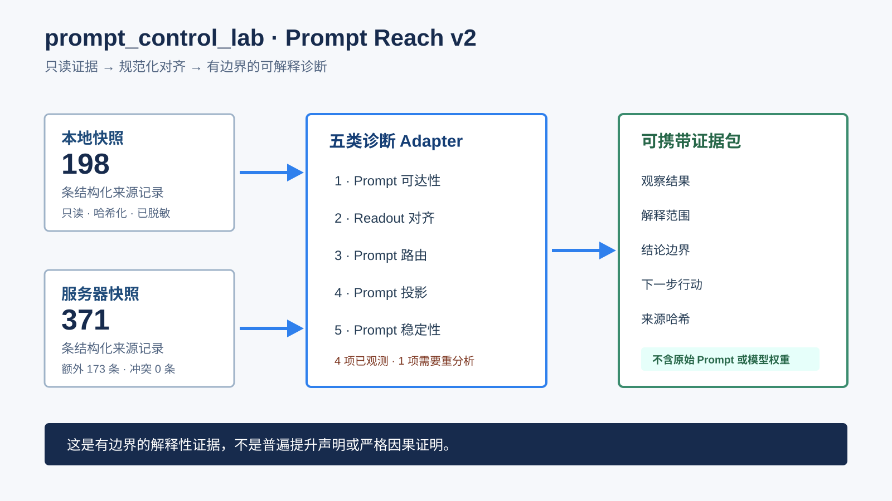

# Prompt Reach v2 真实证据案例

这个案例展示 `prompt_control_lab` 如何把两份只读实验快照整理成可携带、可复核的诊断证据包。它不是论文复现，也不是宣称普遍提升的 benchmark。

## 合并了什么证据

| 证据事实 | 记录结果 |
|---|---:|
| 可公开的来源记录 | 371 |
| 本地与服务器内容规范化后等价的记录 | 198 |
| 服务器额外补充的记录 | 173 |
| 互相冲突的记录 | 0 |
| 快照摘要 | `sha256:a9622c1f3e4738799229504cdd59896c80db3857a194ecaa954f7395f0a08329` |

仓库只保存哈希、允许公开的数值汇总、分类和结论边界，不保存模型权重、数据样本、Prompt 正文、标准答案、预测、生成正文、凭据或私有绝对路径。

## 五类诊断说明了什么

| 诊断 | 来源数 | 状态 | 可以解释什么 |
|---|---:|---|---|
| Prompt 可达性 | 156 | `observed` | 描述匹配条件下记录到的 Prompt 条件表示可达区域。 |
| Readout 对齐 | 32 | `observed` | 关联表示/readout 测量与答案空间变化。 |
| Prompt 路由 | 24 | `observed` | 汇总已有的路由与干预相关测量。 |
| Prompt 投影 | 4 | `observed` | 测量连续 Prompt 控制与可部署投影之间的边界。 |
| Prompt 稳定性 | 155 | `requires_reanalysis` | 来源确实存在，但当前安全 adapter 无法从现有格式中抽取受支持的统一数值指标。 |

稳定性这一行不会被包装成“已经观测到的结果”。它明确记录了来源格式缺口，以及需要进行匹配重分析这一事实。

## 如何阅读一条诊断

1. **观察到了什么：** 原始支持状态、来源数量、汇总统计和来源哈希。
2. **可以解释什么：** 这些证据可以辅助回答的机制、边界、稳定性、不确定性或决策问题。
3. **不能证明什么：** 这些关联不是唯一隐藏机制的严格因果证明。
4. **下一步行动：** 为增强结论，最少需要补充的对照、干预或重分析。

## 可审计文件

- [`public/manifest.json`](public/manifest.json)：证据包 schema 与快照摘要。
- [`public/public_source_manifest.json`](public/public_source_manifest.json)：只含路径哈希的来源记录。
- [`public/source_reconciliation.json`](public/source_reconciliation.json)：内容等价与单侧来源统计。
- [`public/evidence_matrix.json`](public/evidence_matrix.json)：五类诊断的支持状态。
- [`public/source_gap_report.json`](public/source_gap_report.json)：缺失或格式不支持的证据。
- [`public/claim_check.json`](public/claim_check.json)：允许和不允许表达的结论。
- [`public/interpretability_report.html`](public/interpretability_report.html)：面向复核者的本地报告。

这份证据包证明的是：项目能够导入、对齐、限制并解释异构历史证据。完整后训练工作流仍要由受控的三 seed SFT checkpoint pilot 单独验收。
