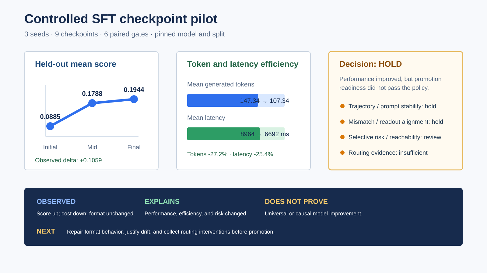

# Controlled SFT checkpoint pilot

This public-safe case records one controlled, three-seed LoRA SFT pilot over a pinned `Qwen/Qwen2.5-0.5B-Instruct` snapshot. It demonstrates the complete local workflow:

```text
checkpoint generation -> aggregate evidence export -> posttrain gate -> bounded explanation -> decision
```

It is a small acceptance case for the workflow, not a universal model benchmark and not a claim that SFT caused a unique hidden mechanism.



## Protocol

| Item | Recorded value |
|---|---|
| Seeds | `0, 1, 2` |
| Checkpoint stages | `initial`, `mid`, `final` |
| Checkpoint runs | 9 |
| Initial-to-candidate gates | 6 |
| Withheld evaluation | 128 GSM8K records + 64 format-following fixtures |
| Model revision | `7ae557604adf67be50417f59c2c2f167def9a775` |
| Split hash | `sha256:664cb24ac6d779378bf256c49f1369f910f49a788594d8813af51655af7bd4b4` |
| Conservative decision | `hold` |

The LoRA protocol used 320 training and 80 validation records. The repository contains only aggregate rows, decisions, source hashes, and bounded explanations. It excludes prompts, dataset records, per-example predictions, model weights, adapters, trainer state, credentials, hidden reasoning, and private paths.

## What was observed

| Measure | Initial | Mid | Final | Interpretation |
|---|---:|---:|---:|---|
| Mean task score | 0.0885 | 0.1788 | 0.1944 | The held-out aggregate score increased by 0.1059. |
| GSM8K score | 0.1328 | 0.2682 | 0.2917 | Final-number accuracy improved on this fixed slice. |
| Format-following score | 0.0000 | 0.0000 | 0.0000 | The format slice did not improve. |
| Mean generated tokens | 147.34 | 106.34 | 107.34 | Final output length was 27.2% lower than initial. |
| Mean latency (ms) | 8963.94 | 6389.04 | 6691.54 | Final observed latency was 25.4% lower than initial. |
| Generation mismatch | 0.5729 | 0.4826 | 0.4670 | It decreased, but remained above the configured 0.10 boundary. |
| Selective-risk AURC | 0.8712 | 0.7071 | 0.6674 | It improved, but remained above the configured 0.40 review boundary. |
| Trajectory drift | 8.3955 | 8.7674 | 8.8259 | Drift increased by 0.4304 and triggered the stability hold. |

All six paired gates reported `hold`. Final score deltas were 0.0990, 0.0990, and 0.1198 across seeds, with paired bootstrap intervals above zero. Direct hold-impact checks were trajectory/prompt stability and generation mismatch/readout alignment. Selective risk and reachability requested review, routing remained insufficient, and the unchanged format slice was an independent observation. The decision did not discard the score improvements; it separated task performance from promotion readiness.

## How to interpret the decision

1. **Observed:** task score rose, outputs became shorter, latency decreased, and selective-risk/mismatch measurements moved in a favorable direction.
2. **Can explain:** SFT was associated with a different performance, efficiency, representation, and risk profile on this fixed protocol.
3. **Cannot prove:** these associations do not establish a unique causal mechanism, universal improvement, or readiness for every deployment setting.
4. **Next action:** repair the format slice, distinguish decode-budget saturation from model failure, reduce or justify trajectory/readout drift, and collect controlled routing interventions before promotion.

`hold` therefore means **do not promote this checkpoint yet under the configured policy**. It does not mean the run failed or that no useful change was observed.

## Auditable artifacts

- [`checkpoint_metrics.csv`](checkpoint_metrics.csv): nine aggregate checkpoint rows.
- [`gate_decisions.json`](gate_decisions.json): six decisions and their triggered checks.
- [`pilot_summary.json`](pilot_summary.json): cross-seed aggregation.
- [`provenance.json`](provenance.json): pinned model, split, source commit, wheel, runtime, and source snapshot hashes.
- [`artifact_manifest.json`](artifact_manifest.json): SHA-256 values for the machine-generated export.
- [`report.md`](report.md): compact generated report.

To create the same aggregate-only package from another completed run:

```bash
pcl posttrain-pilot-export --run runs/sft-pilot-combined --out public/checkpoint-case
```

The exporter refuses incomplete runs, writes only allowlisted aggregate evidence, and rejects source absolute paths in the persisted package.
